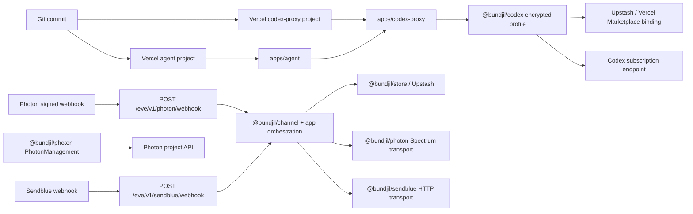
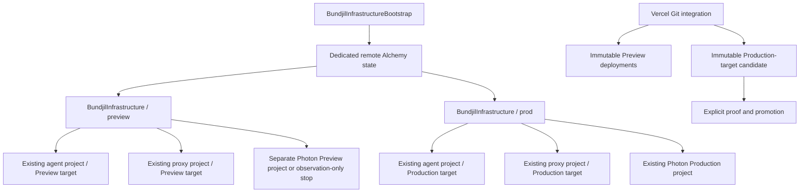

# Alchemy Infrastructure For Vercel And Photon

## Decision and intended outcome

Adopt a **hybrid Alchemy architecture** for Bundjil:

- Alchemy owns declared, convergent, stable configuration and drift detection
  for the existing Vercel agent and codex-proxy projects and the accepted
  Photon Channel management plane.
- Vercel Git integration continues to build immutable Preview and Production
  deployments. Promotion, rollback, alias traffic changes, and deployment
  health proof remain explicit app-owned runbook operations, not ordinary
  Alchemy reconciliation.
- Existing Vercel projects, domains, Upstash/Marketplace connections, Photon
  projects, users, webhooks, and storage are imported or adopted before any
  write is enabled. Production resources default to retain and delete
  protection.
- Preview and Production receive separate Alchemy state, credentials, replay
  namespaces, and desired manifests. Photon management writes in Preview are
  disabled until a separate Photon Preview project is proved. The current
  dated one-project/two-webhook topology is a migration source, not the target
  isolation contract.
- Repository proof, authenticated provider readback, Vercel deployment proof,
  and handset/channel proof remain distinct. No one class can substitute for
  another.

Alchemy does **not** natively support Vercel or Photon at the revalidation
point. Custom resources are therefore required for the selected stable
configuration boundaries. Alchemy's native Stack, Stage, state, Resource,
Provider, adoption, retention, plan, refresh, and provider-test facilities
remain the lifecycle engine.

This SPEC and its sibling task ledger define implementation intent only. They
authorize no provider read, mutation, deployment, secret access, webhook
change, message, or Production operation.

## Accepted repository baseline

This SPEC was drafted after the Photon implementation branch was merged into
`origin/main`:

```text
merge commit: 23ae79bfb3f383f7ff66f0698ac1ec49c51247fe
main parent:  7019a4167cb4ebd09be23ce61d0c6701a3a29f2b
Photon parent: 7ddcdc514af5d3edee1b151575a3ce18226268bb
```

The current source now contains:

- `@bundjil/channel`, `@bundjil/photon`, and `@bundjil/sendblue`;
- independent Photon and Sendblue routes over the shared Channel contract;
- Photon management operations for iMessage platform state, Free shared users,
  and project webhooks;
- bounded Preview and Production receipts for the accepted dual-Channel
  rollout;
- app-owned Vercel, Photon, Sendblue, storage, deployment, proof, and rollback
  runbooks.

The dated
[Production receipt](../verification/channel-production-accepted-2026-07-23.md)
records one accepted historical observation. It is not current provider truth
or authority for this work.

## Truth and revalidation boundaries

| Layer               | Revalidated evidence                                                                                                                                                                                                                                                                                                                                                                                                                                      | Established conclusion                                                                                                                                | Explicit limit                                                                                                                                                                  |
| ------------------- | --------------------------------------------------------------------------------------------------------------------------------------------------------------------------------------------------------------------------------------------------------------------------------------------------------------------------------------------------------------------------------------------------------------------------------------------------------- | ----------------------------------------------------------------------------------------------------------------------------------------------------- | ------------------------------------------------------------------------------------------------------------------------------------------------------------------------------- |
| Bundjil repository  | Merged `origin/main` at `23ae79b`; current architecture, packages, runbooks, authority registers, proof contracts, and supporting research                                                                                                                                                                                                                                                                                                                | Photon is implemented as a first-class Channel provider; two Vercel apps and their runtime Config contracts are repository truth                      | No current Vercel, Photon, Upstash, DNS, secret, webhook, deployment, or handset state                                                                                          |
| Site reference      | `/Users/cooper/Projects/site` at `bbadf2b00c5b861433319cf399a4f6f46d849d4d`, inspected read-only with unrelated dirty documentation/tooling                                                                                                                                                                                                                                                                                                               | Concrete Alchemy `2.0.0-beta.64` Stack/Stage/state, provider Layer, Effect Config, adoption, Preview/Production service, proof, and rollback patterns | It is not a clean Bundjil dependency or proof that Vercel/Photon providers exist                                                                                                |
| Alchemy upstream    | Current `next` package `2.0.0-beta.64`; [resource lifecycle](https://v2.alchemy.run/infrastructure-as-code/resource-lifecycle/), [custom providers](https://v2.alchemy.run/infrastructure-as-code/custom-provider/), and [provider testing](https://v2.alchemy.run/concepts/testing)                                                                                                                                                                      | Custom providers can implement typed create/read/update/delete/list, adoption, replacement, refresh, retention, and tests                             | No native `Vercel` or `Photon` module/resource was found in the package or upstream provider index                                                                              |
| Vercel upstream     | [REST API](https://vercel.com/docs/rest-api), [projects](https://vercel.com/docs/projects), [environment variables](https://vercel.com/docs/environment-variables), [Marketplace](https://vercel.com/docs/integrations/create-integration/marketplace-api), and [deployments](https://vercel.com/docs/deployments/overview)                                                                                                                               | Stable project, domain, env, integration, webhook/drain, and deployment readback APIs exist; sensitive env values are write-only                      | Tenant permissions, project IDs, domains, integration IDs, env metadata, rate limits, and current state require authenticated readback                                          |
| Photon upstream     | [API introduction](https://photon.codes/docs/api-reference/introduction), [webhook management](https://photon.codes/docs/webhooks/managing-webhooks), [users](https://photon.codes/docs/api-reference/users/create-user), [platforms](https://photon.codes/docs/api-reference/platforms/get-platforms), [lines](https://photon.codes/docs/api-reference/lines/add-a-dedicated-imessage-line), and [delivery](https://photon.codes/docs/webhooks/delivery) | Stable project-scoped webhook/user/line identities and platform readback exist; Free shared-user creation is semantically idempotent                  | Project deletion/secret rotation are not complete public API lifecycles; dedicated line creation is billable and lacks a documented idempotency key; no alert-policy API exists |
| Live provider truth | Not queried in this SPEC turn                                                                                                                                                                                                                                                                                                                                                                                                                             | Nothing                                                                                                                                               | Every current provider, credential, deployment, billing, line, webhook, user, and handset claim                                                                                 |

The supporting
[Alchemy ownership research](../research/alchemy-vercel-sendblue-decision-report.md)
retains the longer evidence trail. This SPEC supersedes its conditional
provider choice: Photon is now the selected Channel management plane for this
infrastructure design, while Sendblue remains runtime/runbook-owned and outside
new Alchemy ownership.

## Goals

1. Make intended stable infrastructure reviewable as Schema-decoded code and
   Alchemy plans.
2. Adopt existing resources without accidental creation, replacement,
   deletion, secret rotation, or traffic change.
3. Detect drift through provider readback and produce bounded, sanitized
   receipts.
4. Isolate Preview and Production state, credentials, storage namespaces, and
   Photon management.
5. Keep Vercel Git deployment/promotion and app-owned proof workflows intact.
6. Implement any custom provider through Effect-native services and Layers
   that are independently testable without live credentials.

## Non-goals

- Replacing Vercel Git deployments, staged Production promotion, instant
  rollback, or app-owned deployment runbooks.
- Managing DNS records in the first rollout. Vercel domain attachments may be
  adopted; authoritative DNS remains read-only/outside IaC.
- Creating or deleting Upstash databases, Marketplace resources, Photon
  projects, dedicated lines, billing plans, or Sendblue accounts/lines.
- Migrating legacy Sendblue implementation behavior into the new
  infrastructure package.
- Sending a message, simulating handset delivery, or using Alchemy as a Channel
  runtime.
- Storing plaintext credentials, phone numbers, message content, webhook
  signing secrets, or sensitive environment values in Alchemy state or proof.
- Creating a generic provider SDK wrapper, `common`, `shared`, `helpers`, or
  `utils` package.

## Current call graph and ownership



| Concern                     | Repository owner                                      | External owner               | Alchemy target                                                                          |
| --------------------------- | ----------------------------------------------------- | ---------------------------- | --------------------------------------------------------------------------------------- |
| Agent project/build         | `apps/agent`, `apps/agent/vercel.json`                | Vercel                       | Adopt project/settings/env/domain metadata; never deploy in ordinary reconcile          |
| Proxy project/build         | `apps/codex-proxy`, its `vercel.json`                 | Vercel                       | Same, with independent auth/storage configuration                                       |
| Agent-to-proxy URL/auth     | app Config and deployment runbooks                    | Vercel env/protection        | Coordinated env declarations using one external secret revision                         |
| Photon runtime              | `@bundjil/photon`, agent route, Channel runtime       | Photon Spectrum SDK/webhooks | No runtime ownership; management resources only                                         |
| Photon management           | `@bundjil/photon` management service and runbook      | Photon project API           | Adopt project; manage approved platform/user/webhook resources through custom resources |
| Sendblue runtime/management | `@bundjil/sendblue` and app runbook                   | Sendblue                     | Outside new Alchemy scope; observe only where required for rollback continuity          |
| Replay/profile persistence  | `@bundjil/store`, `@bundjil/codex`, app Config        | Upstash/Marketplace          | Import/read binding and namespace metadata; retain data resource                        |
| Deployment/promotion        | app runbooks and Vercel Git integration               | Vercel                       | Read-only deployment observation                                                        |
| Authority and proof         | authority registers, runbooks, verification contracts | target operator/provider     | Alchemy plan is evidence, never authority                                               |

## Native support and verified gaps

| Capability                                                                                             | Native Alchemy support                                                               | Required Bundjil owner                                                                    |
| ------------------------------------------------------------------------------------------------------ | ------------------------------------------------------------------------------------ | ----------------------------------------------------------------------------------------- |
| Stack, Stage, outputs, resource identity, plan, refresh, adoption, retain, replacement, provider tests | Yes, core Alchemy                                                                    | Root stack plus private `@bundjil/infrastructure` tooling                                 |
| Remote state                                                                                           | Native provider-backed state implementations exist; site proves `Cloudflare.state()` | Separate bootstrap task and credential boundary; local state only during the no-write POC |
| Vercel projects/settings/domains/env/Marketplace/webhooks/drains                                       | No native provider found as of `2.0.0-beta.64`                                       | Custom Vercel resources and private Effect client inside `@bundjil/infrastructure`        |
| Vercel deployments/promotion/rollback                                                                  | APIs exist, but ordinary resource convergence is the wrong ownership model           | Git integration and app runbooks; custom observation only                                 |
| Photon project bootstrap/delete/secret rotation                                                        | No native provider; public lifecycle remains incomplete                              | Imported retained identity; bootstrap/rotation runbook outside ordinary reconcile         |
| Photon platform/shared-user/webhook lifecycle                                                          | No native provider; APIs and stable IDs exist                                        | Custom Alchemy resources consuming `@bundjil/photon/management`                           |
| Photon dedicated lines and billing                                                                     | No native provider; line CRUD exists but creation is billable/non-idempotent         | Read-only inventory now; separately authorized future extension only                      |
| Photon alert policies/delivery log/DLQ                                                                 | No documented management API                                                         | Bundjil runtime metrics and external monitoring; no fake IaC resource                     |
| Sendblue account/line lifecycle                                                                        | No native provider and incomplete safe lifecycle                                     | Existing provider/runbook ownership; no new custom resource                               |

No custom resource is permitted merely because an API endpoint exists. A
resource needs stable identity, complete readback, a safe update/delete
contract, explicit secret behavior, and tests for uncertain outcomes.

## Package and stack structure

```text
alchemy.run.ts
stacks/
  bundjil.ts
  bootstrap.ts
packages/infrastructure/
  README.md
  package.json
  src/
    config.ts
    errors.ts
    schemas.ts
    adoption.ts
    outputs.ts
    vercel/
      schemas.ts
      service.ts
      live.layer.ts
      memory.layer.ts
      resources.ts
    photon/
      schemas.ts
      resources.ts
      provider.layer.ts
  test/
    adoption.test.ts
    vercel-service.test.ts
    vercel-resources.test.ts
    photon-resources.test.ts
    stack.test.ts
```

`@bundjil/infrastructure` is a private repository tooling package. Applications
must not import it at runtime.

The ownership boundary is deliberate:

- `@bundjil/photon` remains the sole Photon HTTP/SDK owner. Harden and expose a
  narrow `@bundjil/photon/management` subpath only for the named management
  service, schemas, errors, and live/memory Layers required by Alchemy.
  `@bundjil/infrastructure` must not duplicate Photon URLs, Basic auth, DTOs,
  response decoding, or retry logic.
- Keep the Vercel client private under `@bundjil/infrastructure/vercel` because
  Alchemy is its only proved consumer. Do not create `@bundjil/vercel` until a
  second stable consumer exists.
- Alchemy resource lifecycle code belongs to `@bundjil/infrastructure`;
  provider transport code belongs to the provider owner. Stack topology stays
  at the root and contains no HTTP details.

This follows the repository `effect-client-wrapper` boundary: named operations,
immediate unknown-output decoding, provider-private raw clients, safe errors,
and explicit live/memory Layers.

## Deployment and state topology



Use exactly two persistent desired-state stages: `preview` and `prod`. Pull
requests run a read-only refreshed plan against `preview`; they do not apply
shared Preview settings or create a stage per PR. A protected Preview job may
apply the shared Preview stage. Production uses a separately protected job and
credentials.

The no-write POC may use ignored local state. No Production adoption may begin
until `stacks/bootstrap.ts` provisions or adopts a dedicated remote state
backend under separate authority. Reuse the site's `Cloudflare.state()` pattern
only after a Bundjil-specific account/token and stack name are approved; never
reuse the site's state identity or credentials.

## Resource inventory

### Production

| Resource                   | Desired ownership                                                                                                                                                                            | Physical identity                                                   | Initial policy                                                                           |
| -------------------------- | -------------------------------------------------------------------------------------------------------------------------------------------------------------------------------------------- | ------------------------------------------------------------------- | ---------------------------------------------------------------------------------------- |
| Alchemy stack/state        | Native Stack/Stage plus dedicated remote state                                                                                                                                               | stack `BundjilInfrastructure`, stage `prod`, backend identity       | Create/adopt only through bootstrap; protected                                           |
| Vercel agent project       | Custom `VercelProject`                                                                                                                                                                       | exact team ID + project ID                                          | Read/import, then manage approved settings; retain/protect                               |
| Vercel proxy project       | Custom `VercelProject`                                                                                                                                                                       | exact team ID + project ID                                          | Same                                                                                     |
| Project settings           | project root, build/install/output/framework/function settings derived from both `vercel.json` files                                                                                         | project ID + canonical setting path                                 | In-place only where Vercel supports it; reject Git identity replacement                  |
| Production domains         | Custom `VercelProjectDomain` attachments                                                                                                                                                     | project ID + normalized domain                                      | Import/read first; retain; DNS read-only                                                 |
| Agent model/Executor env   | `BUNDJIL_AGENT_MODEL_PROVIDER`, `BUNDJIL_AGENT_MODEL`, `BUNDJIL_EXECUTOR_MCP_URL`, `BUNDJIL_EXECUTOR_API_KEY`                                                                                | project + key + `production` target                                 | Key/type/target owned; value by external secret revision                                 |
| Agent-to-proxy env         | `BUNDJIL_CODEX_PROXY_BASE_URL`, `BUNDJIL_CODEX_PROXY_MODEL`, `BUNDJIL_CODEX_PROXY_CONTEXT_WINDOW_TOKENS`, `BUNDJIL_CODEX_PROXY_INTERNAL_TOKEN`, optional `BUNDJIL_CODEX_PROXY_VERCEL_BYPASS` | project + key + `production`                                        | One coordinated rotation group; deployment required                                      |
| Channel routing/replay env | all `BUNDJIL_CHANNEL_ROUTING_*` and `BUNDJIL_CHANNEL_REPLAY_*` keys                                                                                                                          | project + key + `production`                                        | Separate Production namespace and secret revisions                                       |
| Photon runtime env         | `BUNDJIL_CHANNEL_PHOTON_PROJECT_ID`, project secret, webhook ID/secret, tolerance                                                                                                            | project + key + `production`                                        | External values; IDs/revisions only in Alchemy state                                     |
| Sendblue runtime env       | all `BUNDJIL_CHANNEL_SENDBLUE_*` keys                                                                                                                                                        | project + key + `production`                                        | Metadata may be inventoried; values and provider resources remain runbook-owned          |
| Proxy config/auth env      | proxy mode, model/reasoning, internal token, profile/connector/installation/subject/account, encryption and refresh settings                                                                 | proxy project + key + `production`                                  | External values; coordinated token/cipher revisions                                      |
| Replay store binding       | existing Upstash/Marketplace resource and Channel prefix                                                                                                                                     | configuration/resource/database IDs                                 | Import/read/retain; never create from an env alias                                       |
| Profile store binding      | existing Upstash/Marketplace resource and profile prefix                                                                                                                                     | configuration/resource/database IDs                                 | Import/read/retain; preserve fenced profile data                                         |
| Photon project             | custom retained `PhotonProjectObservation`                                                                                                                                                   | reviewed project ID                                                 | Import/read; no create/delete/secret rotation                                            |
| Photon iMessage platform   | custom `PhotonPlatformConfiguration`                                                                                                                                                         | project ID + branded `imessage` literal                             | Read, adopt, in-place enable/metadata diff                                               |
| Photon shared user         | custom `PhotonSharedUser`                                                                                                                                                                    | project ID + stable user UUID; sensitive semantic key kept redacted | Adopt exact approved user; soft delete only if rollout-created and separately authorized |
| Photon Production webhook  | custom `PhotonWebhook`                                                                                                                                                                       | project ID + webhook UUID                                           | Adopt exact URL/ID; retain/protect; replacement only with secret custody                 |
| Photon lines               | `PhotonLineObservation`                                                                                                                                                                      | project ID + stable line IDs                                        | Read-only; assert accepted Free topology has zero dedicated lines                        |
| Photon billing             | `PhotonBillingObservation`                                                                                                                                                                   | project ID                                                          | Read-only; no plan mutation                                                              |
| Vercel deployment          | `VercelDeploymentObservation`                                                                                                                                                                | deployment ID + Git SHA + target                                    | Read-only; no create/delete                                                              |
| Monitoring                 | drift receipt plus existing safe app/provider metrics                                                                                                                                        | stage + resource ID + observation time                              | Report-only until an alert API/owner is selected                                         |

### Preview

| Resource                 | Desired ownership                                                                          | Isolation rule                                                                                                              |
| ------------------------ | ------------------------------------------------------------------------------------------ | --------------------------------------------------------------------------------------------------------------------------- |
| Alchemy stage            | `BundjilInfrastructure / preview`                                                          | Separate state and provider credentials from `prod`                                                                         |
| Vercel projects/settings | same existing two projects, `preview` target                                               | Never mutate Production targets from Preview or PR jobs                                                                     |
| Preview domains          | Vercel-generated deployment URLs; optional imported Preview alias                          | No Production custom-domain or DNS write                                                                                    |
| Agent/proxy env          | Preview-only URL, internal token, bypass, model, Channel routing and storage values        | Must not equal Production credential revisions or replay/profile prefixes                                                   |
| Upstash bindings         | imported Preview connection and prefixes                                                   | Physical DB may be shared only after exact database and namespace review; destructive ownership remains disabled            |
| Photon project           | separate Preview project and project secret                                                | Until proved, Photon Preview apply stops before provider writes; current shared project is observation-only migration state |
| Photon platform/user     | approved synthetic Preview user in Preview project                                         | No Production user identity, assignment, or credential reuse                                                                |
| Photon webhook           | one exact Preview callback in Preview project                                              | Separate signing secret and webhook ID; retain until retry horizon drains on replacement                                    |
| Photon lines/billing     | read-only; zero dedicated lines expected                                                   | No billable line creation                                                                                                   |
| Deployment observation   | immutable PR/Preview deployment IDs                                                        | Observation only; PR closure removes no project/provider resource                                                           |
| Proof                    | plan, provider readback, deployment health/auth, isolated signed ingress and Channel proof | Sanitized artifact; no Production or handset inference                                                                      |

If a separate Free Photon Preview project cannot be created or cannot host an
isolated approved user, the accepted fallback is **no live Photon Preview
management or webhook**. Sharing the Production project is not an isolation
fallback.

## Canonical Schema and Effect contracts

Every resource declares both decoded and encoded contracts:

```ts
export const VercelProjectId = Schema.String.pipe(
  Schema.brand("VercelProjectId")
);
export type VercelProjectId = typeof VercelProjectId.Type;
export type VercelProjectIdEncoded = typeof VercelProjectId.Encoded;

export const InfrastructureStage = Schema.Literals(["preview", "prod"]);
export type InfrastructureStage = typeof InfrastructureStage.Type;
export type InfrastructureStageEncoded = typeof InfrastructureStage.Encoded;

export const SecretReference = Schema.Struct({
  owner: Schema.NonEmptyString,
  reference: Schema.NonEmptyString,
  revision: Schema.NonEmptyString,
});
```

Brand all unbounded semantic identities: Vercel team/project/env/domain/
deployment/integration IDs, Photon project/webhook/user/line IDs, Alchemy
logical/physical IDs, secret references/revisions, database IDs, and adoption
manifest digests. Use closed literal Schemas for target, stage, env type,
provider operation, platform, deletion policy, and retry classification.

Environment, CLI, manifest, state, and provider JSON are unknown encoded input.
Decode once at their owning ingress. Services and resources accept only
`typeof Contract.Type`. Encode `typeof Contract.Encoded` immediately before an
outward HTTP, state, receipt, or file boundary.

### Config

Use one `Config.schema` owner for:

- stage and stack name;
- Vercel team identity and redacted token;
- Photon project identity and redacted project secret;
- remote state account and redacted token;
- adoption manifest path/digest;
- secret references and redacted resolved values;
- plan/apply mode and explicit destructive policy.

Secrets use `Schema.Redacted`. Config errors are safe tagged errors and never
include values, provider bodies, headers, URLs with queries, phone numbers, or
raw SDK errors.

### Services and Layers

Required services expose named operations, not raw clients:

```ts
class VercelProjects extends Context.Service<
  VercelProjects,
  {
    readonly get: (
      id: VercelProjectId
    ) => Effect<ProjectObserved, VercelProjectReadError>;
    readonly create: (
      desired: VercelProjectDesired
    ) => Effect<ProjectObserved, VercelProjectWriteError>;
    readonly update: (
      id: VercelProjectId,
      desired: VercelProjectDesired
    ) => Effect<ProjectObserved, VercelProjectWriteError>;
    readonly delete: (
      id: VercelProjectId
    ) => Effect<void, VercelProjectDeleteError>;
  }
>()("@bundjil/infrastructure/VercelProjects") {}
```

Use separate named services where operation/rate/secret semantics differ:
`VercelProjects`, `VercelEnvironmentVariables`, `VercelDomains`,
`VercelMarketplaceBindings`, and `VercelDeployments`. Photon reuses or extends
`PhotonManagement`; do not expose its underlying `HttpClient`.

Each service has explicit live and memory Layers. Memory Layers record named
calls and can simulate pagination, `404`, `409`, `429`, transient `5xx`,
timeout-before-write, timeout-after-write, eventual consistency, and partial
failure.

Errors are operation-specific tagged classes with only:

- operation and resource kind;
- safe provider code/status;
- retry classification;
- `outcomeKnown | outcomeUncertain`;
- bounded sanitized diagnostic.

Do not use `instanceof`, generic `ProviderError`, unchecked SDK output,
primitive semantic strings, arbitrary callbacks, or helper wrappers. Primary
Effects remain lazy, flat, linear, sequential, and named. One-use mapping,
decoding, and error translation stay inline.

## Call graphs

### Production plan/apply

```text
protected workflow
  -> Config.schema + complete InfrastructureConfig decode
  -> Alchemy Stack("BundjilInfrastructure", stage="prod")
  -> custom Provider Layers
  -> read/import every declared resource
  -> compare desired Type with decoded observed Type
  -> emit sanitized plan
  -> approval gate rejects unapproved create/replace/delete
  -> deploy stable configuration only
  -> refresh provider readback
  -> persist redacted state
  -> Vercel Git builds immutable deployments
  -> app runbooks prove candidate and promote
  -> repository/provider/deployment/channel receipts remain separate
```

### Test

```text
decoded fixtures
  -> memory Vercel/Photon Layers
  -> Alchemy provider test harness
  -> create/read/diff/update/replace/delete/list
  -> adoption/no-op/drift/timeout/partial-failure/retain assertions
  -> state/plan/error/log leak scans
```

### CLI

```text
future root command
  -> CLI Schema decode
  -> stage/mode Config Layer
  -> named inventory/plan/adopt/drift Effect
  -> Alchemy command service
  -> bounded receipt Schema encode
  -> exit nonzero on unsafe plan, unavailable readback, or uncertain outcome
```

### Photon runtime versus management

```text
Alchemy Photon resource
  -> PhotonManagement named operation
  -> Photon management API
  -> stable ID/config readback

signed webhook
  -> agent Photon route
  -> Channel replay/routing/Eve
  -> @bundjil/photon Spectrum send/typing
```

Alchemy never sends messages. Channel runtime never creates/deletes provider
management resources.

## Custom resource lifecycle contract

All custom resources implement:

1. `list/read`: paginate fully, decode immediately, and return missing,
   observed, or ambiguous.
2. `create`: only when the resource class and stage have explicit write
   enablement and no matching unowned resource exists.
3. `diff`: compare canonical decoded desired and observed values; omit
   write-only values and provider timestamps.
4. `update`: apply the minimum supported in-place change, then poll readback.
5. `delete`: default retain; delete-if-present only under explicit policy and
   target-owned authority.
6. `import/adopt`: an exact match returns `Unowned`; adoption requires a
   reviewed manifest digest and Alchemy adoption policy.
7. `refresh`: provider readback updates drift attributes without mutation.

Illustrative provider pseudocode:

```ts
const provider = Provider.make("VercelProject", {
  read: ({ output }) => projects.get(output.physicalId),
  create: ({ input }) =>
    projects
      .create(input)
      .pipe(Effect.flatMap((created) => projects.readUntilVisible(created.id))),
  update: ({ input, output }) =>
    projects
      .update(output.physicalId, input)
      .pipe(
        Effect.flatMap(() =>
          projects.readUntilConverged(output.physicalId, input)
        )
      ),
  delete: ({ input, output }) =>
    input.deletionPolicy === "retain"
      ? Effect.void
      : projects.deleteIfPresent(output.physicalId),
  list: () => projects.listAllPages(),
});
```

Exact Alchemy API names must be verified against the pinned package during
implementation; this is lifecycle pseudocode, not copy-paste source.

### Per-resource rules

| Resource                      | Stable physical identity/import                            | Update/diff                                                                  | Replacement/delete                                                                                              |
| ----------------------------- | ---------------------------------------------------------- | ---------------------------------------------------------------------------- | --------------------------------------------------------------------------------------------------------------- |
| `VercelProject`               | exact team + project ID; name lookup only for discovery    | approved root/build/framework/settings in place                              | team/Git identity change rejected; Production retain/protect                                                    |
| `VercelProjectDomain`         | project ID + normalized domain                             | attach then poll verification; DNS observed                                  | cross-project move is replacement; retain Production                                                            |
| `VercelEnvironmentVariable`   | provider env ID or project + key + sorted targets + branch | key/type/targets plus `secretRevision`; value resolved only at apply         | coordinated replacement; never remove old credential before deployment proof                                    |
| `VercelMarketplaceBinding`    | integration/configuration/resource/database IDs            | first slice read/import only; later attachment only after exact API proof    | always retain; no database create/delete                                                                        |
| `VercelDeploymentObservation` | immutable deployment ID + Git SHA                          | read target/status/aliases/provenance only                                   | no-op retain                                                                                                    |
| `PhotonProjectObservation`    | reviewed project ID                                        | profile/config read only                                                     | retain; no project create/delete/secret rotation                                                                |
| `PhotonPlatformConfiguration` | project ID + `imessage`                                    | in-place enable/metadata; read until visible                                 | restore prior state only if this rollout changed it                                                             |
| `PhotonSharedUser`            | project ID + stable user UUID; semantic phone key redacted | documented idempotent shared upsert, then exact UUID readback                | soft delete only for rollout-created user under separate authority; adopted user retained                       |
| `PhotonWebhook`               | project ID + webhook UUID; discover exact canonical URL    | read URL/config; write-only secret represented by reference/revision/boolean | URL/secret rotation is replacement; retain Production; delete old only after new endpoint proof and retry drain |
| `PhotonLineObservation`       | project ID + line UUID                                     | read routing/profile/subscription only                                       | no create/delete in this SPEC                                                                                   |
| `PhotonBillingObservation`    | project ID                                                 | read-only status                                                             | no-op retain                                                                                                    |

### Timeouts, retries, and eventual consistency

- Honor provider rate headers and `Retry-After`; Photon management is bounded
  to its documented per-project rate.
- Retry bounded `429`, documented transient `5xx`, timeout before a response,
  and eventual-consistency reads with exponential backoff and jitter.
- Never blindly retry a non-idempotent or billable write after a timeout.
  Return `OutcomeUncertain`, observe by exact identity, and require an explicit
  recovery decision where observation cannot disambiguate.
- A successful remote write followed by state-write failure is a partial
  failure. Preserve the remote resource, record its stable identity where
  safely recoverable, and rerun observe-first. Do not create a second resource.
- Missing-on-delete is success; ambiguous matches are a hard stop.

## Secret and state contract

Alchemy state and ordinary artifacts may contain:

- stable resource IDs;
- stage and target;
- secret owner/reference/revision;
- `secretConfigured` booleans;
- canonical non-sensitive metadata;
- sanitized observation/diff/result classes.

They must not contain:

- Vercel, Photon, Sendblue, Upstash, Executor, OpenAI, or GitHub tokens;
- Photon project or webhook signing secrets;
- sensitive environment values;
- phone numbers, assigned numbers, message/Space IDs, content, contacts, or
  provider response bodies;
- auth headers, URL query secrets, raw errors, stacks, prompts, tool data, or
  profile plaintext.

Existing write-only values begin with a reviewed revision such as
`pre-alchemy-v1`; Alchemy does not infer their value. A protected apply job
resolves a `SecretReference` through an explicitly named custody Layer.

Photon webhook create/rotation remains disabled until a
`PhotonWebhookSecretCustody` service is selected and tested. It must persist
the create-only secret before the resource operation returns and expose only a
reference/revision. If the process fails after remote creation but before
custody succeeds, observe the endpoint by URL/ID, classify the outcome as
partial/uncertain, retain it, and require explicit rotation or deletion. Never
register another webhook automatically.

## Adoption and migration

1. **Freeze source identity.** Record the accepted Git SHA, current app
   project names/root settings, runtime Config key inventory, and rollback
   deployments without values.
2. **Build memory providers first.** All live writes are disabled. Contract
   tests prove lifecycle and leak rules.
3. **Run authorized read-only inventory.** Resolve exact Vercel team/project/
   domain/env/integration/deployment IDs, Upstash binding/database IDs, Photon
   project/platform/user/webhook/line/billing state, and current Preview/
   Production isolation.
4. **Create a sanitized adoption manifest.** Bind physical IDs, logical IDs,
   stage, resource class, deletion policy, and a SHA-256 of canonical observed
   metadata. Store secret references only.
5. **Plan with adoption enabled.** Every existing match must be `Unowned`
   until the manifest digest and explicit adoption policy match. Stop on any
   create, replace, or delete.
6. **Adopt one class at a time.** Projects, domains, env metadata,
   Marketplace/Upstash observations, Photon project/platform/user/webhook,
   then deployment observations.
7. **Prove no-op refresh.** Two consecutive refreshed plans at the same
   provider snapshot produce no changes.
8. **Enable narrowly scoped writes.** Preview non-secret Vercel settings first,
   then secret metadata/bindings, then separately isolated Photon Preview
   resources. Production follows only after accepted Preview and a reviewed
   zero-replacement plan.
9. **Retain migration sources.** Do not remove the current shared Photon
   Preview webhook/project relationship until a separate Preview project,
   callback, deployment, retry drain, and rollback are proved.

Logical Alchemy IDs are permanent after adoption. Renaming one is a migration,
not refactoring.

## CI/CD and operational topology

### Pull request

1. Run repository verification and provider-memory tests.
2. Run `bun alchemy plan --stage preview` with read-only provider credentials.
3. Reject a plan that targets Production or contains create/replace/delete.
4. Let Vercel Git create immutable PR deployments.
5. Run local/Preview deployment proof under existing runbooks only when
   separately authorized.
6. Upload a sanitized plan and deployment observation; write no shared
   infrastructure state from the PR.

### Protected Preview

1. Bind immutable source SHA and approved adoption manifest.
2. Plan and require an approval for every write class.
3. Run `bun alchemy deploy --stage preview --yes`.
4. Refresh and require convergence.
5. Let Vercel build source-owned Preview deployments after env/settings
   changes.
6. Prove proxy first, agent second, and Photon only against a separate Preview
   project.

### Production

1. Use immutable `main`, a Production environment approval, and separately
   scoped credentials.
2. Run `bun alchemy plan --stage prod`.
3. Reject unapproved create, replacement, deletion, domain move, database
   operation, Photon project/line/billing mutation, or secret rotation.
4. Apply stable configuration and refresh readback.
5. Let Vercel build a Production-target candidate.
6. Follow the proxy and agent runbooks to prove and promote. Alchemy does not
   promote.
7. Capture a bounded packet with source, state revision, physical IDs,
   deployment IDs, result classes, limitations, and rollback identities.

### Drift

A scheduled workflow may run refreshed plans with read-only credentials and
publish a report-only finding. It may not auto-apply. Drift classes are:

- expected provider normalization;
- unmanaged/unowned resource;
- mutable in-place drift;
- replacement/destructive drift;
- unavailable or ambiguous readback;
- secret revision unknown;
- external deployment drift.

Only the first two accepted in-place classes may become later automation
candidates through the controls admission process.

## Rollback

- Revert Alchemy desired configuration to the last accepted state revision and
  plan before apply.
- Vercel application rollback restores the retained immutable deployment
  through the target-owned runbook. Env-dependent rollback may require a new
  deployment with the prior secret revision; retain both revisions through the
  rollback window.
- Restore the prior Photon platform state only if the current operation changed
  it. Preserve adopted users/projects. Replace a webhook by proving the new
  endpoint before deleting the old one, then wait beyond the documented retry
  horizon.
- Never destroy a stack to roll back Production. `alchemy destroy --stage
prod` is blocked by policy.
- A partial or uncertain provider result stops promotion and records the last
  observed physical identity and safe recovery path.

## Monitoring and proof

| Proof class       | Required evidence                                                                               | Does not prove                                        |
| ----------------- | ----------------------------------------------------------------------------------------------- | ----------------------------------------------------- |
| Repository        | schemas, services, Layers, provider tests, stack outputs, verification gates                    | provider state or deployment                          |
| Provider readback | authenticated Vercel/Photon IDs, canonical metadata, observed time, plan/diff                   | deployment health, Channel behavior, handset delivery |
| Deployment        | immutable source/deployment ID, target, readiness, alias/protection/auth checks                 | Photon delivery or handset behavior                   |
| Channel           | signed ingress, replay identity disposition, Eve completion, provider acceptance, typing result | general provider health or future delivery            |
| Handset           | one approved observed message/typing journey with exact environment                             | infrastructure convergence or permanent reliability   |

Emit Effect spans and bounded receipts with resource kind, stage, operation,
physical-ID fingerprint, attempt count, duration, retry class, diff class,
outcome-known flag, and result. Do not emit raw IDs where the proof contract
requires fingerprints, secret values, provider bodies, phones, messages, URLs
with queries, or error causes.

Photon exposes no alert-policy resource or persistent delivery log. Bundjil
must alert on its own signed-ingress failures, replay/lease failures, provider
send/typing outcomes, webhook inventory drift, billing observation failure,
and missing drift runs. The alert transport remains outside this SPEC until an
owner and API are selected.

## Test contract

Every resource class must prove:

- valid/malformed provider fixture decoding;
- list pagination and ambiguous match rejection;
- create and read-after-create convergence;
- exact no-op;
- in-place update;
- replacement classification;
- drift refresh;
- adoption denied and adoption allowed by exact manifest digest;
- `404`, `409`, `429`, transient `5xx`, and rate reset handling;
- timeout before write and timeout after write;
- eventual consistency exhaustion;
- state persistence failure after a successful write;
- retain and delete protection;
- idempotent delete-if-present where deletion is allowed;
- secret and personal-data absence from state, plan, output, errors, spans,
  receipts, snapshots, and fixtures.

Additional provider-specific cases:

- Vercel env target/type ordering, sensitive value revision, coordinated
  auth rotation, and deployment-required classification;
- Marketplace binding read/import without database recreation;
- Photon shared-user semantic idempotency and soft-delete policy;
- Photon webhook same-URL `409`, write-only secret loss, retry drain, and
  replacement ordering;
- Photon dedicated-line mutation rejection and billing read-only behavior;
- Preview credentials/IDs rejected in Production and vice versa.

Live verification is read-only by default. Mutating tests require disposable
resources, a target-owned runbook, explicit current authority, a stable cleanup
identity, and retained partial-failure evidence.

## Implementation commands and gates

The implementation must add and own these root commands:

```sh
bun run infrastructure:inventory -- --stage preview
bun run infrastructure:inventory -- --stage prod
bun alchemy plan --stage preview
bun alchemy plan --stage prod
bun alchemy deploy --stage preview --yes
bun alchemy deploy --stage prod --yes
bun run infrastructure:drift -- --stage preview
bun run infrastructure:drift -- --stage prod
```

Inventory, plan, and drift default to read-only. Deploy commands remain absent
from ordinary PR CI and require protected environment authority.

Every implementation slice runs:

```sh
bun run check:effect-setup
bun run check:boundaries
bun run check:docs
bun run check:skills
bun run check:authority
bun run check:controls
bun run check:verification
bun run --filter @bundjil/infrastructure check-types
bun run --filter @bundjil/infrastructure test
bun run --filter @bundjil/photon check-types
bun run --filter @bundjil/photon test
bun run verification
git diff --check
```

Run Alchemy provider harness tests against the pinned package. Run live
inventory/plan/deploy only in the task whose authority and acceptance criteria
name that operation.

## Acceptance criteria

- `@bundjil/infrastructure` and root stacks follow the stated ownership and
  Effect/Schema rules with no runtime app dependency.
- Current Vercel and Photon resources can be inventoried and adopted by exact
  identity without create, replace, delete, secret disclosure, or traffic
  change.
- Two consecutive refreshed plans are no-op against the same accepted
  snapshot.
- Preview and Production state/credentials/manifests are separate; Photon
  Preview writes cannot target the Production project.
- Production Vercel projects, domains, stores, Photon project/user/webhook, and
  all data resources are retained and delete-protected.
- Vercel Git remains the deployment owner; Alchemy plans cannot promote or
  roll back.
- Every custom lifecycle test in this SPEC passes, including
  timeout-after-write and state-partial-failure recovery.
- Secrets and personal/channel data are absent from Alchemy state, plans,
  receipts, logs, fixtures, and errors.
- Repository, provider, deployment, Channel, and handset proof remain
  separately addressable.
- Full repository verification passes before implementation handoff.

## Risks and unresolved questions

1. Which dedicated remote state backend and credential owner will Bundjil use?
   `Cloudflare.state()` is proven in the site repository but introduces a new
   scoped provider dependency.
2. Does the current Vercel team expose all required project/env/domain/
   integration read and write operations to one least-privilege principal?
3. What are the exact existing Vercel project IDs, domain attachments, env
   IDs/types/targets, Marketplace configuration IDs, Upstash database IDs, and
   deployment/protection settings?
4. Can the Photon account create a truly separate Free Preview project and
   approved shared user without Production identity reuse? If not, Preview
   Photon remains disabled.
5. Which existing Photon webhooks/users were rollout-created versus adopted,
   and which secret revisions remain recoverable?
6. Which secret custody system can safely receive create-only Photon webhook
   secrets and provide versioned apply-time resolution?
7. Does Photon now expose a stable project bootstrap/delete/secret-rotation API
   beyond the documented CLI, an alert-policy API, or a persistent delivery
   log? Revalidate before implementing those gaps.
8. Which Vercel Marketplace endpoints safely distinguish connection,
   project-binding, credential-target, and database ownership for the installed
   Upstash integration?
9. Should Sendblue env metadata remain declared in Alchemy while its provider
   resources remain runbook-owned, or remain wholly outside to simplify future
   retirement?

The live read-only checks that close questions 2–5 and 8 require a new,
explicitly authorized task. This SPEC does not grant it.

## Documentation impact ledger

| Surface                      | Decision                                     | Owner and reason                                                                  |
| ---------------------------- | -------------------------------------------- | --------------------------------------------------------------------------------- |
| Product SPEC/task ledger     | Change required                              | This SPEC and sibling JSON become canonical implementation intent                 |
| Active plan/indexes          | Change required                              | Route the current phased implementation without claiming provider authority       |
| Supporting research          | Change required                              | Record merged Photon selection and 2026-07-24 Alchemy/site/upstream revalidation  |
| Architecture                 | Preserve until implementation                | Existing architecture remains current; this proposed target is not executable yet |
| Root/app/package READMEs     | Preserve until public commands/exports exist | No infrastructure package or command exists in this turn                          |
| Runbooks                     | Preserve until an operation is implemented   | Existing app runbooks remain target owners; no provider action occurs             |
| Authority/control registers  | Preserve now                                 | The SPEC grants no read/write authority or automation admission                   |
| Verification contracts/proof | Preserve now                                 | No new runtime/provider/deployment/handset result exists                          |
| Skills and mirrors           | Preserve                                     | Required repository-local skills were applied; no skill contract changes          |
| Lint/config/CI               | Preserve until implementation                | No command, package, workflow, or dependency is added in this documentation slice |

## Implementation boundary

Future implementation must start with this SPEC and
`alchemy-vercel-photon-infrastructure.tasks.json`, then use the repository-local
`prd-implementer` skill. The final implementation task must perform the
required five-pass audit after all task code is complete. Any expansion into
DNS mutation, Photon project or dedicated-line lifecycle, automatic drift
apply, Sendblue management, or a new secret backend requires a SPEC amendment
before code or provider work.
