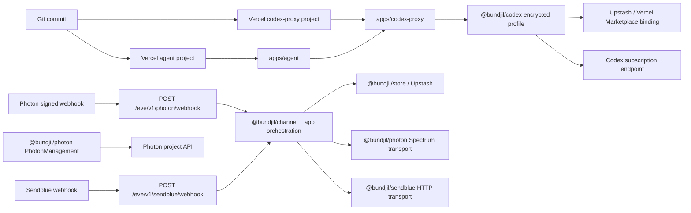
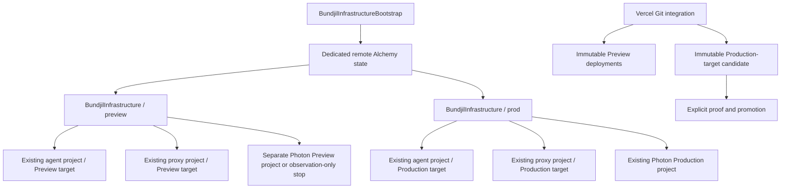

# Alchemy Infrastructure For Vercel And Photon

## Decision and intended outcome

Adopt a **hybrid Alchemy architecture** for Bundjil:

- Alchemy owns declared, convergent, stable configuration and drift detection
  for the existing Vercel agent and codex-proxy projects and the accepted
  Photon Channel management plane.
- Vercel Git integration continues to build immutable Preview and Production
  deployments. Promotion, rollback, alias traffic changes, and deployment
  health proof remain explicit app-owned runbook operations, not ordinary
  Alchemy reconciliation.
- Existing Vercel projects, domains, Upstash/Marketplace connections, Photon
  projects, users, webhooks, and storage are imported or adopted before any
  write is enabled. Production resources default to retain and delete
  protection.
- Preview and Production receive separate Alchemy state, profiles/credentials,
  replay namespaces, and desired manifests. Photon management writes in
  Preview are disabled until account readback proves a separately scoped
  Preview project and credential. The current dated one-project/two-webhook
  topology is a migration source, not proof that the target isolation exists.
- Repository proof, authenticated provider readback, Vercel deployment proof,
  and handset/channel proof remain distinct. No one class can substitute for
  another.

Alchemy does **not** natively support Vercel or Photon at the revalidation
point. Custom resources are therefore required for the selected stable
configuration boundaries. Alchemy's native Stack, Stage, state, Resource,
Provider, adoption, removal policy, plan, `sync`, and provider-test facilities
remain the lifecycle engine. A v2 provider implements `read`, `diff`, one
convergent `reconcile`, `delete`, and `list`; it does not implement separate
provider-level create and update hooks.

This SPEC and its sibling task ledger define implementation intent only. They
authorize no provider read, mutation, deployment, secret access, webhook
change, message, or Production operation.

## Accepted repository baseline

This SPEC was reviewed against `origin/main` after the Photon implementation
branch was merged:

```text
reviewed origin/main: 61992a2fe0525a80c5ecccdadf6f18e65fc6898c
Photon merge commit: 23ae79bfb3f383f7ff66f0698ac1ec49c51247fe
Photon parent:       7ddcdc514af5d3edee1b151575a3ce18226268bb
```

The current source now contains:

- `@bundjil/channel`, `@bundjil/photon`, and `@bundjil/sendblue`;
- independent Photon and Sendblue routes over the shared Channel contract;
- Photon management operations for iMessage platform state, Free shared users,
  and project webhooks;
- bounded Preview and Production receipts for the accepted dual-Channel
  rollout;
- app-owned Vercel, Photon, Sendblue, storage, deployment, proof, and rollback
  runbooks.

The dated
[Production receipt](../verification/channel-production-accepted-2026-07-23.md)
records one accepted historical observation. It is not current provider truth
or authority for this work.

## Truth and revalidation boundaries

| Layer               | Revalidated evidence                                                                                                                                                                                                                                                                                                                                                                                                                                      | Established conclusion                                                                                                                                                    | Explicit limit                                                                                                                                                                                               |
| ------------------- | --------------------------------------------------------------------------------------------------------------------------------------------------------------------------------------------------------------------------------------------------------------------------------------------------------------------------------------------------------------------------------------------------------------------------------------------------------- | ------------------------------------------------------------------------------------------------------------------------------------------------------------------------- | ------------------------------------------------------------------------------------------------------------------------------------------------------------------------------------------------------------ |
| Bundjil repository  | `origin/main` at `61992a2`; current architecture, harness-aligned proposed Eve runtime ownership SPEC, embedded structured harness contract, packages, runbooks, authority registers, proof contracts, and supporting research                                                                                                                                                                                                                            | Photon is implemented as a first-class Channel provider; two Vercel apps and their runtime Config contracts are repository truth                                          | No current Vercel, Photon, Upstash, DNS, secret, webhook, deployment, or handset state                                                                                                                       |
| Site reference      | `/Users/cooper/Projects/site` at `878d18de8af9a7a082df9f8395128e3aecc94b5b`, clean and nine commits behind its `origin/main`; manifest/lock pin Alchemy `2.0.0-beta.64`, while the existing `node_modules` resolution reports beta.63                                                                                                                                                                                                                     | Concrete Stack/Stage/state, provider Layer, Effect Config, adoption, Preview/Production service, proof, and rollback patterns                                             | The installed dependency tree is stale and was not used to establish beta.64 APIs; Site is not a Bundjil dependency or proof that Vercel/Photon providers exist                                              |
| Alchemy upstream    | npm `next` and the exact `2.0.0-beta.64` package tarball; [resource lifecycle](https://alchemy.run/infrastructure-as-code/resource-lifecycle/), [custom providers](https://alchemy.run/infrastructure-as-code/custom-provider/), [sync release](https://alchemy.run/blog/), and [provider testing](https://alchemy.run/concepts/testing)                                                                                                                  | Custom providers use typed `Resource` props/attributes and Layer-provided `read`/`diff`/`reconcile`/`delete`/`list`; `sync --dry-run` detects drift and `sync` repairs it | No native `Vercel` or `Photon` module/resource was found in package exports or source; the public CLI page has not yet added `sync` to its command map, so the pinned package source is the command contract |
| Vercel upstream     | [REST API](https://vercel.com/docs/rest-api), [projects](https://vercel.com/docs/projects), [environment variables](https://vercel.com/docs/environment-variables), [Marketplace](https://vercel.com/docs/integrations/create-integration/marketplace-api), and [deployments](https://vercel.com/docs/deployments/overview)                                                                                                                               | Stable project, domain, env, integration, webhook/drain, and deployment APIs exist; Vercel now documents endpoints that may decrypt env values under sufficient authority | Bundjil will not call value-decryption endpoints; tenant permissions, IDs, env metadata, rate limits, and current state still require authenticated metadata-only readback                                   |
| Photon upstream     | [API introduction](https://photon.codes/docs/api-reference/introduction), [webhook management](https://photon.codes/docs/webhooks/managing-webhooks), [users](https://photon.codes/docs/api-reference/users/create-user), [platforms](https://photon.codes/docs/api-reference/platforms/get-platforms), [lines](https://photon.codes/docs/api-reference/lines/add-a-dedicated-imessage-line), and [delivery](https://photon.codes/docs/webhooks/delivery) | Stable project-scoped webhook/user/line identities and platform readback exist; Free shared-user creation is semantically idempotent                                      | Project deletion/secret rotation are not complete public API lifecycles; dedicated line creation is billable and lacks a documented idempotency key; no alert-policy API exists                              |
| Live provider truth | Not queried in this SPEC turn                                                                                                                                                                                                                                                                                                                                                                                                                             | Nothing                                                                                                                                                                   | Every current provider, credential, deployment, billing, line, webhook, user, and handset claim                                                                                                              |

The supporting
[Alchemy ownership research](../research/alchemy-vercel-sendblue-decision-report.md)
retains the longer evidence trail. This SPEC supersedes its conditional
provider choice: Photon is now the selected Channel management plane for this
infrastructure design, while Sendblue remains runtime/runbook-owned and outside
new Alchemy ownership.

## Goals

1. Make intended stable infrastructure reviewable as Schema-decoded code and
   Alchemy plans.
2. Adopt existing resources without accidental creation, replacement,
   deletion, secret rotation, or traffic change.
3. Detect drift through provider readback and produce bounded, sanitized
   receipts.
4. Isolate Preview and Production state, credentials, storage namespaces, and
   Photon management.
5. Keep Vercel Git deployment/promotion and app-owned proof workflows intact.
6. Implement any custom provider through Effect-native services and Layers
   that are independently testable without live credentials.
7. Make every config, CLI, file, Alchemy state, provider HTTP, secret-binding,
   and receipt boundary name one canonical codec, its `Type` and `Encoded`
   sides, its single decode/encode owner, and its exact exception if a
   third-party primitive is unavoidable.
8. Prevent cross-provider, cross-resource, and cross-stage identity mixing
   through owner-named branded Schemas and closed literal contracts rather
   than raw or aliased `string` values.

## Structured harness alignment

This is a product decision grounded in repository and upstream research, not
an audit-derived correction campaign. It therefore has no accepted-finding
register or finding crosswalk. HGI-307 remains historical repository
qualification/accounting evidence and is not an implementation requirement,
provider receipt, or current worker-effectiveness claim.

One primary implementation trajectory owns the outcome from the offline
foundation through Production disposition and closeout. The sibling task
ledger encodes the dependency chain and records applicable invariant IDs on
every task. The following fixed harness invariants govern this work:

| Invariant                                | Application in this SPEC                                                                                                                                                                                                             |
| ---------------------------------------- | ------------------------------------------------------------------------------------------------------------------------------------------------------------------------------------------------------------------------------------ |
| `HC-OUTCOME-001`                         | One primary owner integrates the ordered task trajectory, proof, delivery, rollback readiness, and terminal receipt.                                                                                                                 |
| `HC-CTX-001`, `HC-CTX-002`, `HC-DOC-001` | Code/config, architecture, runbooks, active intent, dated proof, and external actuality keep distinct owners; implementation loads only the routed owner needed for the current task.                                                |
| `HC-REPO-001`, `HC-BOUNDARY-001`         | The accepted Effect/Schema/provider pattern becomes coherent in source, exports, tests, examples, static controls, and docs; unknown input decodes once and outward values encode once.                                              |
| `HC-TOOL-001`                            | The infrastructure CLI must support discovery, invocation, interpretation, recovery/repair, and boundary-matched real-system verification rather than returning a green wrapper result.                                              |
| `HC-PROOF-001`, `HC-EVIDENCE-001`        | Proof binds candidate, authority, environment, journey and claim; failed, blocked, deferred, no-op, superseded, and inconclusive outcomes remain addressable with non-claims and recovery.                                           |
| `HC-AUTH-001`                            | Capability, authenticated identity, operation authority, approval and provider actuality remain separate at every read, write, deployment and promotion edge.                                                                        |
| `HC-AUTO-001`, `HC-LIFETIME-001`         | Scheduled drift remains report-only until its signal, state, authority, convergence, proof, recovery, cost, review trigger and retirement are admitted as a structured control.                                                      |
| `HC-DEPENDENCY-001`                      | Alchemy beta, Vercel APIs, Photon APIs, remote state and any secret sink each require capability, trust, upgrade, incident, removal and lifetime owners before adoption.                                                             |
| `HC-METRIC-001`                          | Approach effectiveness uses accepted convergence/rollback outcomes and measured operator attention; command, file, finding, pass or worker counts are not success.                                                                   |
| `HC-FEEDBACK-001`                        | A repeated failure is promoted to the earliest Schema/API/test/runbook/control owner and weaker reminders are retired; no new standing control is created from a single speculative risk.                                            |
| `HC-EPOCH-001`                           | **N/A to the infrastructure outcome.** This SPEC makes no general claim that a worker or harness is more effective. A later such claim requires a new epoch bound to the then-current skills, target, tools, authority and scenario. |

The embedded contracts under
`.agents/skills/docs-maintainer/assets/harness/` are fixed compatibility
contracts, not optional prose prompts:

| Artifact                         | Required owner and use                                                                                                                                                                                                                                                  |
| -------------------------------- | ----------------------------------------------------------------------------------------------------------------------------------------------------------------------------------------------------------------------------------------------------------------------- |
| `critical-journey.schema.json`   | `docs/verification/critical-journeys.json` remains the current journey inventory. Add only the small infrastructure/operator journeys that implementation actually introduces, using stable IDs, and map them through `journey-command-map.json`.                       |
| `bounded-receipt.schema.json`    | `InfrastructureBoundedReceipt.Encoded` must validate against this fixed field contract before artifact persistence. The repository `proof-packet.schema.json` remains the outer claim-specific evidence owner; neither contract is replaced by a Markdown-only receipt. |
| `authority-envelope.schema.json` | Every live read or mutation task materializes this exact task-scoped envelope before execution. Long-lived capability rationale remains in `docs/operations/authority-register.json`; the envelope neither grants nor widens authority.                                 |
| `control-record.schema.json`     | Any scheduled drift/repair proposal maps to this complete control contract and the repository control/automation registers. Missing convergence, proof, recovery, cost, retirement or disconfirming evidence keeps the loop report-only or unadmitted.                  |

The implementation must provide Effect Schemas whose `Encoded` field sets are
compatible with these fixed JSON Schemas and test that compatibility against
the checked-in assets. Do not introduce a second task-local receipt, authority,
journey or control shape.

## Non-goals

- Replacing Vercel Git deployments, staged Production promotion, instant
  rollback, or app-owned deployment runbooks.
- Managing DNS records in the first rollout. Vercel domain attachments may be
  adopted; authoritative DNS remains read-only/outside IaC.
- Creating or deleting Upstash databases, Marketplace resources, Photon
  projects, dedicated lines, billing plans, or Sendblue accounts/lines.
- Migrating legacy Sendblue implementation behavior into the new
  infrastructure package.
- Sending a message, simulating handset delivery, or using Alchemy as a Channel
  runtime.
- Storing plaintext credentials, phone numbers, message content, webhook
  signing secrets, or sensitive environment values in Alchemy state or proof.
- Creating a generic provider SDK wrapper, `common`, `shared`, `helpers`, or
  `utils` package.

## Current call graph and ownership



| Concern                     | Repository owner                                      | External owner               | Alchemy target                                                                          |
| --------------------------- | ----------------------------------------------------- | ---------------------------- | --------------------------------------------------------------------------------------- |
| Agent project/build         | `apps/agent`, `apps/agent/vercel.json`                | Vercel                       | Adopt project/settings/env/domain metadata; never deploy in ordinary reconcile          |
| Proxy project/build         | `apps/codex-proxy`, its `vercel.json`                 | Vercel                       | Same, with independent auth/storage configuration                                       |
| Agent-to-proxy URL/auth     | app Config and deployment runbooks                    | Vercel env/protection        | Coordinated env declarations using one external secret revision                         |
| Photon runtime              | `@bundjil/photon`, agent route, Channel runtime       | Photon Spectrum SDK/webhooks | No runtime ownership; management resources only                                         |
| Photon management           | `@bundjil/photon` management service and runbook      | Photon project API           | Adopt project; manage approved platform/user/webhook resources through custom resources |
| Sendblue runtime/management | `@bundjil/sendblue` and app runbook                   | Sendblue                     | Outside new Alchemy scope; observe only where required for rollback continuity          |
| Replay/profile persistence  | `@bundjil/store`, `@bundjil/codex`, app Config        | Upstash/Marketplace          | Import/read binding and namespace metadata; retain data resource                        |
| Deployment/promotion        | app runbooks and Vercel Git integration               | Vercel                       | Read-only deployment observation                                                        |
| Authority and proof         | authority registers, runbooks, verification contracts | target operator/provider     | Alchemy plan is evidence, never authority                                               |

## Native support and verified gaps

| Capability                                                                                            | Native Alchemy support                                                                                                          | Required Bundjil owner                                                                                                     |
| ----------------------------------------------------------------------------------------------------- | ------------------------------------------------------------------------------------------------------------------------------- | -------------------------------------------------------------------------------------------------------------------------- |
| Stack, Stage, outputs, resource identity, plan, adoption, removal policy, replacement, provider tests | Yes, core Alchemy                                                                                                               | Root stack plus private `@bundjil/infrastructure` tooling                                                                  |
| Drift detection/repair                                                                                | Yes: pinned beta.64 includes `alchemy sync --dry-run` and `alchemy sync`; provider `read` observes tracked resources            | Use native sync behind a Bundjil receipt/authority edge; do not invent a parallel drift engine                             |
| Remote state                                                                                          | Native state interfaces and provider-backed implementations exist; Site proves `Cloudflare.state()`                             | Separate bootstrap task and credential boundary; local state only during the no-write POC                                  |
| Custom lifecycle                                                                                      | `read`, `diff`, convergent `reconcile`, `delete`, required exhaustive `list`, optional `precreate`; providers are Effect Layers | Schema-derived props/attributes and provider Layers in `@bundjil/infrastructure`; named transport services remain separate |
| Vercel projects/settings/domains/env/Marketplace/webhooks/drains                                      | No native provider found in the exact beta.64 package                                                                           | Custom Vercel resources and private Effect transport services inside `@bundjil/infrastructure`                             |
| Vercel deployments/promotion/rollback                                                                 | APIs exist, but ordinary resource convergence is the wrong ownership model                                                      | Git integration and app runbooks; custom observation only                                                                  |
| Photon project bootstrap/delete/secret rotation                                                       | No native provider; public management API exposes project read/profile but not complete project create/delete/rotation          | Imported retained identity; bootstrap/rotation remains dashboard/CLI/runbook-owned                                         |
| Photon platform/shared-user lifecycle                                                                 | No native provider; public API and stable user IDs exist                                                                        | Custom resources consuming the rewritten `@bundjil/photon/management` boundary                                             |
| Photon webhook lifecycle                                                                              | No native provider; stable IDs and create/delete exist, but signing secret is create-only                                       | Read/import first; mutation stays disabled until an owner-specific binding sink and cutover/rollback contract pass         |
| Photon dedicated lines and billing                                                                    | No native provider; line CRUD and billing readback exist, but creation is Business-only, billable, and has no idempotency key   | Read-only inventory in this SPEC; separately authorized future extension only                                              |
| Photon alert policies/persistent delivery log/DLQ                                                     | No documented management API                                                                                                    | Bundjil runtime metrics and external monitoring; no fake IaC resource                                                      |
| Sendblue account/line lifecycle                                                                       | No native provider and incomplete safe lifecycle                                                                                | Existing provider/runbook ownership; no new custom resource                                                                |

No custom resource is permitted merely because an API endpoint exists. A
resource needs stable identity, complete readback, a safe update/delete
contract, explicit secret behavior, and tests for uncertain outcomes.

## Package and stack structure

```text
alchemy.run.ts
stacks/
  bundjil.ts
  bootstrap.ts
packages/infrastructure/
  README.md
  package.json
  src/
    schemas.ts
    errors.ts
    service.ts
    live.layer.ts
    memory.layer.ts
    adoption-manifest.ts
    secret-reference.ts
    receipt.ts
    providers.ts
    __testing__/
      fixtures.ts
    vercel/
      schemas.ts
      errors.ts
      service.ts
      live.layer.ts
      memory.layer.ts
      resources/
        project.resource.ts
        environment-variable.resource.ts
        domain.resource.ts
        marketplace-binding.resource.ts
        deployment-observation.resource.ts
      providers.ts
    photon/
      schemas.ts
      errors.ts
      resources/
        project-observation.resource.ts
        platform.resource.ts
        shared-user.resource.ts
        webhook-observation.resource.ts
        line-observation.resource.ts
        billing-observation.resource.ts
      providers.ts
  test/
    adoption-manifest.test.ts
    vercel/
    photon/
    stack.test.ts
```

`@bundjil/infrastructure` is a private repository tooling package. Applications
must not import it at runtime. Its package manifest exposes only the root
infrastructure contract, provider-owned `./vercel` and `./photon` composition
surfaces needed by the root stack, and an explicit `./testing` surface for
deterministic fixtures. Every export retains the repository's
`@bundjil/source`, `types`, and `default` conditions. It exports no raw client,
provider DTO, deep source path, generic live-layer registry, or app-owned
runtime binding.

The ownership boundary is deliberate:

- `@bundjil/photon` remains the sole Photon HTTP/SDK owner. Rewrite and expose a
  narrow `@bundjil/photon/management` subpath only for the named management
  service, canonical Schemas, operation-specific safe errors, lazy credential
  service, and explicit live/memory Layers required by Alchemy.
  `@bundjil/infrastructure` must not duplicate Photon URLs, Basic auth, DTOs,
  response decoding, or retry logic.
- Keep the Vercel client private under `@bundjil/infrastructure/vercel` because
  Alchemy is its only proved consumer. Do not create `@bundjil/vercel` until a
  second stable consumer exists.
- Alchemy resource lifecycle code belongs to `@bundjil/infrastructure`;
  provider transport code belongs to the provider owner. Stack topology stays
  at the root and contains no HTTP details.

Do not preserve the current proof-only management shape: it passes credentials
to a Layer factory, exposes primitive `URL`/`boolean` operations and raw phone
fields, and collapses every failure into `PhotonProviderProofError`. Replace it
with a constant live Layer that requires a lazy
`PhotonManagementCredentials` service and `HttpClient`. Every public operation
accepts one owner-named request Schema `Type` and returns one owner-named result
Schema `Type`; a naked `URL`, `boolean`, ID, object literal, provider DTO, or
array is not a public service contract. Phone values remain `Redacted`, and
observations expose only stable branded IDs and explicitly safe metadata.

This follows the repository `effect-client-wrapper` boundary: named operations,
immediate unknown-output decoding, provider-private raw clients, safe errors,
and explicit live/memory Layers. It also follows Alchemy's lazy-auth rule:
provider Layers are constructed before credentials are configured, so
credential Effects resolve only inside lifecycle operations.

## Deployment and state topology



Use exactly two persistent desired-state stages: `preview` and `prod`. Pull
requests run a read-only plan plus `sync --dry-run` against `preview`; they do
not apply shared Preview settings or create a stage per PR. A protected Preview
job may apply the shared Preview stage. Production uses a separately protected
job and credentials.

The no-write POC may use ignored local state. No Production adoption may begin
until `stacks/bootstrap.ts` provisions or adopts a dedicated remote state
backend under separate authority. Reuse the site's `Cloudflare.state()` pattern
only after a Bundjil-specific account/token and stack name are approved; never
reuse the site's state identity or credentials.

## Resource inventory

### Production

| Resource                   | Desired ownership                                                                                                                                                                            | Physical identity                                                   | Initial policy                                                                                                  |
| -------------------------- | -------------------------------------------------------------------------------------------------------------------------------------------------------------------------------------------- | ------------------------------------------------------------------- | --------------------------------------------------------------------------------------------------------------- |
| Alchemy stack/state        | Native Stack/Stage plus dedicated remote state                                                                                                                                               | stack `BundjilInfrastructure`, stage `prod`, backend identity       | Create/adopt only through bootstrap; protected                                                                  |
| Vercel agent project       | Custom `VercelProject`                                                                                                                                                                       | exact team ID + project ID                                          | Read/import, then manage approved settings; retain/protect                                                      |
| Vercel proxy project       | Custom `VercelProject`                                                                                                                                                                       | exact team ID + project ID                                          | Same                                                                                                            |
| Project settings           | project root, build/install/output/framework/function settings derived from both `vercel.json` files                                                                                         | project ID + canonical setting path                                 | In-place only where Vercel supports it; reject Git identity replacement                                         |
| Production domains         | Custom `VercelProjectDomain` attachments                                                                                                                                                     | project ID + normalized domain                                      | Import/read first; retain; DNS read-only                                                                        |
| Agent model/Executor env   | `BUNDJIL_AGENT_MODEL_PROVIDER`, `BUNDJIL_AGENT_MODEL`, `BUNDJIL_EXECUTOR_MCP_URL`, `BUNDJIL_EXECUTOR_API_KEY`                                                                                | project + key + `production` target                                 | Key/type/target owned; value by external secret revision                                                        |
| Agent-to-proxy env         | `BUNDJIL_CODEX_PROXY_BASE_URL`, `BUNDJIL_CODEX_PROXY_MODEL`, `BUNDJIL_CODEX_PROXY_CONTEXT_WINDOW_TOKENS`, `BUNDJIL_CODEX_PROXY_INTERNAL_TOKEN`, optional `BUNDJIL_CODEX_PROXY_VERCEL_BYPASS` | project + key + `production`                                        | URL/metadata managed; current bearer observed by reference only; rotation blocked while proxy accepts one token |
| Channel routing/replay env | all `BUNDJIL_CHANNEL_ROUTING_*` and `BUNDJIL_CHANNEL_REPLAY_*` keys                                                                                                                          | project + key + `production`                                        | Separate Production namespace and secret revisions                                                              |
| Photon runtime env         | `BUNDJIL_CHANNEL_PHOTON_PROJECT_ID`, project secret, webhook ID/secret, tolerance                                                                                                            | project + key + `production`                                        | External values; IDs/revisions only in Alchemy state                                                            |
| Sendblue runtime env       | all `BUNDJIL_CHANNEL_SENDBLUE_*` keys                                                                                                                                                        | project + key + `production`                                        | Metadata may be inventoried; values and provider resources remain runbook-owned                                 |
| Proxy config/auth env      | proxy mode, model/reasoning, internal token, profile/connector/installation/subject/account, encryption and refresh settings                                                                 | proxy project + key + `production`                                  | Metadata/references owned; cipher rotation app-runbook-owned; shared bearer rotation blocked                    |
| Replay store binding       | existing Upstash/Marketplace resource and Channel prefix                                                                                                                                     | configuration/resource/database IDs                                 | Import/read/retain; never create from an env alias                                                              |
| Profile store binding      | existing Upstash/Marketplace resource and profile prefix                                                                                                                                     | configuration/resource/database IDs                                 | Import/read/retain; preserve fenced profile data                                                                |
| Photon project             | custom retained `PhotonProjectObservation`                                                                                                                                                   | reviewed project ID                                                 | Import/read; no create/delete/secret rotation                                                                   |
| Photon iMessage platform   | custom `PhotonPlatformConfiguration`                                                                                                                                                         | project ID + named `PhotonPlatform` literal `imessage`              | Read, adopt, in-place enable/metadata diff                                                                      |
| Photon shared user         | custom `PhotonSharedUser`                                                                                                                                                                    | project ID + stable user UUID; sensitive semantic key kept redacted | Adopt exact approved user; soft delete only if rollout-created and separately authorized                        |
| Photon Production webhook  | custom `PhotonWebhookObservation`                                                                                                                                                            | project ID + webhook UUID                                           | Adopt exact URL/ID; retain/protect; no mutation until binding-sink and cutover proof                            |
| Photon lines               | `PhotonLineObservation`                                                                                                                                                                      | project ID + stable line IDs                                        | Read-only; assert accepted Free topology has zero dedicated lines                                               |
| Photon billing             | `PhotonBillingObservation`                                                                                                                                                                   | project ID                                                          | Read-only; no plan mutation                                                                                     |
| Vercel deployment          | `VercelDeploymentObservation`                                                                                                                                                                | deployment ID + Git SHA + target                                    | Read-only; no create/delete                                                                                     |
| Monitoring                 | drift receipt plus existing safe app/provider metrics                                                                                                                                        | stage + resource ID + observation time                              | Report-only until an alert API/owner is selected                                                                |

### Preview

| Resource                 | Desired ownership                                                                          | Isolation rule                                                                                                              |
| ------------------------ | ------------------------------------------------------------------------------------------ | --------------------------------------------------------------------------------------------------------------------------- |
| Alchemy stage            | `BundjilInfrastructure / preview`                                                          | Separate state and provider credentials from `prod`                                                                         |
| Vercel projects/settings | same existing two projects, `preview` target                                               | Never mutate Production targets from Preview or PR jobs                                                                     |
| Preview domains          | Vercel-generated deployment URLs; optional imported Preview alias                          | No Production custom-domain or DNS write                                                                                    |
| Agent/proxy env          | Preview-only URL, internal token, bypass, model, Channel routing and storage values        | Must not equal Production secret references or replay/profile prefixes; token rotation is not implied                       |
| Upstash bindings         | imported Preview connection and prefixes                                                   | Physical DB may be shared only after exact database and namespace review; destructive ownership remains disabled            |
| Photon project           | separate Preview project and project secret                                                | Until proved, Photon Preview apply stops before provider writes; current shared project is observation-only migration state |
| Photon platform/user     | approved synthetic Preview user in Preview project                                         | No Production user identity, assignment, or credential reuse                                                                |
| Photon webhook           | one exact Preview callback observation; mutation is a gated spike                          | Separate signing secret and webhook ID; create/delete requires proved binding sink, deployment cutover, and retry drain     |
| Photon lines/billing     | read-only; zero dedicated lines expected                                                   | No billable line creation                                                                                                   |
| Deployment observation   | immutable PR/Preview deployment IDs                                                        | Observation only; PR closure removes no project/provider resource                                                           |
| Proof                    | plan, provider readback, deployment health/auth, isolated signed ingress and Channel proof | Sanitized artifact; no Production or handset inference                                                                      |

If a separate Free Photon Preview project cannot be created or cannot host an
isolated approved user, the accepted fallback is **no live Photon Preview
management or webhook**. Sharing the Production project is not an isolation
fallback.

## Canonical Schema and Effect contracts

Every exported request, result, resource props, resource attributes, manifest,
state-safe value, config value, command input, and receipt declares one
canonical Effect Schema plus its decoded and encoded types. Provider wire
Schemas remain private to the exact live adapter.

```ts
export const VercelProjectId = Schema.NonEmptyString.pipe(
  Schema.brand("@bundjil/infrastructure/VercelProjectId")
);
export type VercelProjectId = typeof VercelProjectId.Type;
export type VercelProjectIdEncoded = typeof VercelProjectId.Encoded;

export const InfrastructureStage = Schema.Literals(["preview", "prod"]);
export type InfrastructureStage = typeof InfrastructureStage.Type;
export type InfrastructureStageEncoded = typeof InfrastructureStage.Encoded;

export const SecretOwner = Schema.NonEmptyString.pipe(
  Schema.brand("@bundjil/infrastructure/SecretOwner")
);
export const SecretReferenceId = Schema.NonEmptyString.pipe(
  Schema.brand("@bundjil/infrastructure/SecretReferenceId")
);
export const SecretRevision = Schema.NonEmptyString.pipe(
  Schema.brand("@bundjil/infrastructure/SecretRevision")
);
export const SecretReference = Schema.Struct({
  owner: SecretOwner,
  reference: SecretReferenceId,
  revision: SecretRevision,
});
export type SecretReference = typeof SecretReference.Type;
export type SecretReferenceEncoded = typeof SecretReference.Encoded;

export const SecretOwnership = Schema.Union([
  Schema.TaggedStruct("Managed", { reference: SecretReference }),
  Schema.TaggedStruct("ObservedUnknown", {
    configured: Schema.Literal(true),
  }),
  Schema.TaggedStruct("Absent", {}),
]);
export type SecretOwnership = typeof SecretOwnership.Type;
export type SecretOwnershipEncoded = typeof SecretOwnership.Encoded;
```

The string-contract classification is mandatory:

- Brand open semantic identities that are valid beyond one closed vocabulary:
  Vercel team/project/env/deployment/integration/configuration/resource/database
  IDs, environment keys and branch selectors, canonical domains, Photon
  project/webhook/user/line IDs, Alchemy logical/physical IDs, Git SHAs, state
  revisions, secret owners/references/revisions, manifest digests, and
  provider idempotency keys. Brands use the owner-qualified
  `@bundjil/<package>/<Name>` identity.
- Use named literal Schemas for closed vocabularies: infrastructure stage,
  Vercel target and env type, plan/apply/adopt mode, provider, platform,
  resource kind, lifecycle operation, ownership state, diff class, outcome
  certainty, retry class, removal policy, and proof result. Material branching
  uses the decoded discriminant through `Match` or Effect tagged-error
  operators.
- Use owner-named URL/domain/path/timestamp/duration codecs for transport
  values. A `URL`, path, timestamp, duration, key, domain, or integer must not
  appear naked in a public service signature when its semantic role can be
  confused with another value.
- Use owner-named checked text Schemas for bounded diagnostics. Do not brand
  diagnostics or content merely because their encoded representation is a
  string.
- Use owner-named `Schema.Redacted` contracts for secrets and phone identities.
  Do not reveal a secret to add a brand. State contains only the decoded
  `SecretOwnership` union, never an optional string/boolean convention.

Cross-brand assignment is a compile-time error: a `PhotonProjectId` cannot be
passed as a `VercelProjectId`; a `VercelDeploymentId` cannot be used as a
`VercelProjectId`; a Preview state revision cannot be accepted where a
Production adoption-manifest identity is required. Any deliberate conversion
is a named, Schema-backed boundary operation with focused tests, not an
assertion or cast. Composite physical identities are owner-named Struct
Schemas over branded components, such as
`VercelEnvironmentVariablePhysicalIdentity`; they are never delimiter-joined
strings or hashes used as a substitute for the component contract.

### Boundary codec matrix

| Boundary                                    | Canonical codec and decoded owner                                                                                                                                          | Inbound decode                                                                                                                                                            | Outbound encode                                                                                                                                                        | Forbidden escape                                                                                                                                                    |
| ------------------------------------------- | -------------------------------------------------------------------------------------------------------------------------------------------------------------------------- | ------------------------------------------------------------------------------------------------------------------------------------------------------------------------- | ---------------------------------------------------------------------------------------------------------------------------------------------------------------------- | ------------------------------------------------------------------------------------------------------------------------------------------------------------------- |
| Environment/config                          | Owner-named config Schemas; decoded config `Type`; secrets `Redacted`                                                                                                      | `Config.schema` in the config Layer; no `process.env` read below it                                                                                                       | Reveal a redacted value only at immediate header/SDK/secret-binding assignment                                                                                         | Primitive `Config.string`, `Config.url`, unredacted token, or Layer factory parameters                                                                              |
| CLI arguments                               | `InfrastructureCommandInput` plus named stage/mode/manifest codecs and fixed-compatible `InfrastructureBoundedReceipt`                                                     | One executable-edge `Schema.decodeUnknownEffect` after argument parsing                                                                                                   | `Schema.encodeEffect(InfrastructureBoundedReceipt)` and fixed-contract validation before stdout/file                                                                   | Passing raw `string[]`, stage strings, option bags or a task-local receipt shape into services                                                                      |
| Adoption manifest/file                      | `Schema.fromJsonString(AdoptionManifest)` with branded logical/physical IDs, stage and digest                                                                              | Read bounded text once, then `Schema.decodeUnknownEffect` at the file adapter                                                                                             | `Schema.encodeEffect` through the JSON-string codec before any generated manifest write                                                                                | `JSON.parse`, `JSON.stringify`, hand-written readers, casts, or optional semantic fields                                                                            |
| Alchemy Resource props/attributes           | Separate `*Props` and state-safe `*Attributes` Schemas with exported `Type`/`Encoded`; no secret-bearing attribute variant                                                 | Resource constructors and provider lifecycle accept decoded `Type`; any imported persisted or test value is decoded once at its owning state/fixture ingress              | Alchemy owns native state serialization; every Bundjil-generated state projection first crosses the attributes codec and every explicit state/fixture write encodes it | Raw provider DTOs, unbranded physical IDs, secret values, phone/content fields, or duplicated resource-local shapes                                                 |
| Provider HTTP request                       | Private provider request codec composed from decoded domain request `Type`                                                                                                 | Domain services already receive decoded owner request `Type`                                                                                                              | `HttpClientRequest.schemaBodyJson` or `Schema.encodeEffect` immediately before URL/query/header/body assignment                                                        | Raw body strings, generic request records, provider DTO types in public signatures, or unchecked interpolation                                                      |
| Provider HTTP status/headers/body           | One complete private response envelope codec plus safe rate/retry metadata codecs                                                                                          | `HttpClientResponse.schemaJson`, `Schema.decodeUnknownEffect`, or `Schema.decodeEffect` only when the SDK statically returns the exact `Encoded`; decode immediately once | No provider response is re-encoded outward; map decoded fields into the canonical domain result `Type` inside the same named operation                                 | Returning `unknown`, SDK/provider DTOs, raw headers/body/error/cause, partial field reads before complete decoding, or double decoding                              |
| Photon webhook binding sink                 | `PhotonWebhookBindingWrite`, redacted secret payload, and `SecretReference` result                                                                                         | Service receives the decoded write `Type`; selected sink adapter decodes any external acknowledgement                                                                     | Encode only the sink provider's private request and the safe reference/revision result                                                                                 | Generic secret callback, returned secret, plaintext intermediate object, or second webhook create after an uncertain sink outcome                                   |
| Inventory/plan/sync receipt and observation | Owner-named sanitized receipt/observation Schemas with branded/fingerprinted identity, literal result classes, `observedAt`, limitations, non-claims and rollback identity | Decode provider/state input at the earlier owning boundary; receipt construction uses decoded values only                                                                 | `Schema.encodeEffect` before JSON/stdout/file/artifact persistence                                                                                                     | Raw `JSON.stringify`, IDs where fingerprints are required, provider bodies, phones, values, messages, queries, raw errors, or claiming an encoded file proves truth |
| Tests/fixtures                              | The same production codecs plus package-owned `src/__testing__` fixture contracts                                                                                          | Decode fixture encoded forms at the test adapter; malformed fixtures remain encoded unknown input                                                                         | Encode golden/state/receipt fixtures with the production codec                                                                                                         | Constructing provider/domain DTO mirrors, bypassing codecs with casts, or letting memory Layers accept a different shape                                            |

No value is decoded merely because it crosses an internal function. Decode
once where trust changes, pass only `typeof Contract.Type` through services and
resources, and encode once immediately before an outward write. A third-party
signature that unavoidably requires a primitive is confined to one exact live
adapter symbol and must gain an occurrence-specific entry in
`tooling/boundary-exceptions.ts`; no exception may widen a public contract.

### Config

Use `Config.schema` at each owning ingress for:

- stage and stack name;
- adoption manifest path/digest and plan/apply mode;
- remote state account and redacted token;
- secret references and redacted resolved values;
- explicit destructive policy.

Vercel and Photon credentials use separate lazy `Context.Service` values whose
payload is an Effect produced by `Config.schema`. Provider handlers double-yield
the credential Effect only when an operation needs it; constructing the
provider collection, loading a stack, or planning a resource that does not use
that provider must not reveal or require credentials. Secrets use
`Schema.Redacted`. Config errors are safe tagged errors and never include
values, provider bodies, headers, URLs with queries, phone numbers, or raw SDK
errors.

### Services and Layers

Required services expose named operations, not raw clients:

```ts
export const ObserveVercelProject = Schema.Struct({
  projectId: VercelProjectId,
  teamId: VercelTeamId,
});
export type ObserveVercelProject = typeof ObserveVercelProject.Type;

export const ReconcileVercelProject = Schema.Struct({
  desired: VercelProjectDesired,
  projectId: Schema.optional(VercelProjectId),
});
export type ReconcileVercelProject = typeof ReconcileVercelProject.Type;

export const VercelProjectObservation = Schema.Struct({
  projectId: VercelProjectId,
  settings: VercelProjectSettings,
  teamId: VercelTeamId,
});
export type VercelProjectObservation = typeof VercelProjectObservation.Type;

export const DeleteVercelProject = Schema.Struct({
  projectId: VercelProjectId,
  teamId: VercelTeamId,
});
export type DeleteVercelProject = typeof DeleteVercelProject.Type;

export const DeletedVercelProject = Schema.Struct({
  projectId: VercelProjectId,
});
export type DeletedVercelProject = typeof DeletedVercelProject.Type;

class VercelProjects extends Context.Service<
  VercelProjects,
  {
    readonly observeProject: (
      input: ObserveVercelProject
    ) => Effect.Effect<VercelProjectObservation, VercelProjectReadError>;
    readonly reconcileProject: (
      input: ReconcileVercelProject
    ) => Effect.Effect<VercelProjectObservation, VercelProjectWriteError>;
    readonly deleteProject: (
      input: DeleteVercelProject
    ) => Effect.Effect<DeletedVercelProject, VercelProjectDeleteError>;
  }
>()("@bundjil/infrastructure/VercelProjects") {}
```

Use separate named services where operation/rate/secret semantics differ:
`VercelProjects`, `VercelEnvironmentVariables`, `VercelDomains`,
`VercelMarketplaceBindings`, and `VercelDeployments`. Photon reuses or extends
`PhotonManagement`; do not expose its underlying `HttpClient`.

Each operation accepts exactly one decoded request Schema `Type` and returns
one decoded result Schema `Type`, including operations that appear to need only
an ID or boolean. Collections, delete results, availability, platform state,
pagination cursors, and empty success are owner-named Schemas rather than
naked arrays, booleans, `void`, tuples, or object literals. This keeps the same
codec available to the live Layer, memory Layer, resource provider, fixtures,
and proof without a parallel DTO or mapper.

Each service has explicit constant live and deterministic memory Layers.
Configuration Layers are separately composed at the executable edge; the
transport Layer is not a factory that accepts raw credentials. Memory Layers
record the same decoded request/result contracts as live Layers and can
simulate pagination, `404`, `409`, `429`, transient `5xx`,
timeout-before-write, timeout-after-write, eventual consistency, and partial
failure.

Errors are operation-specific tagged classes with only:

- named literal operation and resource-kind values;
- safe provider code/status;
- named retry classification;
- a tagged outcome-certainty union;
- an owner-named bounded sanitized diagnostic.

Do not use `instanceof`, generic `ProviderError`, unchecked SDK output,
primitive semantic strings, arbitrary callbacks, or helper wrappers. Primary
Effects remain lazy, flat, linear, sequential, and named. One-use mapping,
decoding, and error translation stay inline.

## Call graphs

### Production plan/apply

```text
protected workflow
  -> task authority adapter validates fixed AuthorityEnvelope.Encoded
  -> Config.schema decodes stage/profile/credentials
  -> adoption file adapter decodes AdoptionManifest.Encoded once
  -> Alchemy Stack("BundjilInfrastructure", stage="prod")
  -> custom Provider collection Layers
  -> lazy provider credential Effects
  -> read/import resources missing from state
  -> provider live adapter encodes request and decodes full response once
  -> named services return decoded request/result Types
  -> compare decoded desired props with persisted props through diff
  -> emit sanitized plan
  -> approval gate rejects unapproved create/replace/delete
  -> reconcile approved stable configuration through observe -> ensure -> sync
  -> provider readback
  -> return state-safe branded Attributes Type to Alchemy
  -> alchemy sync --dry-run detects remaining live drift
  -> Vercel Git builds immutable deployments
  -> app runbooks prove candidate and promote
  -> receipt adapter Schema-encodes each proof class separately
  -> fixed bounded-receipt compatibility validation
  -> repository proof-packet wrapper for retained evidence
```

### Test

```text
encoded fixture input
  -> fixture adapter decodes production codec
  -> fixed journey/receipt/authority/control compatibility fixtures
  -> memory Vercel/Photon Layers
  -> Alchemy provider test harness
  -> read/diff/reconcile/delete/list
  -> create/update/replace/no-op plan classifications
  -> adoption/no-op/drift/timeout/partial-failure/retain assertions
  -> production codec encodes golden/state/receipt output
  -> state/plan/error/log leak scans
```

### CLI

```text
future root command
  -> CLI adapter decodes InfrastructureCommandInput.Encoded once
  -> authority adapter validates the task-scoped fixed envelope
  -> stage/mode Config Layer
  -> named inventory or receipt Effect
  -> pinned Alchemy plan/deploy/sync command
  -> receipt adapter encodes InfrastructureBoundedReceipt.Type once
  -> fixed bounded-receipt validation before stdout/file persistence
  -> exit nonzero on unsafe plan, unavailable readback, or uncertain outcome
```

### Photon runtime versus management

```text
Alchemy Photon resource
  -> decoded Photon management request Type
  -> PhotonManagement named operation
  -> private request codec encode
  -> Photon management API
  -> full response envelope decode
  -> decoded observation Type with branded identity

signed webhook
  -> agent Photon route
  -> Channel replay/routing/Eve
  -> @bundjil/photon Spectrum send/typing
```

Alchemy never sends messages. Channel runtime never creates/deletes provider
management resources.

## Custom resource lifecycle contract

All custom resources implement the pinned Alchemy v2 contract:

The resource constructor, `Props`, `Attributes`, physical identity, diff, and
list result each have an owner-named Schema. Lifecycle handlers receive only
their decoded `Type` values and do not decode them again. They call named
services with decoded request `Type`s; only the live adapter encodes provider
requests and decodes complete provider responses. Returned Attributes are
state-safe by construction and contain no generic `id: string`, provider DTO,
secret, phone/content value, or optional-string ownership convention.

1. `list`: paginate exhaustively and return the same decoded Attributes shape
   used by `read`; never omit pages merely because Bundjil expects few records.
2. `read`: observe by deterministic identity or persisted stable ID and return
   missing, owned, or `Unowned(attributes)`. An ambiguous match is a hard
   failure, not `undefined`.
3. `diff`: compare desired props with persisted props and classify no-op,
   in-place update, or replacement. `diff` does not claim live drift detection.
4. `reconcile`: one flat observe → ensure → sync → fresh-attributes Effect for
   greenfield, adoption, and update. It trusts provider readback rather than
   branching into separate create/update programs.
5. `delete`: idempotent missing-is-success, but protected resources use native
   `defaultRemovalPolicy: "retain"`/`retain()` plus a Bundjil destructive
   policy gate before any provider deletion.
6. `import/adopt`: a reviewed physical identity returning
   `Unowned(attributes)` requires `--adopt`. `alchemy plan --adopt` mutates
   neither provider nor state; `alchemy deploy --adopt` persists state and
   invokes `reconcile`, which must observe and return without a provider write
   when the adopted resource already matches.
7. `sync`: `alchemy sync --dry-run` calls `read` for tracked resources and
   reports missing/drifted/unchanged without repair. An approved `alchemy sync`
   re-observes and calls `reconcile`; ordinary `alchemy plan` is not a drift
   check.

Illustrative provider pseudocode:

```ts
export const VercelProjectProvider = Provider.succeed(
  VercelProject,
  VercelProject.Provider.of({
    read: Effect.fn("VercelProjectProvider.read")(function* ({ olds, output }) {
      const projects = yield* VercelProjects;
      return yield* projects.observe({ desired: olds, physicalId: output?.id });
    }),
    diff: Effect.fn("VercelProjectProvider.diff")(function* ({ news, olds }) {
      return yield* classifyVercelProjectDiff({
        desired: news,
        previous: olds,
      });
    }),
    reconcile: Effect.fn("VercelProjectProvider.reconcile")(function* ({
      news,
      output,
    }) {
      const projects = yield* VercelProjects;
      const observed = yield* projects.observe({
        desired: news,
        physicalId: output?.id,
      });
      return yield* projects.ensureAndSync({ desired: news, observed });
    }),
    delete: Effect.fn("VercelProjectProvider.delete")(function* ({ output }) {
      const projects = yield* VercelProjects;
      return yield* projects.deleteIfPresent(output.id);
    }),
    list: Effect.fn("VercelProjectProvider.list")(function* () {
      const projects = yield* VercelProjects;
      return yield* projects.listAllPages();
    }),
  })
);
```

The outer Alchemy API names above are verified against the beta.64 package.
Domain request/attribute names remain pseudocode and must be derived from the
owning Schemas rather than copied verbatim.

### Per-resource rules

| Resource                      | Stable physical identity/import                            | Update/diff                                                                       | Replacement/delete                                                                                                                   |
| ----------------------------- | ---------------------------------------------------------- | --------------------------------------------------------------------------------- | ------------------------------------------------------------------------------------------------------------------------------------ |
| `VercelProject`               | exact team + project ID; name lookup only for discovery    | approved root/build/framework/settings in place                                   | team/Git identity change rejected; Production retain/protect                                                                         |
| `VercelProjectDomain`         | project ID + normalized domain                             | attach then poll verification; DNS observed                                       | cross-project move is replacement; retain Production                                                                                 |
| `VercelEnvironmentVariable`   | provider env ID or project + key + sorted targets + branch | key/type/targets plus managed `SecretReference`; value resolved only at reconcile | update in place where supported; external custody retains prior revision for rollback; unknown legacy values remain observation-only |
| `VercelMarketplaceBinding`    | integration/configuration/resource/database IDs            | first slice read/import only; later attachment only after exact API proof         | always retain; no database create/delete                                                                                             |
| `VercelDeploymentObservation` | immutable deployment ID + Git SHA                          | read target/status/aliases/provenance only                                        | no-op retain                                                                                                                         |
| `PhotonProjectObservation`    | reviewed project ID                                        | profile/config read only                                                          | retain; no project create/delete/secret rotation                                                                                     |
| `PhotonPlatformConfiguration` | project ID + `imessage`                                    | in-place enable/metadata; read until visible                                      | restore prior state only if this rollout changed it                                                                                  |
| `PhotonSharedUser`            | project ID + stable user UUID; semantic phone key redacted | documented idempotent shared upsert, then exact UUID readback                     | soft delete only for rollout-created user under separate authority; adopted user retained                                            |
| `PhotonWebhookObservation`    | project ID + webhook UUID; discover exact canonical URL    | read URL/config; signing state is `unknown` or a managed reference/revision       | retain; create/rotation/delete disabled until binding sink and deployment cutover prove no secret-loss window                        |
| `PhotonLineObservation`       | project ID + line UUID                                     | read routing/profile/subscription only                                            | no create/delete in this SPEC                                                                                                        |
| `PhotonBillingObservation`    | project ID                                                 | read-only status                                                                  | no-op retain                                                                                                                         |

### Timeouts, retries, and eventual consistency

- Honor provider rate headers and `Retry-After`; Photon management is bounded
  to its documented five requests per second per project.
- Retry bounded `429`, documented transient `5xx`, timeout before a response,
  and eventual-consistency reads with exponential backoff and jitter.
- Never blindly retry a non-idempotent or billable write after a timeout.
  Return `OutcomeUncertain`, observe by exact identity, and require an explicit
  recovery decision where observation cannot disambiguate.
- A successful remote write followed by state-write failure is a partial
  failure. Preserve the remote resource, record its stable identity where
  safely recoverable, and rerun observe-first. Do not create a second resource.
- Missing-on-delete is success; ambiguous matches are a hard stop.

## Secret and state contract

Alchemy state and ordinary artifacts may contain:

- stable resource IDs;
- stage and target;
- decoded `SecretOwnership` tagged values containing either a managed
  owner/reference/revision, `ObservedUnknown`, or `Absent`;
- canonical non-sensitive metadata;
- sanitized observation/diff/result classes.

They must not contain:

- Vercel, Photon, Sendblue, Upstash, Executor, OpenAI, or GitHub tokens;
- Photon project or webhook signing secrets;
- sensitive environment values;
- phone numbers, assigned numbers, message/Space IDs, content, contacts, or
  provider response bodies;
- auth headers, URL query secrets, raw errors, stacks, prompts, tool data, or
  profile plaintext.

Existing write-only values with no proved custody record are
the `ObservedUnknown` variant, not assigned a fabricated revision or expressed
as an optional string plus boolean. Alchemy may own their key/type/target
metadata while value ownership remains blocked. A protected apply resolves
only the `Managed` variant through an owner-specific Config/credential Layer.
Vercel's documented decrypt endpoints remain forbidden to this workflow.

Before any Bundjil-owned state projection, fixture, plan receipt, or manifest
is written, it is encoded through its canonical `Encoded` contract. On read,
that same artifact is decoded once before policy decisions. Alchemy's native
state engine owns its own serialization; Bundjil does not bypass it with
manual JSON or place values outside the declared Attributes Schema.

The current agent and proxy each accept one
`BUNDJIL_CODEX_PROXY_INTERNAL_TOKEN`. Therefore Alchemy must not attempt a
zero-downtime cross-project bearer rotation: no transaction can make both old
deployments and both new deployments accept one in-place value change. Rotation
requires either a separately specified dual-token overlap contract or a
separately accepted bounded-downtime runbook. Until then, Alchemy observes the
existing reference and manages only URL/key/type/target metadata.

Photon webhook create/rotation remains disabled until an owner-specific
`PhotonWebhookBindingSink` and cutover contract are selected and tested. The
service accepts one Schema-decoded created binding, persists it directly to
the selected secret/Vercel binding owner before the resource returns, and
exposes only a reference/revision. It is not a generic callback or secret-store
facade. If the process fails after remote creation but before persistence,
observe the endpoint by URL/ID, classify the outcome as partial/uncertain,
retain it, and require explicit recovery. Never register another webhook
automatically. Production enablement additionally requires a plan for old/new
deployment signature compatibility and the provider retry horizon.

## Adoption and migration

1. **Freeze source identity.** Record the accepted Git SHA, current app
   project names/root settings, runtime Config key inventory, and rollback
   deployments without values.
2. **Build memory providers first.** All live writes are disabled. Contract
   tests prove lifecycle and leak rules.
3. **Run authorized read-only inventory.** Resolve exact Vercel team/project/
   domain/env/integration/deployment IDs, Upstash binding/database IDs, Photon
   project/platform/user/webhook/line/billing state, and current Preview/
   Production isolation.
4. **Create a sanitized adoption manifest.** Bind physical IDs, logical IDs,
   stage, resource class, deletion policy, and a SHA-256 of canonical observed
   metadata. Store secret references only.
5. **Plan with adoption enabled.** Every existing match without positive
   stack/stage/logical-ID ownership must be `Unowned` until the manifest digest
   and explicit adoption policy match. `alchemy plan --adopt` is
   side-effect-free. Stop on any unintended create, replace, or delete.
6. **Apply state adoption one class at a time.** Run a protected
   `alchemy deploy --adopt` for projects, domains, env metadata,
   Marketplace/Upstash observations, Photon project/platform/user/webhook
   observations, then deployments. The engine persists adopted state and calls
   `reconcile`; read/import mode must make that reconcile observe-only and
   reject every provider write.
7. **Prove desired-state and live-state no-op.** Require a no-op `alchemy plan`
   plus two consecutive `alchemy sync --dry-run` results of `unchanged` at the
   same provider snapshot.
8. **Enable narrowly scoped writes.** Preview non-secret Vercel settings first,
   then secret metadata/bindings, then separately isolated Photon Preview
   resources. Production follows only after accepted Preview and a reviewed
   zero-replacement plan.
9. **Retain migration sources.** Do not remove the current shared Photon
   Preview webhook/project relationship until a separate Preview project,
   callback, deployment, retry drain, and rollback are proved.

Logical Alchemy IDs are permanent after adoption. Renaming one is a migration,
not refactoring.

## CI/CD and operational topology

### Pull request

1. Run repository verification and provider-memory tests.
2. Run `bun alchemy plan --stage preview --profile preview-read` and
   `bun alchemy sync --stage preview --profile preview-read --dry-run` with
   read-only provider credentials.
3. Reject a plan that targets Production or contains create/replace/delete;
   classify every sync result and fail on missing, drifted, skipped, or
   unavailable readback unless the accepted baseline explicitly allows it.
4. Let Vercel Git create immutable PR deployments.
5. Run local/Preview deployment proof under existing runbooks only when
   separately authorized.
6. Upload a sanitized plan and deployment observation; write no shared
   infrastructure state from the PR.

### Protected Preview

1. Bind immutable source SHA and approved adoption manifest.
2. Plan and require an approval for every write class.
3. Run `bun alchemy deploy --stage preview --profile preview-apply --yes`.
4. Run `bun alchemy sync --stage preview --profile preview-read --dry-run` and
   require convergence.
5. Let Vercel build source-owned Preview deployments after env/settings
   changes.
6. Prove proxy first, agent second, and Photon only against a separate Preview
   project.

### Production

1. Use immutable `main`, a Production environment approval, and separately
   scoped credentials.
2. Run `bun alchemy plan --stage prod --profile prod-read`.
3. Reject unapproved create, replacement, deletion, domain move, database
   operation, Photon project/line/billing mutation, or secret rotation.
4. Apply stable configuration through the protected `prod-apply` profile, then
   run metadata-only provider readback and `sync --dry-run`.
5. Let Vercel build a Production-target candidate.
6. Follow the proxy and agent runbooks to prove and promote. Alchemy does not
   promote.
7. Capture a bounded packet with source, state revision, physical IDs,
   deployment IDs, result classes, limitations, and rollback identities.

### Drift

A scheduled workflow may run `alchemy sync --dry-run` with read-only
credentials and publish a report-only finding. It may not auto-apply. Ordinary
`alchemy plan` remains a desired-versus-persisted-state check. Drift classes
are:

- expected provider normalization;
- unmanaged/unowned resource;
- mutable in-place drift;
- replacement/destructive drift;
- unavailable or ambiguous readback;
- secret revision unknown;
- external deployment drift.

Only the first two accepted in-place classes may become later automation
candidates through the controls admission process.

## Rollback

- Revert desired configuration to the last accepted Git revision, plan, and
  deploy that revision. Do not edit remote state to simulate rollback.
- Vercel application rollback restores the retained immutable deployment
  through the target-owned runbook. Env-dependent rollback requires the
  external secret owner to retain the prior value revision, reapply it to the
  same Vercel env key, and build a new deployment. Vercel itself does not
  provide two simultaneous values for one key/target.
- Restore the prior Photon platform state only if the current operation changed
  it. Preserve adopted users/projects. Replace a webhook by proving the new
  endpoint before deleting the old one, then wait beyond the documented retry
  horizon.
- Never destroy a stack to roll back Production. `alchemy destroy --stage
prod` is blocked by policy.
- A partial or uncertain provider result stops promotion and records the last
  observed physical identity and safe recovery path.

## Monitoring and proof

| Proof class       | Required evidence                                                                               | Does not prove                                        |
| ----------------- | ----------------------------------------------------------------------------------------------- | ----------------------------------------------------- |
| Repository        | schemas, services, Layers, provider tests, stack outputs, verification gates                    | provider state or deployment                          |
| Provider readback | authenticated Vercel/Photon IDs, canonical metadata, observed time, plan/diff                   | deployment health, Channel behavior, handset delivery |
| Deployment        | immutable source/deployment ID, target, readiness, alias/protection/auth checks                 | Photon delivery or handset behavior                   |
| Channel           | signed ingress, replay identity disposition, Eve completion, provider acceptance, typing result | general provider health or future delivery            |
| Handset           | one approved observed message/typing journey with exact environment                             | infrastructure convergence or permanent reliability   |

Emit Effect spans and bounded receipts with resource kind, stage, operation,
physical-ID fingerprint, attempt count, duration, retry class, diff class,
outcome-known flag, and result. Do not emit raw IDs where the proof contract
requires fingerprints, secret values, provider bodies, phones, messages, URLs
with queries, or error causes.

Each live task first validates a task-scoped authority envelope against the
embedded fixed contract. Each observation then emits an
`InfrastructureBoundedReceipt.Encoded` compatible with the embedded bounded
receipt contract and, when retained as verification evidence, wraps it in the
repository proof-packet contract. Receipt status is one of `passed`, `failed`,
`blocked`, `skipped`, `inconclusive`, or `no_op`; implementation-task terminal
state is `accepted`, `failed`, `blocked`, `deferred`, `no_op`, `superseded`, or
`inconclusive`. Do not collapse the two vocabularies or manufacture a passed
receipt from an accepted source diff.

Photon exposes no alert-policy resource or persistent delivery log. Bundjil
must alert on its own signed-ingress failures, replay/lease failures, provider
send/typing outcomes, webhook inventory drift, billing observation failure,
and missing drift runs. The alert transport remains outside this SPEC until an
owner and API are selected.

## Test contract

Every resource class must prove:

- canonical `Type` → `Encoded` → `Type` round trips for props, attributes,
  request, result, manifest, state-safe projection, and receipt contracts;
- invalid encoded input is rejected at the single owning ingress, provider
  output is decoded as one complete envelope, and no internal domain operation
  decodes an already decoded value;
- typecheck fixtures reject cross-brand assignment for provider, resource,
  stage, secret-reference, logical/physical, and deployment identities;
- outbound provider, state, manifest, fixture, and receipt writes pass through
  `Schema.encodeEffect` or the framework-native Schema body API;
- valid/malformed provider fixture decoding;
- list pagination and ambiguous match rejection;
- greenfield reconcile and read-after-reconcile convergence;
- exact no-op;
- in-place update through the same reconcile;
- replacement classification;
- `sync --dry-run` drift detection and authorized sync repair;
- adoption denied and adoption allowed by exact manifest digest;
- `404`, `409`, `429`, transient `5xx`, and rate reset handling;
- timeout before write and timeout after write;
- eventual consistency exhaustion;
- state persistence failure after a successful write;
- retain and delete protection;
- idempotent delete-if-present where deletion is allowed;
- secret and personal-data absence from state, plan, output, errors, spans,
  receipts, snapshots, and fixtures.

Additional provider-specific cases:

- Vercel env target/type ordering, sensitive value revision, coordinated
  auth rotation, and deployment-required classification;
- Marketplace binding read/import without database recreation;
- Photon shared-user semantic idempotency and soft-delete policy;
- Photon webhook same-URL `409`, write-only secret loss, retry drain, and
  replacement ordering in memory; live mutation remains gated by binding-sink
  and cutover proof;
- Photon dedicated-line mutation rejection and billing read-only behavior;
- Preview credentials/IDs rejected in Production and vice versa.
- existing single-bearer agent/proxy rotation rejected until an overlap or
  downtime contract is accepted.
- the boundary audit reports zero raw public semantic primitives, direct JSON,
  synchronous codec, raw outbound write, codec-provenance, or stale exact
  exception findings in the new package and rewritten Photon management
  surface.

Live verification is read-only by default. Mutating tests require disposable
resources, a target-owned runbook, explicit current authority, a stable cleanup
identity, and retained partial-failure evidence.

## Approach effectiveness scorecard

Before each live spike, record the current runbook's operator commands,
decision points, provider reads, rollback steps, and elapsed proof window as
the imperative baseline. Alchemy is effective for a resource class only when:

- every proposed action is classified before apply and a second desired-state
  plan is no-op;
- two consecutive `sync --dry-run` runs at one provider snapshot are
  `unchanged`, while one induced safe drift is detected precisely;
- timeout-after-write and state-write failure recover by observation without a
  duplicate resource or blind write replay;
- state, plan, logs, errors, fixtures, and receipts contain zero secret or
  personal-data sentinels;
- rollback restores the exact before readback within the approved runbook
  window;
- the Alchemy path requires fewer unstructured provider commands or manual
  comparison decisions than the recorded baseline; and
- no deployment, promotion, message, handset, or provider-health claim is
  inferred from repository or state proof.

A spike that merely reaches a successful provider response, adds more
unclassified operator decisions, or cannot prove rollback is inconclusive, not
effective.

This scorecard compares two infrastructure-operation approaches for the same
bounded resource class; it is not a harness or worker-effectiveness campaign.
Record measured worker duration, feedback latency, synchronous human attention
and time to accepted outcome separately when available, using `null` rather
than estimates. Do not infer a general result across different provider state,
authority, target revision, model, tools, skills or scenarios.

## Implementation commands and gates

The implementation must add and own these root commands:

```sh
bun run infrastructure:inventory -- --stage preview
bun run infrastructure:inventory -- --stage prod
bun alchemy plan --stage preview --profile preview-read
bun alchemy plan --stage prod --profile prod-read
bun alchemy deploy --stage preview --profile preview-apply --yes
bun alchemy deploy --stage prod --profile prod-apply --yes
bun alchemy sync --stage preview --profile preview-read --dry-run
bun alchemy sync --stage prod --profile prod-read --dry-run
```

Inventory, plan, and drift default to read-only. Deploy commands remain absent
from ordinary PR CI and require protected environment authority.

Every implementation slice runs:

```sh
bun run check:effect-setup
bun run check:boundaries
bun run check:docs
bun run check:skills
bun run check:authority
bun run check:controls
bun run check:verification
bun run test:boundaries
bun run --filter @bundjil/infrastructure check-types
bun run --filter @bundjil/infrastructure test
bun run --filter @bundjil/infrastructure build
bun run --filter @bundjil/photon check-types
bun run --filter @bundjil/photon test
bun run --filter @bundjil/photon build
bun run verification
git diff --check
```

Run Alchemy provider harness tests against the pinned package. Run live
inventory/plan/deploy only in the task whose authority and acceptance criteria
name that operation. `bun run verification` already runs the accepted HGI-307
audit as a repository consistency gate; it does not requalify the changed
worker/skill epoch or prove infrastructure effectiveness. Run
`bun run test:harness` separately only when a harness evaluator/control
implementation or fixture changes.

## Acceptance criteria

- `@bundjil/infrastructure` and root stacks follow the stated ownership and
  Effect/Schema rules with no runtime app dependency.
- Every changed boundary has a recorded canonical codec, `Type`, `Encoded`,
  single decode owner, single encode owner, and exact registered exception or
  an explicit no-exception result. Public services/resources expose no naked
  semantic primitives, provider DTOs, or parallel request/result shapes.
- Compile-time fixtures prevent cross-use of Vercel, Photon, Alchemy, secret,
  stage, resource, and deployment identities; runtime decoding rejects invalid
  encoded representations.
- Current Vercel and Photon resources can be inventoried and adopted by exact
  identity without create, replace, delete, secret disclosure, or traffic
  change.
- A desired-state plan is no-op and two consecutive `sync --dry-run` results
  are unchanged against the same accepted provider snapshot.
- Preview and Production state/credentials/manifests are separate; Photon
  Preview writes cannot target the Production project.
- Production Vercel projects, domains, stores, Photon project/user/webhook, and
  all data resources are retained and delete-protected.
- Vercel Git remains the deployment owner; Alchemy plans cannot promote or
  roll back.
- Every custom lifecycle test in this SPEC passes, including
  timeout-after-write and state-partial-failure recovery.
- Secrets and personal/channel data are absent from Alchemy state, plans,
  receipts, logs, fixtures, and errors.
- Repository, provider, deployment, Channel, and handset proof remain
  separately addressable.
- Every added critical journey, bounded receipt, authority envelope, and
  automation/control record validates against the fixed embedded harness
  contract and its current repository owner without a parallel free-form
  shape.
- Applicable stable harness invariant IDs are closed by task evidence; the
  infrastructure outcome makes no inherited or general HGI-307 worker/harness
  effectiveness claim.
- Full repository verification passes before implementation handoff.

## Risks and unresolved questions

1. Which dedicated remote state backend and credential owner will Bundjil use?
   `Cloudflare.state()` is proven in the site repository but introduces a new
   scoped provider dependency.
2. Does the current Vercel team expose all required project/env/domain/
   integration read and write operations to one least-privilege principal?
3. What are the exact existing Vercel project IDs, domain attachments, env
   IDs/types/targets, Marketplace configuration IDs, Upstash database IDs, and
   deployment/protection settings?
4. Can the Photon account create a truly separate Free Preview project and
   approved shared user without Production identity reuse? If not, Preview
   Photon remains disabled.
5. Which existing Photon webhooks/users were rollout-created versus adopted,
   and which secret revisions remain recoverable?
6. Which exact owner can implement `PhotonWebhookBindingSink`, retain the old
   signing binding through deployment/retry drain, and provide versioned
   apply-time resolution without exposing a generic secret callback?
7. Does Photon now expose a stable project bootstrap/delete/secret-rotation API
   beyond the documented CLI, an alert-policy API, or a persistent delivery
   log? Revalidate before implementing those gaps.
8. Which Vercel Marketplace endpoints safely distinguish connection,
   project-binding, credential-target, and database ownership for the installed
   Upstash integration?
9. Should Sendblue env metadata remain declared in Alchemy while its provider
   resources remain runbook-owned, or remain wholly outside to simplify future
   retirement?
10. Will the proxy gain a dual-token overlap contract, or will bearer rotation
    remain outside Alchemy under a separately accepted bounded-downtime
    procedure?

The live read-only checks that close questions 2–5 and 8 require a new,
explicitly authorized task. Questions 1, 6, 9, and 10 are product/security
decisions and cannot be closed by provider readback alone. This SPEC does not
grant any of those operations or decisions.

## Documentation impact ledger

The machine-checked planning baseline contains 182 tracked `docs/**` paths and
22 tracked READMEs. That count proves path accounting only. The router,
semantic owners, source, tests, runbooks, and claim-matched evidence must still
support every decision below.

| Surface                                                         | Decision and trigger                                                                                                                                                                                   | Earliest owner and exact paths                                                                                                                                                                                                                                                                                                                                                                                                                                                                                                                         | Required lifecycle/pointer action                                                                                                                                                                                                                                                                                                                                                                                                          | Verification and observable postcondition                                                                                                                          | Proof path, limitation, and non-claim                                                                                                                                  |
| --------------------------------------------------------------- | ------------------------------------------------------------------------------------------------------------------------------------------------------------------------------------------------------ | ------------------------------------------------------------------------------------------------------------------------------------------------------------------------------------------------------------------------------------------------------------------------------------------------------------------------------------------------------------------------------------------------------------------------------------------------------------------------------------------------------------------------------------------------------ | ------------------------------------------------------------------------------------------------------------------------------------------------------------------------------------------------------------------------------------------------------------------------------------------------------------------------------------------------------------------------------------------------------------------------------------------ | ------------------------------------------------------------------------------------------------------------------------------------------------------------------ | ---------------------------------------------------------------------------------------------------------------------------------------------------------------------- |
| Product SPEC, task ledger and active plan                       | **Change required now** because the structured harness contract changes invariant, artifact, dependency, closeout and documentation acceptance                                                         | This SPEC; `alchemy-vercel-photon-infrastructure.tasks.json`; `docs/product-specs/index.md`; `docs/exec-plans/active/alchemy-vercel-photon-infrastructure.md`; `docs/exec-plans/active/README.md`                                                                                                                                                                                                                                                                                                                                                      | Keep SPEC `proposed`, task ledger `pending` and plan `active`; record that this is research/product-decision work with no accepted-finding crosswalk; update current pointers only where their short status changes; move to completed/implemented routes only at an honest terminal disposition                                                                                                                                           | `bun run check:docs`, task JSON decode/dependency/invariant checks, index/plan link checks; current routes resolve exactly once                                    | Worktree diff is repository planning proof only; it proves no implementation, provider state, authority or harness effectiveness                                       |
| Documentation router and complete corpus accounting             | **Preserve now** at 182 `docs/**` and 22 README paths; **change required later** if implementation adds/moves/removes a tracked path, changes lifecycle/authority metadata, or changes a current route | `docs/README.md`; `docs/documentation-audit/README.md`; `docs/documentation-audit/HGI-307-impact-ledger.json`; `docs/documentation-audit/HGI-307-photon-merge-inventory-correction.json`; `tooling/documentation-policy*.ts`; `tooling/evals/harness-evaluation*.ts`                                                                                                                                                                                                                                                                                   | Preserve historical HGI epoch/validation receipts and the current inventory digest. Recompute exact sorted docs/README inventories after later path changes. Create a dated successor/correction receipt and pointer only when a real accounting or harness trigger occurs; never rewrite historical HGI acceptance into current provider proof or inherit it as current worker-effectiveness evidence                                     | `bun run check:docs`, `bun run eval:hgi-307`, `bun run test:harness`; path count/digest and lifecycle routes converge without unresolved finding                   | Audit evidence proves repository accounting/qualification only; current skills do not grant implementation, provider state, authority or a general effectiveness claim |
| Durable architecture and standards                              | **Preserve now**; **change required with executable boundaries**                                                                                                                                       | `docs/architecture/README.md`; `docs/architecture/repo-structure.md`; `docs/architecture/effect-patterns.md`; `docs/architecture/testing-and-quality.md`                                                                                                                                                                                                                                                                                                                                                                                               | Add implemented package/export/call graph, codec matrix, Alchemy lifecycle and commands only when code exists; retire any weaker duplicated reminder once source, boundary audit or tests own it                                                                                                                                                                                                                                           | Focused type/test/build plus `check:effect-setup`, `check:boundaries`, `check:docs`; architecture matches actual imports/exports and command graph                 | Proposed diagrams are not current architecture and cannot establish provider behavior                                                                                  |
| Root, app, package and auxiliary READMEs                        | **Preserve now**; **change required** only when a public package, export, command or route exists                                                                                                      | Create `packages/infrastructure/README.md`; update `README.md`, `packages/photon/README.md`, `packages/photon/package.json` and its export owner for `@bundjil/photon/management`. Update `apps/agent/README.md` or `apps/codex-proxy/README.md` only for public command/binding routes. Preserve `packages/channel/README.md`, `packages/sendblue/README.md`, `packages/store/README.md`, `packages/codex/README.md`, `packages/eve/README.md`, router/runbook READMEs, `.changeset/README.md`, and skill READMEs unless their owned contract changes | READMEs remain concise purpose/export/command maps and point to architecture/runbooks/proof. Recompute the current 22-path README inventory when `packages/infrastructure/README.md` lands                                                                                                                                                                                                                                                 | Package export tests, build, Knip, `check:docs`, `eval:hgi-307`; every package has one sibling README and all exported subpaths resolve                            | READMEs contain no provisioning sequence, provider actuality, credentials, deployment identity or dated proof                                                          |
| Public Schema/service/Layer/export API and generated references | **N/A now**; **change required in Tasks 1 and 3**                                                                                                                                                      | Future `packages/infrastructure/src/**`, `packages/infrastructure/package.json`, `packages/photon/src/**`, `packages/photon/package.json`; upstream Alchemy/Vercel/Photon types remain external                                                                                                                                                                                                                                                                                                                                                        | Export canonical Schema `Type`/`Encoded`, named services/errors and explicit live/memory/testing surfaces only. If generation or snapshots are introduced, name their source, output and regeneration command before acceptance                                                                                                                                                                                                            | Typecheck, package build, export/Knip tests, full codec matrix and malformed-output tests; packed/source/type/default surfaces agree                               | No generated API exists in this planning slice; provider DTOs never become Bundjil public API                                                                          |
| Runbooks and operational ownership                              | **Preserve now**; **change required before first live read, state bootstrap, apply, sync repair or deployment proof**                                                                                  | `apps/agent/runbooks/README.md`, `deploy-promote.md`, `photon.md`, and a new app-owned Alchemy procedure only if needed; `apps/codex-proxy/runbooks/README.md`, `preview-proof.md`, `production-proof.md`, and any new proxy Alchemy procedure                                                                                                                                                                                                                                                                                                         | Keep cross-target steps in their target app trees. Each procedure names product owner `bundjil-product-owner`, operating owner, principal, identity source, operation/resource/environment, duration/revocation, approval, release/halt/rollback trigger, sequential proof and escalation                                                                                                                                                  | Scoped dry run and `check:docs`/`check:authority`; a reader can resolve the exact target operation without copying it into README, architecture, skill or SPEC     | A runbook is procedure, not current state or authority; this review executes none                                                                                      |
| Authority, control and automation registers                     | **Preserve now**; **change required before live or recurring admission**                                                                                                                               | `.agents/skills/docs-maintainer/assets/harness/authority-envelope.schema.json`; `.agents/skills/docs-maintainer/assets/harness/control-record.schema.json`; `docs/operations/authority-model.md`; `docs/operations/authority-register.json`; `docs/operations/automation-register.md`; `docs/standards/controls.md`; `docs/standards/control-register.json`; `docs/standards/automation-register.json`; `.github/workflows/**`                                                                                                                         | Validate each live task against the fixed authority envelope. Add exact Alchemy inventory/apply/sync capabilities and any recurring control with identities, bounded operations, stopping, proof, rollback, cost, review and retirement fields only when commands and owners exist. Scheduled drift remains `report_only`; apply remains protected foreground authority                                                                    | JSON Schema validation, `check:authority`, `check:controls`, policy tests; PR/scheduled jobs cannot apply and Preview credentials cannot address Production        | Existing Photon rollout, tool capability or a syntactically valid envelope grants no provider authority                                                                |
| Critical journeys, proof, effectiveness and retained evidence   | **Preserve now**; **change required when a new journey or observation exists**                                                                                                                         | `.agents/skills/docs-maintainer/assets/harness/critical-journey.schema.json`; `.agents/skills/docs-maintainer/assets/harness/bounded-receipt.schema.json`; `docs/verification/README.md`; `critical-journeys.json`; `journey-command-map.json`; `proof-packet.schema.json`; matching `templates/**`; `bounded-command-receipt.md`; `evidence-index.json`; `harness-epochs.md`; `effectiveness.md`; `docs/evidence/README.md`                                                                                                                           | Add only small stable-ID journeys and claim-matched receipts that validate against the fixed embedded fields and repository packet owner. Record worker, feedback, human-attention and accepted-outcome clocks separately when measured; use `null`, never estimates. Requalify a worker/harness only for an explicit epoch-bound claim, not for this infrastructure comparison                                                            | Embedded/repository Schema validation, `check:verification`, receipt digest/readback; repository, provider, deployment, Channel and handset claims remain distinct | Memory/provider fixtures do not prove live behavior; a plan, state write or deployment cannot substitute for provider or handset evidence                              |
| Fixtures and tests                                              | **Change required during every code task**                                                                                                                                                             | `packages/infrastructure/src/__testing__/**`; `packages/infrastructure/test/**`; affected `packages/photon/test/**`; `tooling/boundary-audit.test.ts` only if a new failure class is added                                                                                                                                                                                                                                                                                                                                                             | Every fixture records create/update/retain/retire state, owning path, upstream/API review trigger, canonical production codec, compatibility/malformed case and negative stale-use test. Retire only with its resource/operation and preserved negative proof                                                                                                                                                                              | Focused package tests, Alchemy provider harness, codec round trips, cross-brand compile failures, malformed envelopes, uncertain outcomes and leak scans           | Fakes prove the named repository contract only; they establish no provider latency, billing, deployment or delivery                                                    |
| Skills, mirrors and agent instructions                          | **Preserve** unless implementation reveals a repeated unowned failure or changes the workflow                                                                                                          | `AGENTS.md`; `.agents/skills/prd-review/**`, `prd-writer/**`, `prd-implementer/**`, `docs-maintainer/**`, `effect-client-wrapper/**`, `package-structure/**`; `.claude/skills/**`; `agents/openai.yaml`; `tooling/skill-policy*.ts`                                                                                                                                                                                                                                                                                                                    | Invoke the existing skills at their routed boundaries. Do not add fixed worker/pass counts or duplicate the codec rules into another skill; promote only a proved repeated failure to its earliest executable owner                                                                                                                                                                                                                        | Four quick validations, `bun run check:skills`, mirror/digest checks; skill routes remain portable from a clean clone                                              | Skill text coordinates work; it does not prove implementation quality or provider state                                                                                |
| Lint, boundary provenance, config and commands                  | **Preserve now**; **change required with package/command implementation**                                                                                                                              | `package.json`; `bun.lock`; `turbo.json`; `knip.json`; TypeScript configs; `oxlint.config.ts`; `lint/oxlint-plugin.ts`; `tooling/boundary-audit.ts`; `tooling/boundary-exceptions.ts`                                                                                                                                                                                                                                                                                                                                                                  | Add workspace commands/dependencies/discovery narrowly. Reuse existing raw-primitive, codec-provenance, direct-JSON, sync-codec and raw-outbound controls. Add an exception only for one unavoidable third-party adapter symbol/occurrence with owner, canonical contract and stale fixture; add a new lint rule only after a repeated failure proves the need                                                                             | `check:effect-setup`, `check:boundaries`, `test:boundaries`, `check`, `test:lint`, Knip and typechecks; zero unexplained/stale findings                            | A green static audit does not prove semantic ownership, live provider behavior or safe rollout                                                                         |
| CI, release and rollback                                        | **Preserve now**; **change required before workflow admission or first release**                                                                                                                       | `.github/workflows/ci.yml`; `docs/operations/automation-register.md`; typed automation register; target app runbooks; active plan                                                                                                                                                                                                                                                                                                                                                                                                                      | Product owner releases the desired configuration decision; app operators own target execution. PR may run read-only plan/sync only after admission; Preview/Production apply uses protected identities. Unsafe plan, unavailable readback, codec failure, cross-stage brand/config mismatch or uncertain consequence halts. Rollback restores the named desired Git revision and target-owned retained resource/secret/deployment identity | Workflow policy tests, immutable SHA, approved manifest/state revision, post-apply readback, rollback dry run and exact halt trigger                               | Source workflow wiring is not a hosted run, deployment, promotion, rollback or provider-state claim                                                                    |
| Supporting research                                             | **Change required now only where the accepted decision changed; preserve thereafter**                                                                                                                  | `docs/research/README.md`; `docs/research/alchemy-vercel-sendblue-decision-report.md`                                                                                                                                                                                                                                                                                                                                                                                                                                                                  | Keep mutable upstream evidence supporting/reference and route accepted decisions into this SPEC/source. Revalidate versions/APIs at implementation triggers without copying research into architecture                                                                                                                                                                                                                                     | Link/docs checks plus primary-source revalidation in the owning task                                                                                               | Research is neither executable policy nor current provider truth                                                                                                       |
| Receipts, lifecycle and archive pointers                        | **N/A for a provider receipt now**; **required at each accepted, failed, blocked or inconclusive task observation**                                                                                    | `docs/verification/**`; `docs/evidence/**`; current indexes; `docs/exec-plans/completed/README.md` only at terminal lifecycle                                                                                                                                                                                                                                                                                                                                                                                                                          | Retain exact artifact/environment/actor/authority/`observedAt`/digest/postcondition/limitations/non-claims/rollback identity. Preserve failed and inconclusive evidence. Archive only after final acceptance and retain successor/reason                                                                                                                                                                                                   | Receipt Schema decode, SHA-256 readback, `check:verification`, `check:docs`, exact Git identity                                                                    | No receipt is fabricated from this review; local checks do not prove hosted CI, provider state, credential validity, deployment or Production                          |

## Implementation boundary

Future implementation must start with this SPEC and
`alchemy-vercel-photon-infrastructure.tasks.json`, then use the repository-local
`prd-implementer` skill. Each task must close its applicable invariant IDs and
three risk lenses with evidence. The final task performs one fresh independent
review of the integrated result across ownership/call graphs, boundary codecs
and branded identities, Effect/service quality, failure/fixture coverage,
documentation/authority/proof consistency, and clean verification/Git state.
It is not a comparative harness campaign. A pass, worker, command or finding
count is not acceptance proof. Any expansion into DNS mutation, Photon project
or dedicated-line lifecycle, automatic drift apply, Sendblue management, or a
new secret backend requires a SPEC amendment before code or provider work.
