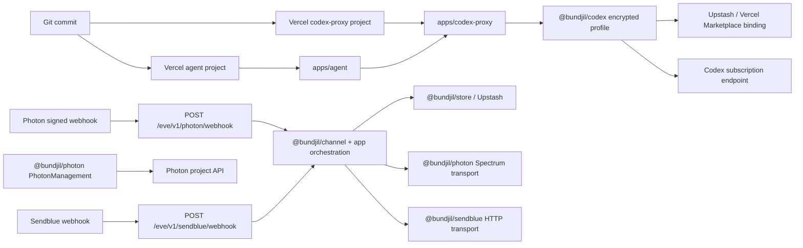
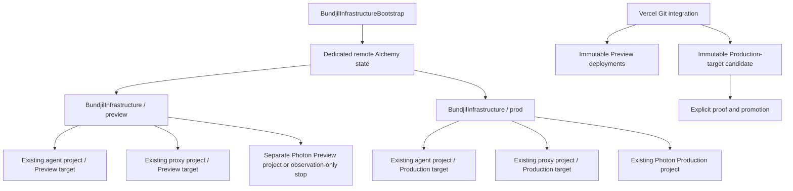

# Alchemy Infrastructure For Vercel And Photon

## Implementation status

The accepted repository and provider rollout is implemented on
`codex/alchemy-vercel-photon-infrastructure`. All ten ledger tasks reached
completed state after the exact-source report-only drift qualification and one
fresh terminal five-pass audit. The completed execution plan retains the
ordered pass evidence, corrections, exact proof boundaries, rollback chain and
Git identity. This history is not standing authority for another provider
read, write, deployment, message, credential, billing or Production
operation.

The current operational successor is
`automatic-production-and-operational-closeout.md`. Its 2026-08-13 correction
replaces the historical report command's single broad Vercel token with a
distinct Schema-decoded set of dedicated exact-project credentials and exact
manifest-project observation. The historical accepted receipts below remain
evidence for their source revision; they are not evidence that current hosted
credential custody exists.

## Decision and intended outcome

Adopt a **hybrid Alchemy architecture** for Bundjil:

- Alchemy owns declared, convergent, stable configuration and drift detection
  for the existing Vercel agent and codex-proxy projects and the accepted
  Photon Channel management plane.
- Vercel Git integration continues to build immutable Preview and Production
  deployments. Promotion, rollback, alias traffic changes, and deployment
  health proof remain explicit app-owned runbook operations, not ordinary
  Alchemy reconciliation.
- Existing Vercel projects, domains, Upstash/Marketplace connections, Photon
  projects, users, webhooks, and storage are imported or adopted before any
  write is enabled. Production resources default to retain and delete
  protection.
- Preview and Production receive separate Alchemy state, profiles/credentials,
  replay namespaces, and desired manifests. Photon management writes in
  Preview are disabled until account readback proves a separately scoped
  Preview project and credential. The current dated one-project/two-webhook
  topology is a migration source, not proof that the target isolation exists.
- Repository proof, authenticated provider readback, Vercel deployment proof,
  and handset/channel proof remain distinct. No one class can substitute for
  another.

Alchemy does **not** natively support Vercel or Photon at the revalidation
point. Custom resources are therefore required for the selected stable
configuration boundaries. Alchemy's native Stack, Stage, state, Resource,
Provider, adoption, removal policy, plan, `sync`, and provider-test facilities
remain the lifecycle engine. A v2 provider implements `read`, `diff`, one
convergent `reconcile`, `delete`, and `list`; it does not implement separate
provider-level create and update hooks.

This SPEC and its sibling task ledger define implementation intent only. They
authorize no provider read, mutation, deployment, secret access, webhook
change, message, or Production operation.

## Accepted repository baseline

This SPEC was reviewed against `origin/main` after the Photon implementation
branch was merged:

```text
reviewed origin/main: 61992a2fe0525a80c5ecccdadf6f18e65fc6898c
Photon merge commit: 23ae79bfb3f383f7ff66f0698ac1ec49c51247fe
Photon parent:       7ddcdc514af5d3edee1b151575a3ce18226268bb
```

The current source now contains:

- `@bundjil/channel`, `@bundjil/photon`, and `@bundjil/sendblue`;
- independent Photon and Sendblue routes over the shared Channel contract;
- Photon management operations for iMessage platform state, Free shared users,
  and project webhooks;
- bounded Preview and Production receipts for the accepted dual-Channel
  rollout;
- app-owned Vercel, Photon, Sendblue, storage, deployment, proof, and rollback
  runbooks.

The dated
[Production receipt](../verification/channel-production-accepted-2026-07-23.md)
records one accepted historical observation. It is not current provider truth
or authority for this work.

## Truth and revalidation boundaries

| Layer               | Revalidated evidence                                                                                                                                                                                                                                                                                                                                                                                                                                      | Established conclusion                                                                                                                                                    | Explicit limit                                                                                                                                                                                                                                     |
| ------------------- | --------------------------------------------------------------------------------------------------------------------------------------------------------------------------------------------------------------------------------------------------------------------------------------------------------------------------------------------------------------------------------------------------------------------------------------------------------- | ------------------------------------------------------------------------------------------------------------------------------------------------------------------------- | -------------------------------------------------------------------------------------------------------------------------------------------------------------------------------------------------------------------------------------------------- |
| Bundjil repository  | Implementation start revalidated `origin/main` at `38a8a3f4cde7b6c519803f233b80b48f079a206d`; current architecture, this committed SPEC/task ledger, embedded structured harness contract, packages, runbooks, authority registers, proof contracts, and supporting research                                                                                                                                                                              | Photon is implemented as a first-class Channel provider; two Vercel apps and their runtime Config contracts are repository truth                                          | No current Vercel, Photon, Upstash, DNS, secret, webhook, deployment, or handset state                                                                                                                                                             |
| Site reference      | `/Users/cooper/Projects/site` at `878d18de8af9a7a082df9f8395128e3aecc94b5b`, clean and nine commits behind its `origin/main`; manifest/lock pin Alchemy `2.0.0-beta.64`, while the existing `node_modules` resolution reports beta.63                                                                                                                                                                                                                     | Concrete Stack/Stage/state, provider Layer, Effect Config, adoption, Preview/Production service, proof, and rollback patterns                                             | The installed dependency tree is stale and was not used to establish beta.64 APIs; Site is not a Bundjil dependency or proof that Vercel/Photon providers exist                                                                                    |
| Alchemy upstream    | npm `next` and the exact `2.0.0-beta.64` package tarball; [resource lifecycle](https://alchemy.run/infrastructure-as-code/resource-lifecycle/), [custom providers](https://alchemy.run/infrastructure-as-code/custom-provider/), [sync release](https://alchemy.run/blog/), and [provider testing](https://alchemy.run/concepts/testing)                                                                                                                  | Custom providers use typed `Resource` props/attributes and Layer-provided `read`/`diff`/`reconcile`/`delete`/`list`; `sync --dry-run` detects drift and `sync` repairs it | The package requires Effect/platform peers at beta.100 or later and its CLI imports the declared-optional Node platform peer; no native `Vercel` or `Photon` module/resource was found, and the pinned package source remains the command contract |
| Vercel upstream     | [REST API](https://vercel.com/docs/rest-api), [projects](https://vercel.com/docs/projects), [environment variables](https://vercel.com/docs/environment-variables), [Marketplace](https://vercel.com/docs/integrations/create-integration/marketplace-api), and [deployments](https://vercel.com/docs/deployments/overview)                                                                                                                               | Stable project, domain, env, integration, webhook/drain, and deployment APIs exist; Vercel now documents endpoints that may decrypt env values under sufficient authority | Bundjil will not call value-decryption endpoints; tenant permissions, IDs, env metadata, rate limits, and current state still require authenticated metadata-only readback                                                                         |
| Photon upstream     | [API introduction](https://photon.codes/docs/api-reference/introduction), [webhook management](https://photon.codes/docs/webhooks/managing-webhooks), [users](https://photon.codes/docs/api-reference/users/create-user), [platforms](https://photon.codes/docs/api-reference/platforms/get-platforms), [lines](https://photon.codes/docs/api-reference/lines/add-a-dedicated-imessage-line), and [delivery](https://photon.codes/docs/webhooks/delivery) | Stable project-scoped webhook/user/line identities and platform readback exist; Free shared-user creation is semantically idempotent                                      | Project deletion/secret rotation are not complete public API lifecycles; dedicated line creation is billable and lacks a documented idempotency key; no alert-policy API exists                                                                    |
| Live provider truth | Not queried in this SPEC turn                                                                                                                                                                                                                                                                                                                                                                                                                             | Nothing                                                                                                                                                                   | Every current provider, credential, deployment, billing, line, webhook, user, and handset claim                                                                                                                                                    |

The supporting
[Alchemy ownership research](../research/alchemy-vercel-sendblue-decision-report.md)
retains the longer evidence trail. This SPEC supersedes its conditional
provider choice: Photon is now the selected Channel management plane for this
infrastructure design, while Sendblue remains runtime/runbook-owned and outside
new Alchemy ownership.

## Goals

1. Make intended stable infrastructure reviewable as Schema-decoded code and
   Alchemy plans.
2. Adopt existing resources without accidental creation, replacement,
   deletion, secret rotation, or traffic change.
3. Detect drift through provider readback and produce bounded, sanitized
   receipts.
4. Isolate Preview and Production state, credentials, storage namespaces, and
   Photon management.
5. Keep Vercel Git deployment/promotion and app-owned proof workflows intact.
6. Implement any custom provider through Effect-native services and Layers
   that are independently testable without live credentials.
7. Make every config, CLI, file, Alchemy state, provider HTTP, secret-binding,
   and receipt boundary name one canonical codec, its `Type` and `Encoded`
   sides, its single decode/encode owner, and its exact exception if a
   third-party primitive is unavoidable.
8. Prevent cross-provider, cross-resource, and cross-stage identity mixing
   through owner-named branded Schemas and closed literal contracts rather
   than raw or aliased `string` values.

## Structured harness alignment

This is a product decision grounded in repository and upstream research, not
an audit-derived correction campaign. It therefore has no accepted-finding
register or finding crosswalk. HGI-307 remains historical repository
qualification/accounting evidence and is not an implementation requirement,
provider receipt, or current worker-effectiveness claim.

One primary implementation trajectory owns the outcome from the offline
foundation through Production disposition and closeout. The sibling task
ledger encodes the dependency chain and records applicable invariant IDs on
every task. The following fixed harness invariants govern this work:

| Invariant                                | Application in this SPEC                                                                                                                                                                                                             |
| ---------------------------------------- | ------------------------------------------------------------------------------------------------------------------------------------------------------------------------------------------------------------------------------------ |
| `HC-OUTCOME-001`                         | One primary owner integrates the ordered task trajectory, proof, delivery, rollback readiness, and terminal receipt.                                                                                                                 |
| `HC-CTX-001`, `HC-CTX-002`, `HC-DOC-001` | Code/config, architecture, runbooks, active intent, dated proof, and external actuality keep distinct owners; implementation loads only the routed owner needed for the current task.                                                |
| `HC-REPO-001`, `HC-BOUNDARY-001`         | The accepted Effect/Schema/provider pattern becomes coherent in source, exports, tests, examples, static controls, and docs; unknown input decodes once and outward values encode once.                                              |
| `HC-TOOL-001`                            | The infrastructure CLI must support discovery, invocation, interpretation, recovery/repair, and boundary-matched real-system verification rather than returning a green wrapper result.                                              |
| `HC-PROOF-001`, `HC-EVIDENCE-001`        | Proof binds candidate, authority, environment, journey and claim; failed, blocked, deferred, no-op, superseded, and inconclusive outcomes remain addressable with non-claims and recovery.                                           |
| `HC-AUTH-001`                            | Capability, authenticated identity, operation authority, approval and provider actuality remain separate at every read, write, deployment and promotion edge.                                                                        |
| `HC-AUTO-001`, `HC-LIFETIME-001`         | Scheduled drift remains report-only until its signal, state, authority, convergence, proof, recovery, cost, review trigger and retirement are admitted as a structured control.                                                      |
| `HC-DEPENDENCY-001`                      | Alchemy beta, Vercel APIs, Photon APIs, remote state and any secret sink each require capability, trust, upgrade, incident, removal and lifetime owners before adoption.                                                             |
| `HC-METRIC-001`                          | Approach effectiveness uses accepted convergence/rollback outcomes and measured operator attention; command, file, finding, pass or worker counts are not success.                                                                   |
| `HC-FEEDBACK-001`                        | A repeated failure is promoted to the earliest Schema/API/test/runbook/control owner and weaker reminders are retired; no new standing control is created from a single speculative risk.                                            |
| `HC-EPOCH-001`                           | **N/A to the infrastructure outcome.** This SPEC makes no general claim that a worker or harness is more effective. A later such claim requires a new epoch bound to the then-current skills, target, tools, authority and scenario. |

The embedded contracts under
`.agents/skills/docs-maintainer/assets/harness/` are fixed compatibility
contracts, not optional prose prompts:

| Artifact                         | Required owner and use                                                                                                                                                                                                                                                  |
| -------------------------------- | ----------------------------------------------------------------------------------------------------------------------------------------------------------------------------------------------------------------------------------------------------------------------- |
| `critical-journey.schema.json`   | `docs/verification/critical-journeys.json` remains the current journey inventory. Add only the small infrastructure/operator journeys that implementation actually introduces, using stable IDs, and map them through `journey-command-map.json`.                       |
| `bounded-receipt.schema.json`    | `InfrastructureBoundedReceipt.Encoded` must validate against this fixed field contract before artifact persistence. The repository `proof-packet.schema.json` remains the outer claim-specific evidence owner; neither contract is replaced by a Markdown-only receipt. |
| `authority-envelope.schema.json` | Every live read or mutation task materializes this exact task-scoped envelope before execution. Long-lived capability rationale remains in `docs/operations/authority-register.json`; the envelope neither grants nor widens authority.                                 |
| `control-record.schema.json`     | Any scheduled drift/repair proposal maps to this complete control contract and the repository control/automation registers. Missing convergence, proof, recovery, cost, retirement or disconfirming evidence keeps the loop report-only or unadmitted.                  |

The implementation must provide Effect Schemas whose `Encoded` field sets are
compatible with these fixed JSON Schemas and test that compatibility against
the checked-in assets. Do not introduce a second task-local receipt, authority,
journey or control shape.

## Non-goals

- Replacing Vercel Git deployments, staged Production promotion, instant
  rollback, or app-owned deployment runbooks.
- Managing DNS records in the first rollout. Vercel domain attachments may be
  adopted; authoritative DNS remains read-only/outside IaC.
- Creating or deleting Upstash databases, Marketplace resources, Photon
  projects, dedicated lines, billing plans, or Sendblue accounts/lines.
- Migrating legacy Sendblue implementation behavior into the new
  infrastructure package.
- Sending a message, simulating handset delivery, or using Alchemy as a Channel
  runtime.
- Storing plaintext credentials, phone numbers, message content, webhook
  signing secrets, or sensitive environment values in Alchemy state or proof.
- Creating a generic provider SDK wrapper, `common`, `shared`, `helpers`, or
  `utils` package.

## Current call graph and ownership


```mermaid
flowchart LR
  Git["Git commit"] --> VAgent["Vercel agent project"]
  Git --> VProxy["Vercel codex-proxy project"]
  VAgent --> Agent["apps/agent"]
  VProxy --> Proxy["apps/codex-proxy"]

  PhotonWebhook["Photon signed webhook"] --> PhotonRoute["POST /eve/v1/photon/webhook"]
  SendblueWebhook["Sendblue webhook"] --> SendblueRoute["POST /eve/v1/sendblue/webhook"]
  PhotonRoute --> Channel["@bundjil/channel + app orchestration"]
  SendblueRoute --> Channel
  Channel --> Replay["@bundjil/store / Upstash"]
  Channel --> PhotonRuntime["@bundjil/photon Spectrum transport"]
  Channel --> SendblueRuntime["@bundjil/sendblue HTTP transport"]

  Agent --> Proxy
  Proxy --> Profile["@bundjil/codex encrypted profile"]
  Profile --> Upstash["Upstash / Vercel Marketplace binding"]
  Profile --> OpenAI["Codex subscription endpoint"]

  PhotonManagement["@bundjil/photon PhotonManagement"] --> PhotonAPI["Photon project API"]
```

| Concern                     | Repository owner                                      | External owner               | Alchemy target                                                                          |
| --------------------------- | ----------------------------------------------------- | ---------------------------- | --------------------------------------------------------------------------------------- |
| Agent project/build         | `apps/agent`, `apps/agent/vercel.json`                | Vercel                       | Adopt project/settings/env/domain metadata; never deploy in ordinary reconcile          |
| Proxy project/build         | `apps/codex-proxy`, its `vercel.json`                 | Vercel                       | Same, with independent auth/storage configuration                                       |
| Agent-to-proxy URL/auth     | app Config and deployment runbooks                    | Vercel env/protection        | Coordinated env declarations using one external secret revision                         |
| Photon runtime              | `@bundjil/photon`, agent route, Channel runtime       | Photon Spectrum SDK/webhooks | No runtime ownership; management resources only                                         |
| Photon management           | `@bundjil/photon` management service and runbook      | Photon project API           | Adopt project; manage approved platform/user/webhook resources through custom resources |
| Sendblue runtime/management | `@bundjil/sendblue` and app runbook                   | Sendblue                     | Outside new Alchemy scope; observe only where required for rollback continuity          |
| Replay/profile persistence  | `@bundjil/store`, `@bundjil/codex`, app Config        | Upstash/Marketplace          | Import/read binding and namespace metadata; retain data resource                        |
| Deployment/promotion        | app runbooks and Vercel Git integration               | Vercel                       | Read-only deployment observation                                                        |
| Authority and proof         | authority registers, runbooks, verification contracts | target operator/provider     | Alchemy plan is evidence, never authority                                               |

## Native support and verified gaps

| Capability                                                                                            | Native Alchemy support                                                                                                          | Required Bundjil owner                                                                                                     |
| ----------------------------------------------------------------------------------------------------- | ------------------------------------------------------------------------------------------------------------------------------- | -------------------------------------------------------------------------------------------------------------------------- |
| Stack, Stage, outputs, resource identity, plan, adoption, removal policy, replacement, provider tests | Yes, core Alchemy                                                                                                               | Root stack plus private `@bundjil/infrastructure` tooling                                                                  |
| Drift detection/repair                                                                                | Yes: pinned beta.64 includes `alchemy sync --dry-run` and `alchemy sync`; provider `read` observes tracked resources            | Use native sync behind a Bundjil receipt/authority edge; do not invent a parallel drift engine                             |
| Remote state                                                                                          | Native state interfaces and provider-backed implementations exist; Site proves `Cloudflare.state()`                             | Separate bootstrap task and credential boundary; local state only during the no-write POC                                  |
| Custom lifecycle                                                                                      | `read`, `diff`, convergent `reconcile`, `delete`, required exhaustive `list`, optional `precreate`; providers are Effect Layers | Schema-derived props/attributes and provider Layers in `@bundjil/infrastructure`; named transport services remain separate |
| Vercel projects/settings/domains/env/Marketplace/webhooks/drains                                      | No native provider found in the exact beta.64 package                                                                           | Custom Vercel resources and private Effect transport services inside `@bundjil/infrastructure`                             |
| Vercel deployments/promotion/rollback                                                                 | APIs exist, but ordinary resource convergence is the wrong ownership model                                                      | Git integration and app runbooks; custom observation only                                                                  |
| Photon project bootstrap/delete/secret rotation                                                       | No native provider; public management API exposes project read/profile but not complete project create/delete/rotation          | Imported retained identity; bootstrap/rotation remains dashboard/CLI/runbook-owned                                         |
| Photon platform/shared-user lifecycle                                                                 | No native provider; public API and stable user IDs exist                                                                        | Custom resources consuming the rewritten `@bundjil/photon/management` boundary                                             |
| Photon webhook lifecycle                                                                              | No native provider; stable IDs and create/delete exist, but signing secret is create-only                                       | Read/import first; mutation stays disabled until an owner-specific binding sink and cutover/rollback contract pass         |
| Photon dedicated lines and billing                                                                    | No native provider; line CRUD and billing readback exist, but creation is Business-only, billable, and has no idempotency key   | Read-only inventory in this SPEC; separately authorized future extension only                                              |
| Photon alert policies/persistent delivery log/DLQ                                                     | No documented management API                                                                                                    | Bundjil runtime metrics and external monitoring; no fake IaC resource                                                      |
| Sendblue account/line lifecycle                                                                       | No native provider and incomplete safe lifecycle                                                                                | Existing provider/runbook ownership; no new custom resource                                                                |

No custom resource is permitted merely because an API endpoint exists. A
resource needs stable identity, complete readback, a safe update/delete
contract, explicit secret behavior, and tests for uncertain outcomes.

## Package and stack structure

```text
alchemy.run.ts
stacks/
  bundjil.ts
  bootstrap.ts
packages/infrastructure/
  README.md
  package.json
  src/
    schemas.ts
    errors.ts
    service.ts
    live.layer.ts
    memory.layer.ts
    adoption-manifest.ts
    secret-reference.ts
    receipt.ts
    providers.ts
    __testing__/
      fixtures.ts
    vercel/
      schemas.ts
      errors.ts
      service.ts
      live.layer.ts
      memory.layer.ts
      resources/
        project.resource.ts
        environment-variable.resource.ts
        domain.resource.ts
        marketplace-binding.resource.ts
        deployment-observation.resource.ts
      providers.ts
    photon/
      schemas.ts
      errors.ts
      resources/
        project-observation.resource.ts
        platform.resource.ts
        shared-user.resource.ts
        webhook-observation.resource.ts
        line-observation.resource.ts
        billing-observation.resource.ts
      providers.ts
  test/
    adoption-manifest.test.ts
    vercel/
    photon/
    stack.test.ts
```

`@bundjil/infrastructure` is a private repository tooling package. Applications
must not import it at runtime. Its package manifest exposes only the root
infrastructure contract, provider-owned `./vercel` and `./photon` composition
surfaces needed by the root stack, and an explicit `./testing` surface for
deterministic fixtures. Every export retains the repository's
`@bundjil/source`, `types`, and `default` conditions. It exports no raw client,
provider DTO, deep source path, generic live-layer registry, or app-owned
runtime binding.

The ownership boundary is deliberate:

- `@bundjil/photon` remains the sole Photon HTTP/SDK owner. Rewrite and expose a
  narrow `@bundjil/photon/management` subpath only for the named management
  service, canonical Schemas, operation-specific safe errors, lazy credential
  service, and explicit live/memory Layers required by Alchemy.
  `@bundjil/infrastructure` must not duplicate Photon URLs, Basic auth, DTOs,
  response decoding, or retry logic.
- Keep the Vercel client private under `@bundjil/infrastructure/vercel` because
  Alchemy is its only proved consumer. Do not create `@bundjil/vercel` until a
  second stable consumer exists.
- Alchemy resource lifecycle code belongs to `@bundjil/infrastructure`;
  provider transport code belongs to the provider owner. Stack topology stays
  at the root and contains no HTTP details.

Do not preserve the current proof-only management shape: it passes credentials
to a Layer factory, exposes primitive `URL`/`boolean` operations and raw phone
fields, and collapses every failure into `PhotonProviderProofError`. Replace it
with a constant live Layer that requires a lazy
`PhotonManagementCredentials` service and `HttpClient`. Every public operation
accepts one owner-named request Schema `Type` and returns one owner-named result
Schema `Type`; a naked `URL`, `boolean`, ID, object literal, provider DTO, or
array is not a public service contract. Phone values remain `Redacted`, and
observations expose only stable branded IDs and explicitly safe metadata.

This follows the repository `effect-client-wrapper` boundary: named operations,
immediate unknown-output decoding, provider-private raw clients, safe errors,
and explicit live/memory Layers. It also follows Alchemy's lazy-auth rule:
provider Layers are constructed before credentials are configured, so
credential Effects resolve only inside lifecycle operations.

## Deployment and state topology


```mermaid
flowchart TB
  Bootstrap["BundjilInfrastructureBootstrap"] --> State["Dedicated remote Alchemy state"]
  State --> Preview["BundjilInfrastructure / preview"]
  State --> Production["BundjilInfrastructure / prod"]

  Preview --> VPAgent["Existing agent project / Preview target"]
  Preview --> VPProxy["Existing proxy project / Preview target"]
  Preview --> PhotonPreview["Separate Photon Preview project or observation-only stop"]

  Production --> VAgent["Existing agent project / Production target"]
  Production --> VProxy["Existing proxy project / Production target"]
  Production --> PhotonProd["Existing Photon Production project"]

  Git["Vercel Git integration"] --> PreviewDeploy["Immutable Preview deployments"]
  Git --> ProdCandidate["Immutable Production-target candidate"]
  ProdCandidate --> Runbook["Explicit proof and promotion"]
```

Use exactly two persistent desired-state stages: `preview` and `prod`. Pull
requests run a read-only plan plus `sync --dry-run` against `preview`; they do
not apply shared Preview settings or create a stage per PR. A protected Preview
job may apply the shared Preview stage. Production uses a separately protected
job and credentials.

The no-write POC may use ignored local state. No Production adoption may begin
until `stacks/bootstrap.ts` provisions or adopts a dedicated remote state
backend under separate authority. Reuse the site's `Cloudflare.state()` pattern
only after a Bundjil-specific account/token and stack name are approved; never
reuse the site's state identity or credentials.

## Resource inventory

### Production

| Resource                   | Desired ownership                                                                                                                                                                            | Physical identity                                                   | Initial policy                                                                                                  |
| -------------------------- | -------------------------------------------------------------------------------------------------------------------------------------------------------------------------------------------- | ------------------------------------------------------------------- | --------------------------------------------------------------------------------------------------------------- |
| Alchemy stack/state        | Native Stack/Stage plus dedicated remote state                                                                                                                                               | stack `BundjilInfrastructure`, stage `prod`, backend identity       | Create/adopt only through bootstrap; protected                                                                  |
| Vercel agent project       | Custom `VercelProject`                                                                                                                                                                       | exact team ID + project ID                                          | Read/import, then manage approved settings; retain/protect                                                      |
| Vercel proxy project       | Custom `VercelProject`                                                                                                                                                                       | exact team ID + project ID                                          | Same                                                                                                            |
| Project settings           | project root, build/install/output/framework/function settings derived from both `vercel.json` files                                                                                         | project ID + canonical setting path                                 | In-place only where Vercel supports it; reject Git identity replacement                                         |
| Production domains         | Custom `VercelProjectDomain` attachments                                                                                                                                                     | project ID + normalized domain                                      | Import/read first; retain; DNS read-only                                                                        |
| Agent model/Executor env   | `BUNDJIL_AGENT_MODEL_PROVIDER`, `BUNDJIL_AGENT_MODEL`, `BUNDJIL_EXECUTOR_MCP_URL`, `BUNDJIL_EXECUTOR_API_KEY`                                                                                | project + key + `production` target                                 | Key/type/target owned; value by external secret revision                                                        |
| Agent-to-proxy env         | `BUNDJIL_CODEX_PROXY_BASE_URL`, `BUNDJIL_CODEX_PROXY_MODEL`, `BUNDJIL_CODEX_PROXY_CONTEXT_WINDOW_TOKENS`, `BUNDJIL_CODEX_PROXY_INTERNAL_TOKEN`, optional `BUNDJIL_CODEX_PROXY_VERCEL_BYPASS` | project + key + `production`                                        | URL/metadata managed; current bearer observed by reference only; rotation blocked while proxy accepts one token |
| Channel routing/replay env | all `BUNDJIL_CHANNEL_ROUTING_*` and `BUNDJIL_CHANNEL_REPLAY_*` keys                                                                                                                          | project + key + `production`                                        | Separate Production namespace and secret revisions                                                              |
| Photon runtime env         | `BUNDJIL_CHANNEL_PHOTON_PROJECT_ID`, project secret, webhook ID/secret, tolerance                                                                                                            | project + key + `production`                                        | External values; IDs/revisions only in Alchemy state                                                            |
| Sendblue runtime env       | all `BUNDJIL_CHANNEL_SENDBLUE_*` keys                                                                                                                                                        | project + key + `production`                                        | Metadata may be inventoried; values and provider resources remain runbook-owned                                 |
| Proxy config/auth env      | proxy mode, model/reasoning, internal token, profile/connector/installation/subject/account, encryption and refresh settings                                                                 | proxy project + key + `production`                                  | Metadata/references owned; cipher rotation app-runbook-owned; shared bearer rotation blocked                    |
| Replay store binding       | existing Upstash/Marketplace resource and Channel prefix                                                                                                                                     | configuration/resource/database IDs                                 | Import/read/retain; never create from an env alias                                                              |
| Profile store binding      | existing Upstash/Marketplace resource and profile prefix                                                                                                                                     | configuration/resource/database IDs                                 | Import/read/retain; preserve fenced profile data                                                                |
| Photon project             | custom retained `PhotonProjectObservation`                                                                                                                                                   | reviewed project ID                                                 | Import/read; no create/delete/secret rotation                                                                   |
| Photon iMessage platform   | custom `PhotonPlatformConfiguration`                                                                                                                                                         | project ID + named `PhotonPlatform` literal `imessage`              | Read, adopt, in-place enable/metadata diff                                                                      |
| Photon shared user         | custom `PhotonSharedUser`                                                                                                                                                                    | project ID + stable user UUID; sensitive semantic key kept redacted | Adopt exact approved user; soft delete only if rollout-created and separately authorized                        |
| Photon Production webhook  | custom `PhotonWebhookObservation`                                                                                                                                                            | project ID + webhook UUID                                           | Adopt exact URL/ID; retain/protect; no mutation until binding-sink and cutover proof                            |
| Photon lines               | `PhotonLineObservation`                                                                                                                                                                      | project ID + stable line IDs                                        | Read-only; assert accepted Free topology has zero dedicated lines                                               |
| Photon billing             | `PhotonBillingObservation`                                                                                                                                                                   | project ID                                                          | Read-only; no plan mutation                                                                                     |
| Vercel deployment          | `VercelDeploymentObservation`                                                                                                                                                                | deployment ID + Git SHA + target                                    | Read-only; no create/delete                                                                                     |
| Monitoring                 | drift receipt plus existing safe app/provider metrics                                                                                                                                        | stage + resource ID + observation time                              | Report-only until an alert API/owner is selected                                                                |

### Preview

| Resource                 | Desired ownership                                                                          | Isolation rule                                                                                                                                                     |
| ------------------------ | ------------------------------------------------------------------------------------------ | ------------------------------------------------------------------------------------------------------------------------------------------------------------------ |
| Alchemy stage            | `BundjilInfrastructure / preview`                                                          | Separate state and provider credentials from `prod`                                                                                                                |
| Vercel projects/settings | same existing two projects, `preview` target                                               | Never mutate Production targets from Preview or PR jobs                                                                                                            |
| Preview domains          | Vercel-generated deployment URLs; optional imported Preview alias                          | No Production custom-domain or DNS write                                                                                                                           |
| Agent/proxy env          | Preview-only URL, internal token, bypass, model, Channel routing and storage values        | Must not equal Production secret references or replay/profile prefixes; token rotation is not implied                                                              |
| Upstash bindings         | imported Preview connection and prefixes                                                   | Physical DB may be shared only after exact database and namespace review; destructive ownership remains disabled                                                   |
| Photon project           | separate Preview project and project secret                                                | Until proved, Photon Preview apply stops before provider writes; current shared project is observation-only migration state                                        |
| Photon platform/user     | approved existing controlled identity in Preview project                                   | Prefer a test/non-Production identity; reuse across projects only when provider readback proves it causes no detach, reassignment, disablement, or delivery change |
| Photon webhook           | one exact Preview callback observation; mutation is a gated spike                          | Separate signing secret and webhook ID; create/delete requires proved binding sink, deployment cutover, and retry drain                                            |
| Photon lines/billing     | read-only; zero dedicated lines expected                                                   | No billable line creation                                                                                                                                          |
| Deployment observation   | immutable PR/Preview deployment IDs                                                        | Observation only; PR closure removes no project/provider resource                                                                                                  |
| Proof                    | plan, provider readback, deployment health/auth, isolated signed ingress and Channel proof | Sanitized artifact; no Production or handset inference                                                                                                             |

If a separate Free Photon Preview project cannot be created or cannot host an
isolated approved user, the accepted fallback is **no live Photon Preview
management or webhook**. Sharing the Production project is not an isolation
fallback.

The approved Preview user need not require purchasing or provisioning a new
number. Inventory existing controlled iMessage-capable identities through
approved surfaces with full values omitted. Select the least disruptive
candidate by safe fingerprint. A candidate already bound to another project
may be reused only when current Photon capability/readback proves the same
identity can be referenced by the isolated Preview project without moving,
detaching, reassigning, disabling, or changing delivery for the existing
project. Never detach an existing binding to make the spike pass. If every
controlled identity is provider-exclusive, retain the isolated Preview stop
and record that provider constraint instead of weakening project isolation.

The 2026-07-25 provider bootstrap created a separate Free
`bundjil-preview` project. Photon enabled managed-shared iMessage and
automatically seeded the earlier adopted controlled identity during project
creation; no separate user-create request ran. Source readback retained the
original binding and assignment, while Preview used a separate project
credential, user UUID, and assigned routing identity. Because deleting the
seeded user or adding a second user would be more disruptive, the isolated
Preview topology adopts that provider-seeded user by safe fingerprint. The
dated verification receipt owns the exact redacted before/after and rollback
identity; webhook, deployment, Channel, and Production proof remain open.

The later Preview callback slice created one rollout-owned webhook against the
exact READY Git deployment and attempted one four-value sensitive Preview
binding. Vercel metadata readback found the project ID/secret and webhook
ID/secret identities, but the write acknowledgement failed its complete
Schema contract. The create-only recovery artifact therefore remains mode
`0600`, and read-before-write blocks any replay. This is an accepted uncertain
recovery state, not convergence: a new Git deployment and valid signed ingress
must prove the configured values before the artifact can be removed.

Response-envelope inspection later corrected two false greens. The initial
`401` was Vercel Authentication rather than application signature rejection,
and the binding-file ingress had attempted to decode its encoded JSON secret
string as an already decoded `Redacted` Type. The owner now decodes the string
once, immediately redacts it, accepts documented Vercel upsert status
`200|201`, and permits one explicit `signedIngressMismatch` recovery only when
all four exact Preview-only sensitive metadata identities already exist. A
note-scoped automation bypass is separately custodied for the protected
Preview callback; its value and callback query remain absent from tracked
artifacts.

Corrected commit `2436ddb` produced a READY non-Production deployment whose
protected valid-signature unsupported event returned exact `204`, proving the
recovered webhook ID/secret without Channel dispatch or SDK acquisition. A
lossless stable-callback cutover then created one second temporary webhook at
safe fingerprint
`d24567746bb03623f86e5f8b3d43449dc56a6cb374788c482e1fcab56b35913b`,
preserved the old webhook and both mode-`0600` artifacts, and rebound the new
ID/secret through explicit `stableCallbackCutover`. Commit `8089076` then
produced a READY non-Production deployment whose immutable URL and stable
branch alias each returned exact protected valid-signature `204` for the
unsupported-event no-op. After the documented retry horizon, cleanup deleted
only the old callback by exact URL and fresh readback found one stable webhook
at that fingerprint. Two post-cutover candidate inventories matched and
retained both the source and isolated Preview user bindings. Stable credentials
remain only in ignored mode-`0600` local custody and Vercel's sensitive Preview
environment; both temporary binding artifacts and the retired signing secret
were removed after readback.

The Preview task remains open at the hosted Channel proof boundary. It requires
one exact approved test conversation to prove real provider delivery,
same-event retry/replay disposition, Eve completion, one outbound result,
typing start/stop and handset limitations. No synthetic identity, guessed
recipient or shared source-project conversation may substitute for that direct
observable.

The later Preview-only topology adaptation tested whether the current Mac
Apple identity could establish the isolated journey without disturbing its
source binding. It created only one rollout-owned temporary Preview user and
one query-controlled callback, preserved the adopted user and stable callback,
and stopped before an SMS-only Messages route could send. A separately
authorized cold outbound-first attempt then resolved a direct Space but
returned `AuthenticationError`, provider code `internalError`, transport
status `7` (`PERMISSION_DENIED`) and `retryable=false`; it returned no provider
message identity and ran no retry. Exact cleanup restored one adopted Preview
user, one stable callback, unchanged source bindings, and canonical inventory
digest
`9e6108d55bd6801b1d7e041d98cfbdce4587f39c0d0d3384ffad7bc2f7488a3f`.
The retained receipts own the immutable deployment, callback, drain, cleanup,
and negative-send detail.

Fresh Messages and live candidate inventory supplied on 2026-07-28 correct the
diagnosis. The Messages conversation named `Bundjil` is Sendblue at recipient
fingerprint `6a6a862e…`; it is not Photon. The successful Photon conversation
is the unnamed assigned line `d4039779…`, mapped to original/source project
`ad20033f…` and current Mac Apple handle `82ac258d…`. Its transcript and the
accepted 2026-07-22/23 receipts are inbound-first: the registered user messages
the assigned line, then Bundjil replies through the provider-created
conversation. A source-project cold outbound attempt also failed at the
shared boundary on 2026-07-22, so the denied cold send is neither a general
reply outage nor uniquely a Preview regression.

The retained isolated Preview user `db23193a…` maps to assigned line
`db49756e…` and a different Apple identity. The current Mac identity cannot
originate that retained user's journey. The temporary Preview binding for Mac
identity `82ac258d…` mapped to `0809669f…`, which Messages classified as
SMS-only; it is not an iMessage proof route. SMS remains forbidden.

Current Photon pricing lists direct-messaging API access for Free and Pro
managed-shared tiers, but lists cold outreach only for Business and Enterprise
dedicated offerings. The shared-project registered-user troubleshooting rule
constrains an admitted target; it does not guarantee cold outbound-first
entitlement. Therefore the prior `PERMISSION_DENIED` receipt remains valid
negative evidence for cold outbound-first on managed shared, not proof that
ordinary Photon reply delivery is broken.

The 2026-07-29 product decision makes one controlled iMessage sender mandatory
for both environments. Production and Preview must remain separate Photon
projects with separate credentials, distinct Photon-assigned destination
lines, and separate environment webhook routing. Sending from the one sender
to the Production destination must reach only Production; sending from the
same sender to the Preview destination must reach only Preview. Another Apple
identity/device is not an accepted solution. Two callbacks in one Photon
project are also rejected because one project event fans out to every
registered webhook.

The separately authorized 2026-07-28 Computer Use inspection confirmed this
gate directly. Messages details separated Sendblue `6a6a862e…` from source
Photon `d4039779…`; both existing conversations exposed iMessage, and the
debug-bot row identified the current Mac start identity `82ac258d…` on the
iMessage service. No conversation for retained Preview assigned line
`db49756e…` was present, while current Mac identity `82ac258d…` still did not
match the retained Preview registered identity. The send gate failed before
composition: no message was typed or sent, no duplicate count was observed,
and no provider state changed.

Official Photon material now says shared inbound ownership resolves from the
pair of Photon destination number plus sender number. The live management API
must still prove that the same sender can be registered concurrently across
the two projects without moving or changing the source binding. Under the
accepted authority, first read both complete topologies and source binding,
then perform at most the minimum Preview-only user adoption/create needed for
that sender and read back a distinct Preview destination. Stop before a send
if duplicate registration is rejected, the source changes, the route is SMS,
or isolated routing remains ambiguous.

Only after the current Mac identity `82ac258d…` equals the Preview user,
the distinct Preview destination is exact, and Messages labels that exact
conversation iMessage may one bounded inbound-first message begin the signed
Preview callback, one Preview response, zero Production response, and exact
duplicate-disposition proof. Preserve a passing stable Preview binding; delete
only rollout-created failed or temporary Preview resources after drain and
exact readback. The decision and non-claims are retained in
`docs/verification/alchemy-photon-shared-sender-topology-decision-2026-07-29.md`.
At this checkpoint the task remained open and the terminal five-pass audit had
not run.

Two consecutive live management reads on 2026-07-29 stopped this accepted
journey before mutation. Source/Production remains Free managed-shared with two
unchanged users, zero actual dedicated lines, and two webhooks
`2083611d…`/`72cac9b5…`; isolated Preview remains Free managed-shared with one
adopted user, zero actual dedicated lines, and its sole stable webhook
`d2456774…`. Candidate inventory still maps sender `82ac258d…` to unchanged
source destination `d4039779…`, reports it available, and finds no Preview
binding.

The accepted Production receipt identifies the source webhooks as one
Production callback plus one preserved Preview callback. Photon fans a project
event to every project webhook, so the mandatory Production-only destination
postcondition is impossible while that preserved callback remains. Current
authority prohibited source/Production mutation; no Preview user create,
Messages action, provider write, or message occurred. The duplicate
cross-project registration question remains untested. Resume only after
separate authority retires the exact preserved source-project Preview callback
with rollback, retry-drain, sole-Production-callback, unchanged-user, and
zero-fan-out readback. The bounded evidence is
`docs/verification/alchemy-photon-shared-sender-topology-readback-2026-07-29.md`.

Fresh Vercel deployment-by-URL readback removes the route ambiguity:
`2083611d…` is the READY Preview-target callback and `72cac9b5…` is the READY
Production-target callback. Only `2083611d…` is eligible for later retirement.
Its create-only signing secret is absent from current mode-`0600` custody;
current Preview metadata belongs to isolated callback `d2456774…`, and the
local 1Password CLI was unavailable. Before deletion, either recover the exact
retired secret or obtain explicit acceptance that the removal is irreversible.
Stable ID and URL custody without the signing value do not satisfy rollback.

Cooper provided that exact irreversible-retirement authority on 2026-07-30.
The exact obsolete callback/path had zero Vercel runtime rows over the
available 30-day window; a single non-mutating `GET` positive-control probe
returned `404` and produced exactly one row, rejecting an empty-log-service
false green. The owner command then deleted only `2083611d…`. Immediate and
post-drain reads beyond Photon's approximately 3.5-minute retry horizon
returned sole source callback `72cac9b5…`, both unchanged source
users/assignments, shared service, and iMessage enabled. Exact restoration of
the retired callback remains impossible because the accepted lost create-only
signing secret cannot be reconstructed.

The now-isolated Preview check registered sender `82ac258d…` exactly once,
creating Preview user `0e2e2abe…` with distinct destination `0809669f…` while
the source binding remained unchanged. This directly proves current
non-disruptive duplicate cross-project registration. Messages resolved that
exact destination as `iMessage`, never SMS, and showed `Delivered` for one
bounded inbound-first test.

The application acceptance gate nevertheless failed closed. Exact Preview
runtime readback recorded one `204` and one `401`, Production recorded zero
Photon callback invocations, and there was no accepted `202`, Eve
dispatch/completion, outbound response, typing proof, or same-event duplicate
disposition. Preview routing-identity metadata predates the new binding; the
available safe logs do not distinguish the exact ignored/duplicate identity
branch or explain the second authentication failure. A later exact
valid-signature unsupported-event probe against the stable callback on source
commit `1f8600d79c60ae5451ee09cd4d7bab2f158e0b4e` returned `204` without a
redirect or body. That directly proves the deployed Preview callback ID,
signing-secret custody and path are internally coherent; it does not explain
the provider-originated `401` or prove an accepted message.

The owning Channel adapter now requires a safe
`ChannelWebhookDisposition` record for every returned route class. The record
contains only the branded webhook path, a closed disposition literal and any
applicable closed ignore/identity/routing reason or replay operation. Focused
tests distinguish ignored, duplicate, identity rejection, authentication
rejection, schema rejection, replay failure, routing failure, accepted
dispatch and the provider-retry control, while proving that participant and
message sentinels are absent. Immutable Preview deployment `310dc759…` then
reached READY. One exact signed unsupported-event probe returned `204` with no
redirect, location or body, and its deployment-scoped log contained exactly
one `ignored`/`unsupportedEvent` disposition with zero forbidden
identity/signature/bypass tokens. This removes status-only ambiguity for later
callbacks; it does not retroactively classify the historical `204`/`401`,
recover the write-only routing directory, or authorize another message.

Authenticated Vercel API, CLI and dashboard reads then established that the
sensitive Preview `BUNDJIL_CHANNEL_ROUTING_IDENTITIES` value is write-only:
the API returned its metadata with no value, `vercel env pull` produced an
empty redacted value, and the dashboard editor exposed no readable current
value. Nine Production Photon Agent Run details and traces retained no
`principalId`; no local environment, process environment or retained
repository-task session record contained a recoverable owner value. Therefore
the current directory cannot be merged or appended safely. Replacing it
requires a separately approved Preview-only Vercel write and either the exact
owner-supplied canonical principal ID or an explicit product decision adopting
a new stable Preview principal ID. A guessed principal, a neighbouring test
fixture or a successful signed `204` is not an acceptable substitute.

Cooper supplied that exact product and mutation decision on 2026-07-30. The
complete Preview-only routing directory will be replaced with one record for
controlled sender `82ac258d…` and a newly generated opaque stable principal
whose safe fingerprint is `1b41b326…`. The exact mapping is retained only in
ignored mode-`0600` local custody; its sanitized digest is `96971a51…`.
Approval covers the resulting Preview deployment/readback, one minimal Preview
shared-user reconciliation, and one bounded inbound-first iMessage/replay
journey with exact cleanup on failure. It does not authorize Production,
billing, SMS, cold outbound, credential rotation, a main merge, or unrelated
mutation. The overwrite is not accepted until one immutable deployment proves
the new directory at the owning route.

That bounded attempt is now complete and failed closed. Preview sensitive
metadata updated, deployment fingerprint `687e5a7d…` at source `29467f1…`
reached READY, and a signed safe probe produced exactly
`ignored/unsupportedEvent`. The same sender was then registered again as
rollout user `19489599…` with distinct destination `0809669f…`, while its
source binding remained unchanged. Computer Use proved the exact sender and
recipient, an iMessage/Encrypted composer, and Delivered for one bounded
inbound-first message. The real application window contained one
`ignored/unsupportedService` and one `authenticationRejected` disposition,
zero accepted dispatch, zero Eve completion/response, and zero exact duplicate.
Official Photon event documentation says the iMessage payload's space,
message, sender, and nested-space platform fields are `iMessage`; the observed
closed disposition therefore records a provider/runtime contract mismatch
without guessing which wire field differed.

After 239 seconds, longer than the documented retry horizon, cleanup deleted
only rollout user `19489599…`/destination `0809669f…`. Two subsequent
candidate-inventory commands each restored digest
`9e6108d55bd6801b1d7e041d98cfbdce4587f39c0d0d3384ffad7bc2f7488a3f`.
The approved one-record Preview routing mapping and immutable deployment remain
for diagnosis; the overwritten write-only value cannot be reconstructed.

Read-only deployment-log diagnosis on 2026-07-30 proved that the historical
`ignored/unsupportedService` response and `authenticationRejected` response
were two distinct requests 696 milliseconds apart. Photon's delivery contract
states that any `2xx` terminates an attempt, so the later `401` is not a retry
caused by the earlier `204`. Authenticated Preview dashboard readback exposed
one retained webhook but no delivery-attempt detail or repair control. The
historical records therefore remain safely unclassified.

Before another provider event, the private Photon adapter must deploy an
identity-free checkpoint diagnostic. Unsupported-service records may identify
only the first of the four official iMessage platform positions, and
authentication records may identify only header decoding, webhook ID,
timestamp, or signature verification. Direct tests must exercise every
checkpoint independently and reject a value-leak sentinel. No public package
contract changes, provider value logging, case-folding, SMS acceptance,
signing-secret change, or real-message replay is implied by this correction.

The diagnostic deployed from source `7e29cc9…` and reached READY as immutable
Preview deployment `AB9G854g…`. Eight synthetic requests produced the exact
four authentication checkpoints and four platform checkpoints with their
expected `401`/`204` classes. Deployment-scoped log search found zero copies of
the explicit provider-value leak sentinel. This proves deployed diagnostic
observability only; it neither classifies the historical requests nor proves a
Photon-originated event.

Cooper then approved one bounded real retry against final deployment
`6bVHqBib…` at source `654c5ac…`. Preview created only rollout user
`ab4f5f8d…` for sender `82ac258d…`, assigned distinct destination
`0809669f…`, and preserved source user `020cc192…`/destination `d4039779…`
plus adopted Preview user `46b1fb0c…`/destination `db49756e…`. Messages proved
the exact selected start identity, an explicit iMessage composer, one outgoing
iMessage container and one Delivered marker for safe message fingerprint
`605f8245…`; no SMS path was used.

The real deployment recorded one separate `204`
`ignored/unsupportedService` request at `spacePlatform`, then one `401`
`authenticationRejected` request at `headers`. Neither request reached
`acceptedForDispatch`; there was no Eve completion, outbound response,
same-event duplicate, typing or later retry-horizon callback. The latest
Production deployment had no same-window row, but no Production positive
control ran, so zero Production response is not claimed. This confirms that
the repeat blocker is at the provider/application contract boundary: one
request presents a non-exact top-level iMessage space platform and another
fails required-header decoding. The observed value and exact header failure
remain intentionally unknown.

After the horizon, stable-ID cleanup deleted only rollout user `ab4f5f8d…`.
Two independent post-cleanup inventories each restored canonical digest
`9e6108d55bd6801b1d7e041d98cfbdce4587f39c0d0d3384ffad7bc2f7488a3f`,
preserving both source bindings, the adopted Preview binding, callbacks,
service/platform, plans, credentials, deployments and Vercel state. Another
create or send is ineligible without Photon/provider evidence resolving both
closed checkpoints and a separately bounded authority. The accepted Channel
journey and terminal five-pass audit remain open.

The resumed provider-contract diagnosis establishes one repository defect and
one still-unclassified provider request. The pinned
`@spectrum-ts/imessage@12.3.0` cloud provider owns platform ID `imessage`, and
Photon's current provider guide states that same lowercase ID. The current
webhook event example still shows `iMessage`; that documentation conflict
cannot override the installed owner contract plus the repeated live
`spacePlatform` rejection. The Photon ingress owner must therefore accept only
exact lowercase `imessage` at all four platform positions. It must not
case-fold or retain the legacy display spelling.

The separate `headers` rejection is not evidence that signature verification,
the webhook secret, or a particular required header failed. Current primary
material says Spectrum signature verification requires timestamp, signature
and raw body, while the delivery contract also documents event and webhook ID
headers. Neither Photon management nor retained Vercel logs expose the
historical request headers. Before another provider event, replace the
aggregate checkpoint with a private closed classification for the exact
missing or malformed required header and classify a rejected platform only as
exact accepted, known alternative, case variant or unknown. Never log a header
value, platform value, payload, identity, signature, URL or credential. Deploy
and prove that diagnostic before using the newly approved bounded Preview
qualification authority.

After the retry horizon, cleanup deleted only rollout-created user
`0e2e2abe…` and restored the original candidate digest
`9e6108d55bd6801b1d7e041d98cfbdce4587f39c0d0d3384ffad7bc2f7488a3f`.
Source retains only `72cac9b5…`; Preview retains adopted user `46b1fb0c…` and
callback `d2456774…`. The next slice must correct and deploy the owning Preview
routing-identity configuration under separate Vercel authority before
repeating the bounded inbound-first journey. It must not recreate the user or
send until that configuration is proven to include the intended identity and
an exact stable principal, and a new bounded message authority is recorded.
The safe disposition oracle was deployed and proved; the existing webhook
configuration remained preserved. At this checkpoint the task stayed open at
the exact unsupported-service/authentication provider boundary; another user
create or message required separately bounded authority after that mismatch
was resolved. The terminal five-pass audit had not run.

## Canonical Schema and Effect contracts

Every exported request, result, resource props, resource attributes, manifest,
state-safe value, config value, command input, and receipt declares one
canonical Effect Schema plus its decoded and encoded types. Provider wire
Schemas remain private to the exact live adapter.

```ts
export const VercelProjectId = Schema.NonEmptyString.pipe(
  Schema.brand("@bundjil/infrastructure/vercel/VercelProjectId")
);
export type VercelProjectId = typeof VercelProjectId.Type;
export type VercelProjectIdEncoded = typeof VercelProjectId.Encoded;

export const InfrastructureStage = Schema.Literals(["preview", "prod"]);
export type InfrastructureStage = typeof InfrastructureStage.Type;
export type InfrastructureStageEncoded = typeof InfrastructureStage.Encoded;

export const SecretOwner = Schema.NonEmptyString.pipe(
  Schema.brand("@bundjil/infrastructure/SecretOwner")
);
export const SecretReferenceId = Schema.NonEmptyString.pipe(
  Schema.brand("@bundjil/infrastructure/SecretReferenceId")
);
export const SecretRevision = Schema.NonEmptyString.pipe(
  Schema.brand("@bundjil/infrastructure/SecretRevision")
);
export const SecretReference = Schema.Struct({
  owner: SecretOwner,
  reference: SecretReferenceId,
  revision: SecretRevision,
});
export type SecretReference = typeof SecretReference.Type;
export type SecretReferenceEncoded = typeof SecretReference.Encoded;

export const SecretOwnership = Schema.Union([
  Schema.TaggedStruct("Managed", { reference: SecretReference }),
  Schema.TaggedStruct("ObservedUnknown", {
    configured: Schema.Literal(true),
  }),
  Schema.TaggedStruct("Absent", {}),
]);
export type SecretOwnership = typeof SecretOwnership.Type;
export type SecretOwnershipEncoded = typeof SecretOwnership.Encoded;
```

The string-contract classification is mandatory:

- Brand open semantic identities that are valid beyond one closed vocabulary:
  Vercel team/project/env/deployment/integration/configuration/resource/database
  IDs, environment keys and branch selectors, canonical domains, Photon
  project/webhook/user/line IDs, Alchemy logical/physical IDs, Git SHAs, state
  revisions, secret owners/references/revisions, manifest digests, and
  provider idempotency keys. Brands use the owner-qualified
  `@bundjil/<package>/<Name>` identity.
- Use named literal Schemas for closed vocabularies: infrastructure stage,
  Vercel target and env type, plan/apply/adopt mode, provider, platform,
  resource kind, lifecycle operation, ownership state, diff class, outcome
  certainty, retry class, removal policy, and proof result. Material branching
  uses the decoded discriminant through `Match` or Effect tagged-error
  operators.
- Use owner-named URL/domain/path/timestamp/duration codecs for transport
  values. A `URL`, path, timestamp, duration, key, domain, or integer must not
  appear naked in a public service signature when its semantic role can be
  confused with another value.
- Use owner-named checked text Schemas for bounded diagnostics. Do not brand
  diagnostics or content merely because their encoded representation is a
  string.
- Use owner-named `Schema.Redacted` contracts for secrets and phone identities.
  Do not reveal a secret to add a brand. State contains only the decoded
  `SecretOwnership` union, never an optional string/boolean convention.

Cross-brand assignment is a compile-time error: a `PhotonProjectId` cannot be
passed as a `VercelProjectId`; a `VercelDeploymentId` cannot be used as a
`VercelProjectId`; a Preview state revision cannot be accepted where a
Production adoption-manifest identity is required. Any deliberate conversion
is a named, Schema-backed boundary operation with focused tests, not an
assertion or cast. Composite physical identities are owner-named Struct
Schemas over branded components, such as
`VercelEnvironmentVariablePhysicalIdentity`; they are never delimiter-joined
strings or hashes used as a substitute for the component contract.

### Boundary codec matrix

| Boundary                                    | Canonical codec and decoded owner                                                                                                                                          | Inbound decode                                                                                                                                                            | Outbound encode                                                                                                                                                        | Forbidden escape                                                                                                                                                    |
| ------------------------------------------- | -------------------------------------------------------------------------------------------------------------------------------------------------------------------------- | ------------------------------------------------------------------------------------------------------------------------------------------------------------------------- | ---------------------------------------------------------------------------------------------------------------------------------------------------------------------- | ------------------------------------------------------------------------------------------------------------------------------------------------------------------- |
| Environment/config                          | Owner-named config Schemas; decoded config `Type`; secrets `Redacted`                                                                                                      | `Config.schema` in the config Layer; no `process.env` read below it                                                                                                       | Reveal a redacted value only at immediate header/SDK/secret-binding assignment                                                                                         | Primitive `Config.string`, `Config.url`, unredacted token, or Layer factory parameters                                                                              |
| CLI arguments                               | `InfrastructureCommandInput` plus named stage/mode/manifest codecs and fixed-compatible `InfrastructureBoundedReceipt`                                                     | One executable-edge `Schema.decodeUnknownEffect` after argument parsing                                                                                                   | `Schema.encodeEffect(InfrastructureBoundedReceipt)` and fixed-contract validation before stdout/file                                                                   | Passing raw `string[]`, stage strings, option bags or a task-local receipt shape into services                                                                      |
| Adoption manifest/file                      | `Schema.fromJsonString(AdoptionManifest)` with branded logical/physical IDs, stage and digest                                                                              | Read bounded text once, then `Schema.decodeUnknownEffect` at the file adapter                                                                                             | `Schema.encodeEffect` through the JSON-string codec before any generated manifest write                                                                                | `JSON.parse`, `JSON.stringify`, hand-written readers, casts, or optional semantic fields                                                                            |
| Alchemy Resource props/attributes           | Separate `*Props` and state-safe `*Attributes` Schemas with exported `Type`/`Encoded`; no secret-bearing attribute variant                                                 | Resource constructors and provider lifecycle accept decoded `Type`; any imported persisted or test value is decoded once at its owning state/fixture ingress              | Alchemy owns native state serialization; every Bundjil-generated state projection first crosses the attributes codec and every explicit state/fixture write encodes it | Raw provider DTOs, unbranded physical IDs, secret values, phone/content fields, or duplicated resource-local shapes                                                 |
| Provider HTTP request                       | Private provider request codec composed from decoded domain request `Type`                                                                                                 | Domain services already receive decoded owner request `Type`                                                                                                              | `HttpClientRequest.schemaBodyJson` or `Schema.encodeEffect` immediately before URL/query/header/body assignment                                                        | Raw body strings, generic request records, provider DTO types in public signatures, or unchecked interpolation                                                      |
| Provider HTTP status/headers/body           | One complete private response envelope codec plus safe rate/retry metadata codecs                                                                                          | `HttpClientResponse.schemaJson`, `Schema.decodeUnknownEffect`, or `Schema.decodeEffect` only when the SDK statically returns the exact `Encoded`; decode immediately once | No provider response is re-encoded outward; map decoded fields into the canonical domain result `Type` inside the same named operation                                 | Returning `unknown`, SDK/provider DTOs, raw headers/body/error/cause, partial field reads before complete decoding, or double decoding                              |
| Photon webhook binding sink                 | `PhotonWebhookBindingWrite`, redacted secret payload, and `SecretReference` result                                                                                         | Service receives the decoded write `Type`; selected sink adapter decodes any external acknowledgement                                                                     | Encode only the sink provider's private request and the safe reference/revision result                                                                                 | Generic secret callback, returned secret, plaintext intermediate object, or second webhook create after an uncertain sink outcome                                   |
| Inventory/plan/sync receipt and observation | Owner-named sanitized receipt/observation Schemas with branded/fingerprinted identity, literal result classes, `observedAt`, limitations, non-claims and rollback identity | Decode provider/state input at the earlier owning boundary; receipt construction uses decoded values only                                                                 | `Schema.encodeEffect` before JSON/stdout/file/artifact persistence                                                                                                     | Raw `JSON.stringify`, IDs where fingerprints are required, provider bodies, phones, values, messages, queries, raw errors, or claiming an encoded file proves truth |
| Tests/fixtures                              | The same production codecs plus package-owned `src/__testing__` fixture contracts                                                                                          | Decode fixture encoded forms at the test adapter; malformed fixtures remain encoded unknown input                                                                         | Encode golden/state/receipt fixtures with the production codec                                                                                                         | Constructing provider/domain DTO mirrors, bypassing codecs with casts, or letting memory Layers accept a different shape                                            |

No value is decoded merely because it crosses an internal function. Decode
once where trust changes, pass only `typeof Contract.Type` through services and
resources, and encode once immediately before an outward write. A third-party
signature that unavoidably requires a primitive is confined to one exact live
adapter symbol and must gain an occurrence-specific entry in
`tooling/boundary-exceptions.ts`; no exception may widen a public contract.

### Config

Use `Config.schema` at each owning ingress for:

- stage and stack name;
- adoption manifest path/digest and plan/apply mode;
- remote state account and redacted token;
- secret references and redacted resolved values;
- explicit destructive policy.

Vercel and Photon credentials use separate lazy `Context.Service` values whose
payload is an Effect produced by `Config.schema`. Provider handlers double-yield
the credential Effect only when an operation needs it; constructing the
provider collection, loading a stack, or planning a resource that does not use
that provider must not reveal or require credentials. Secrets use
`Schema.Redacted`. Config errors are safe tagged errors and never include
values, provider bodies, headers, URLs with queries, phone numbers, or raw SDK
errors.

### Services and Layers

Required services expose named operations, not raw clients:

```ts
export const ObserveVercelProject = Schema.Struct({
  projectId: VercelProjectId,
  teamId: VercelTeamId,
});
export type ObserveVercelProject = typeof ObserveVercelProject.Type;

export const ReconcileVercelProject = Schema.Struct({
  desired: VercelProjectDesired,
  projectId: Schema.optional(VercelProjectId),
});
export type ReconcileVercelProject = typeof ReconcileVercelProject.Type;

export const VercelProjectObservation = Schema.Struct({
  projectId: VercelProjectId,
  settings: VercelProjectSettings,
  teamId: VercelTeamId,
});
export type VercelProjectObservation = typeof VercelProjectObservation.Type;

export const DeleteVercelProject = Schema.Struct({
  projectId: VercelProjectId,
  teamId: VercelTeamId,
});
export type DeleteVercelProject = typeof DeleteVercelProject.Type;

export const DeletedVercelProject = Schema.Struct({
  projectId: VercelProjectId,
});
export type DeletedVercelProject = typeof DeletedVercelProject.Type;

class VercelProjects extends Context.Service<
  VercelProjects,
  {
    readonly observeProject: (
      input: ObserveVercelProject
    ) => Effect.Effect<VercelProjectObservation, VercelProjectReadError>;
    readonly reconcileProject: (
      input: ReconcileVercelProject
    ) => Effect.Effect<VercelProjectObservation, VercelProjectWriteError>;
    readonly deleteProject: (
      input: DeleteVercelProject
    ) => Effect.Effect<DeletedVercelProject, VercelProjectDeleteError>;
  }
>()("@bundjil/infrastructure/VercelProjects") {}
```

Use separate named services where operation/rate/secret semantics differ:
`VercelProjects`, `VercelEnvironmentVariables`, `VercelDomains`,
`VercelMarketplaceBindings`, and `VercelDeployments`. Photon reuses or extends
`PhotonManagement`; do not expose its underlying `HttpClient`.

Each operation accepts exactly one decoded request Schema `Type` and returns
one decoded result Schema `Type`, including operations that appear to need only
an ID or boolean. Collections, delete results, availability, platform state,
pagination cursors, and empty success are owner-named Schemas rather than
naked arrays, booleans, `void`, tuples, or object literals. This keeps the same
codec available to the live Layer, memory Layer, resource provider, fixtures,
and proof without a parallel DTO or mapper.

Each service has explicit constant live and deterministic memory Layers.
Configuration Layers are separately composed at the executable edge; the
transport Layer is not a factory that accepts raw credentials. Memory Layers
record the same decoded request/result contracts as live Layers and can
simulate pagination, `404`, `409`, `429`, transient `5xx`,
timeout-before-write, timeout-after-write, eventual consistency, and partial
failure.

Errors are operation-specific tagged classes with only:

- named literal operation and resource-kind values;
- safe provider code/status;
- named retry classification;
- a tagged outcome-certainty union;
- an owner-named bounded sanitized diagnostic.

Do not use `instanceof`, generic `ProviderError`, unchecked SDK output,
primitive semantic strings, arbitrary callbacks, or helper wrappers. Primary
Effects remain lazy, flat, linear, sequential, and named. One-use mapping,
decoding, and error translation stay inline.

## Call graphs

### Production plan/apply

```text
protected workflow
  -> task authority adapter validates fixed AuthorityEnvelope.Encoded
  -> Config.schema decodes stage/profile/credentials
  -> adoption file adapter decodes AdoptionManifest.Encoded once
  -> Alchemy Stack("BundjilInfrastructure", stage="prod")
  -> custom Provider collection Layers
  -> lazy provider credential Effects
  -> read/import resources missing from state
  -> provider live adapter encodes request and decodes full response once
  -> named services return decoded request/result Types
  -> compare decoded desired props with persisted props through diff
  -> emit sanitized plan
  -> approval gate rejects unapproved create/replace/delete
  -> reconcile approved stable configuration through observe -> ensure -> sync
  -> provider readback
  -> return state-safe branded Attributes Type to Alchemy
  -> alchemy sync --dry-run detects remaining live drift
  -> Vercel Git builds immutable deployments
  -> app runbooks prove candidate and promote
  -> receipt adapter Schema-encodes each proof class separately
  -> fixed bounded-receipt compatibility validation
  -> repository proof-packet wrapper for retained evidence
```

### Test

```text
encoded fixture input
  -> fixture adapter decodes production codec
  -> fixed journey/receipt/authority/control compatibility fixtures
  -> memory Vercel/Photon Layers
  -> Alchemy provider test harness
  -> read/diff/reconcile/delete/list
  -> create/update/replace/no-op plan classifications
  -> adoption/no-op/drift/timeout/partial-failure/retain assertions
  -> production codec encodes golden/state/receipt output
  -> state/plan/error/log leak scans
```

### CLI

```text
future root command
  -> CLI adapter decodes InfrastructureCommandInput.Encoded once
  -> authority adapter validates the task-scoped fixed envelope
  -> stage/mode Config Layer
  -> named inventory or receipt Effect
  -> pinned Alchemy plan/deploy/sync command
  -> receipt adapter encodes InfrastructureBoundedReceipt.Type once
  -> fixed bounded-receipt validation before stdout/file persistence
  -> exit nonzero on unsafe plan, unavailable readback, or uncertain outcome
```

### Photon runtime versus management

```text
Alchemy Photon resource
  -> decoded Photon management request Type
  -> PhotonManagement named operation
  -> private request codec encode
  -> Photon management API
  -> full response envelope decode
  -> decoded observation Type with branded identity

signed webhook
  -> agent Photon route
  -> Channel replay/routing/Eve
  -> @bundjil/photon Spectrum send/typing
```

Alchemy never sends messages. Channel runtime never creates/deletes provider
management resources.

## Custom resource lifecycle contract

All custom resources implement the pinned Alchemy v2 contract:

The resource constructor, `Props`, `Attributes`, physical identity, diff, and
list result each have an owner-named Schema. Lifecycle handlers receive only
their decoded `Type` values and do not decode them again. They call named
services with decoded request `Type`s; only the live adapter encodes provider
requests and decodes complete provider responses. Returned Attributes are
state-safe by construction and contain no generic `id: string`, provider DTO,
secret, phone/content value, or optional-string ownership convention.

1. `list`: paginate exhaustively and return the same decoded Attributes shape
   used by `read`; never omit pages merely because Bundjil expects few records.
2. `read`: observe by deterministic identity or persisted stable ID and return
   missing, owned, or `Unowned(attributes)`. An ambiguous match is a hard
   failure, not `undefined`.
3. `diff`: compare desired props with persisted props and classify no-op,
   in-place update, or replacement. `diff` does not claim live drift detection.
4. `reconcile`: one flat observe → ensure → sync → fresh-attributes Effect for
   greenfield, adoption, and update. It trusts provider readback rather than
   branching into separate create/update programs.
5. `delete`: idempotent missing-is-success, but protected resources use native
   `defaultRemovalPolicy: "retain"`/`retain()` plus a Bundjil destructive
   policy gate before any provider deletion.
6. `import/adopt`: a reviewed physical identity returning
   `Unowned(attributes)` requires `--adopt`. `alchemy plan --adopt` mutates
   neither provider nor state; `alchemy deploy --adopt` persists state and
   invokes `reconcile`, which must observe and return without a provider write
   when the adopted resource already matches.
7. `sync`: `alchemy sync --dry-run` calls `read` for tracked resources and
   reports missing/drifted/unchanged without repair. An approved `alchemy sync`
   re-observes and calls `reconcile`; ordinary `alchemy plan` is not a drift
   check.

Illustrative provider pseudocode:

```ts
export const VercelProjectProvider = Provider.succeed(
  VercelProject,
  VercelProject.Provider.of({
    read: Effect.fn("VercelProjectProvider.read")(function* ({ olds, output }) {
      const projects = yield* VercelProjects;
      return yield* projects.observe({ desired: olds, physicalId: output?.id });
    }),
    diff: Effect.fn("VercelProjectProvider.diff")(function* ({ news, olds }) {
      return yield* classifyVercelProjectDiff({
        desired: news,
        previous: olds,
      });
    }),
    reconcile: Effect.fn("VercelProjectProvider.reconcile")(function* ({
      news,
      output,
    }) {
      const projects = yield* VercelProjects;
      const observed = yield* projects.observe({
        desired: news,
        physicalId: output?.id,
      });
      return yield* projects.ensureAndSync({ desired: news, observed });
    }),
    delete: Effect.fn("VercelProjectProvider.delete")(function* ({ output }) {
      const projects = yield* VercelProjects;
      return yield* projects.deleteIfPresent(output.id);
    }),
    list: Effect.fn("VercelProjectProvider.list")(function* () {
      const projects = yield* VercelProjects;
      return yield* projects.listAllPages();
    }),
  })
);
```

The outer Alchemy API names above are verified against the beta.64 package.
Domain request/attribute names remain pseudocode and must be derived from the
owning Schemas rather than copied verbatim.

### Per-resource rules

| Resource                      | Stable physical identity/import                            | Update/diff                                                                       | Replacement/delete                                                                                                                   |
| ----------------------------- | ---------------------------------------------------------- | --------------------------------------------------------------------------------- | ------------------------------------------------------------------------------------------------------------------------------------ |
| `VercelProject`               | exact team + project ID; name lookup only for discovery    | approved root/build/framework/settings in place                                   | team/Git identity change rejected; Production retain/protect                                                                         |
| `VercelProjectDomain`         | project ID + normalized domain                             | attach then poll verification; DNS observed                                       | cross-project move is replacement; retain Production                                                                                 |
| `VercelEnvironmentVariable`   | provider env ID or project + key + sorted targets + branch | key/type/targets plus managed `SecretReference`; value resolved only at reconcile | update in place where supported; external custody retains prior revision for rollback; unknown legacy values remain observation-only |
| `VercelMarketplaceBinding`    | integration/configuration/resource/database IDs            | first slice read/import only; later attachment only after exact API proof         | always retain; no database create/delete                                                                                             |
| `VercelDeploymentObservation` | immutable deployment ID + Git SHA                          | read target/status/aliases/provenance only                                        | no-op retain                                                                                                                         |
| `PhotonProjectObservation`    | reviewed project ID                                        | profile/config read only                                                          | retain; no project create/delete/secret rotation                                                                                     |
| `PhotonPlatformConfiguration` | project ID + `imessage`                                    | in-place enable/metadata; read until visible                                      | restore prior state only if this rollout changed it                                                                                  |
| `PhotonSharedUser`            | project ID + stable user UUID; semantic phone key redacted | documented idempotent shared upsert, then exact UUID readback                     | soft delete only for rollout-created user under separate authority; adopted user retained                                            |
| `PhotonWebhookObservation`    | project ID + webhook UUID; discover exact canonical URL    | read URL/config; signing state is `unknown` or a managed reference/revision       | retain; create/rotation/delete disabled until binding sink and deployment cutover prove no secret-loss window                        |
| `PhotonLineObservation`       | project ID + line UUID                                     | read routing/profile/subscription only                                            | no create/delete in this SPEC                                                                                                        |
| `PhotonBillingObservation`    | project ID                                                 | read-only status                                                                  | no-op retain                                                                                                                         |

### Timeouts, retries, and eventual consistency

- Honor provider rate headers and `Retry-After`; Photon management is bounded
  to its documented five requests per second per project.
- Retry bounded `429`, documented transient `5xx`, timeout before a response,
  and eventual-consistency reads with exponential backoff and jitter.
- Never blindly retry a non-idempotent or billable write after a timeout.
  Return `OutcomeUncertain`, observe by exact identity, and require an explicit
  recovery decision where observation cannot disambiguate.
- A successful remote write followed by state-write failure is a partial
  failure. Preserve the remote resource, record its stable identity where
  safely recoverable, and rerun observe-first. Do not create a second resource.
- Missing-on-delete is success; ambiguous matches are a hard stop.

## Secret and state contract

Alchemy state and ordinary artifacts may contain:

- stable resource IDs;
- stage and target;
- decoded `SecretOwnership` tagged values containing either a managed
  owner/reference/revision, `ObservedUnknown`, or `Absent`;
- canonical non-sensitive metadata;
- sanitized observation/diff/result classes.

They must not contain:

- Vercel, Photon, Sendblue, Upstash, Executor, OpenAI, or GitHub tokens;
- Photon project or webhook signing secrets;
- sensitive environment values;
- phone numbers, assigned numbers, message/Space IDs, content, contacts, or
  provider response bodies;
- auth headers, URL query secrets, raw errors, stacks, prompts, tool data, or
  profile plaintext.

Existing write-only values with no proved custody record are
the `ObservedUnknown` variant, not assigned a fabricated revision or expressed
as an optional string plus boolean. Alchemy may own their key/type/target
metadata while value ownership remains blocked. A protected apply resolves
only the `Managed` variant through an owner-specific Config/credential Layer.
Vercel's documented decrypt endpoints remain forbidden to this workflow.

Inventory, adoption, and state-proof adapters select Photon credentials from
the decoded stage before composing the live Layer. Preview uses only the
isolated Preview credential pair; Production uses only the source/Production
pair. A stage-correct manifest authenticated against the other Photon project
is a hard isolation failure, even when every provider operation is read-only.
The inventory executable persists both the Schema-encoded manifest and its
fixed-contract receipt as distinct mode-`0600` artifacts; captured stdout is
not a durable evidence owner.

Before any Bundjil-owned state projection, fixture, plan receipt, or manifest
is written, it is encoded through its canonical `Encoded` contract. On read,
that same artifact is decoded once before policy decisions. Alchemy's native
state engine owns its own serialization; Bundjil does not bypass it with
manual JSON or place values outside the declared Attributes Schema.

The current agent and proxy each accept one
`BUNDJIL_CODEX_PROXY_INTERNAL_TOKEN`. Therefore Alchemy must not attempt a
zero-downtime cross-project bearer rotation: no transaction can make both old
deployments and both new deployments accept one in-place value change. Rotation
requires either a separately specified dual-token overlap contract or a
separately accepted bounded-downtime runbook. Until then, Alchemy observes the
existing reference and manages only URL/key/type/target metadata.

Photon webhook create/rotation remains disabled until an owner-specific
`PhotonWebhookBindingSink` and cutover contract are selected and tested. The
service accepts one Schema-decoded created binding, persists it directly to
the selected secret/Vercel binding owner before the resource returns, and
exposes only a reference/revision. It is not a generic callback or secret-store
facade. If the process fails after remote creation but before persistence,
observe the endpoint by URL/ID, classify the outcome as partial/uncertain,
retain it, and require explicit recovery. Never register another webhook
automatically. Production enablement additionally requires a plan for old/new
deployment signature compatibility and the provider retry horizon.

## Adoption and migration

1. **Freeze source identity.** Record the accepted Git SHA, current app
   project names/root settings, runtime Config key inventory, and rollback
   deployments without values.
2. **Build memory providers first.** All live writes are disabled. Contract
   tests prove lifecycle and leak rules.
3. **Run authorized read-only inventory.** Resolve exact Vercel team/project/
   domain/env/integration/deployment IDs, Upstash binding/database IDs, Photon
   project/platform/user/webhook/line/billing state, and current Preview/
   Production isolation.
4. **Create a sanitized adoption manifest.** Bind physical IDs, logical IDs,
   stage, resource class, deletion policy, and a SHA-256 of canonical observed
   metadata. Store secret references only.
5. **Plan with adoption enabled.** Every existing match without positive
   stack/stage/logical-ID ownership must be `Unowned` until the manifest digest
   and explicit adoption policy match. `alchemy plan --adopt` is
   side-effect-free. Stop on any unintended create, replace, or delete.
6. **Apply state adoption one class at a time.** Run a protected
   `alchemy deploy --adopt` for projects, domains, env metadata,
   Marketplace/Upstash observations, Photon project/platform/user/webhook
   observations, then deployments. The engine persists adopted state and calls
   `reconcile`; read/import mode must make that reconcile observe-only and
   reject every provider write.
7. **Prove desired-state and live-state no-op.** Require a no-op `alchemy plan`
   plus two consecutive `alchemy sync --dry-run` results of `unchanged` at the
   same provider snapshot.
8. **Enable narrowly scoped writes.** Preview non-secret Vercel settings first,
   then secret metadata/bindings, then separately isolated Photon Preview
   resources. Production follows only after accepted Preview and a reviewed
   zero-replacement plan.
9. **Retain migration sources.** Do not remove the current shared Photon
   Preview webhook/project relationship until a separate Preview project,
   callback, deployment, retry drain, and rollback are proved.

Logical Alchemy IDs are permanent after adoption. Renaming one is a migration,
not refactoring.

## CI/CD and operational topology

### Pull request

1. Run repository verification and provider-memory tests.
2. Run `bun alchemy plan --stage preview --profile preview-read` and
   `bun alchemy sync --stage preview --profile preview-read --dry-run` with
   read-only provider credentials.
3. Reject a plan that targets Production or contains create/replace/delete;
   classify every sync result and fail on missing, drifted, skipped, or
   unavailable readback unless the accepted baseline explicitly allows it.
4. Let Vercel Git create immutable PR deployments.
5. Run local/Preview deployment proof under existing runbooks only when
   separately authorized.
6. Upload a sanitized plan and deployment observation; write no shared
   infrastructure state from the PR.

### Protected Preview

1. Bind immutable source SHA and approved adoption manifest.
2. Plan and require an approval for every write class.
3. Run `bun alchemy deploy --stage preview --profile preview-apply --yes`.
4. Run `bun alchemy sync --stage preview --profile preview-read --dry-run` and
   require convergence.
5. Let Vercel build source-owned Preview deployments after env/settings
   changes.
6. Prove proxy first, agent second, and Photon only against a separate Preview
   project.

### Production

1. Use immutable `main`, a Production environment approval, and separately
   scoped credentials.
2. Run `bun alchemy plan --stage prod --profile prod-read`.
3. Reject unapproved create, replacement, deletion, domain move, database
   operation, Photon project/line/billing mutation, or secret rotation.
4. Apply stable configuration through the protected `prod-apply` profile, then
   run metadata-only provider readback and `sync --dry-run`.
5. Let Vercel build a Production-target candidate.
6. Follow the proxy and agent runbooks to prove and promote. Alchemy does not
   promote.
7. Capture a bounded packet with source, state revision, physical IDs,
   deployment IDs, result classes, limitations, and rollback identities.

### Drift

A scheduled workflow may run `alchemy sync --dry-run` with read-only
credentials and publish a report-only finding. It may not auto-apply. Ordinary
`alchemy plan` remains a desired-versus-persisted-state check. Drift classes
are:

- expected provider normalization;
- unmanaged/unowned resource;
- mutable in-place drift;
- replacement/destructive drift;
- unavailable or ambiguous readback;
- secret revision unknown;
- external deployment drift.

Every report binds the receipt-bearing post-apply manifest and digest. A
mutable local filename such as `current` is not an acceptance owner and cannot
replace that receipt identity. Native sync may report unchanged metadata for a
write-only Vercel environment value while the value/revision itself remains
unobservable; that row stays `secret revision unknown` and the bounded report
stays inconclusive rather than inferring equality from the desired plan or
neighbouring metadata.

Only the first two accepted in-place classes may become later automation
candidates through the controls admission process.

## Rollback

- Revert desired configuration to the last accepted Git revision, plan, and
  deploy that revision. Do not edit remote state to simulate rollback.
- Vercel application rollback restores the retained immutable deployment
  through the target-owned runbook. Env-dependent rollback requires the
  external secret owner to retain the prior value revision, reapply it to the
  same Vercel env key, and build a new deployment. Vercel itself does not
  provide two simultaneous values for one key/target.
- Restore the prior Photon platform state only if the current operation changed
  it. Preserve adopted users/projects. Replace a webhook by proving the new
  endpoint before deleting the old one, then wait beyond the documented retry
  horizon.
- Never destroy a stack to roll back Production. `alchemy destroy --stage
prod` is blocked by policy.
- A partial or uncertain provider result stops promotion and records the last
  observed physical identity and safe recovery path.

## Monitoring and proof

| Proof class       | Required evidence                                                                               | Does not prove                                        |
| ----------------- | ----------------------------------------------------------------------------------------------- | ----------------------------------------------------- |
| Repository        | schemas, services, Layers, provider tests, stack outputs, verification gates                    | provider state or deployment                          |
| Provider readback | authenticated Vercel/Photon IDs, canonical metadata, observed time, plan/diff                   | deployment health, Channel behavior, handset delivery |
| Deployment        | immutable source/deployment ID, target, readiness, alias/protection/auth checks                 | Photon delivery or handset behavior                   |
| Channel           | signed ingress, replay identity disposition, Eve completion, provider acceptance, typing result | general provider health or future delivery            |
| Handset           | one approved observed message/typing journey with exact environment                             | infrastructure convergence or permanent reliability   |

Emit Effect spans and bounded receipts with resource kind, stage, operation,
physical-ID fingerprint, attempt count, duration, retry class, diff class,
outcome-known flag, and result. Do not emit raw IDs where the proof contract
requires fingerprints, secret values, provider bodies, phones, messages, URLs
with queries, or error causes.

Each live task first validates a task-scoped authority envelope against the
embedded fixed contract. Each observation then emits an
`InfrastructureBoundedReceipt.Encoded` compatible with the embedded bounded
receipt contract and, when retained as verification evidence, wraps it in the
repository proof-packet contract. Receipt status is one of `passed`, `failed`,
`blocked`, `skipped`, `inconclusive`, or `no_op`; implementation-task terminal
state is `accepted`, `failed`, `blocked`, `deferred`, `no_op`, `superseded`, or
`inconclusive`. Do not collapse the two vocabularies or manufacture a passed
receipt from an accepted source diff.

Photon exposes no alert-policy resource or persistent delivery log. Bundjil
must alert on its own signed-ingress failures, replay/lease failures, provider
send/typing outcomes, webhook inventory drift, billing observation failure,
and missing drift runs. The alert transport remains outside this SPEC until an
owner and API are selected.

## Test contract

Every resource class must prove:

- canonical `Type` → `Encoded` → `Type` round trips for props, attributes,
  request, result, manifest, state-safe projection, and receipt contracts;
- invalid encoded input is rejected at the single owning ingress, provider
  output is decoded as one complete envelope, and no internal domain operation
  decodes an already decoded value;
- typecheck fixtures reject cross-brand assignment for provider, resource,
  stage, secret-reference, logical/physical, and deployment identities;
- outbound provider, state, manifest, fixture, and receipt writes pass through
  `Schema.encodeEffect` or the framework-native Schema body API;
- valid/malformed provider fixture decoding;
- list pagination and ambiguous match rejection;
- greenfield reconcile and read-after-reconcile convergence;
- exact no-op;
- in-place update through the same reconcile;
- replacement classification;
- `sync --dry-run` drift detection and authorized sync repair;
- adoption denied and adoption allowed by exact manifest digest;
- `404`, `409`, `429`, transient `5xx`, and rate reset handling;
- timeout before write and timeout after write;
- eventual consistency exhaustion;
- state persistence failure after a successful write;
- retain and delete protection;
- idempotent delete-if-present where deletion is allowed;
- secret and personal-data absence from state, plan, output, errors, spans,
  receipts, snapshots, and fixtures.

Additional provider-specific cases:

- Vercel env target/type ordering, sensitive value revision, coordinated
  auth rotation, and deployment-required classification;
- Marketplace binding read/import without database recreation;
- Photon shared-user semantic idempotency and soft-delete policy;
- Photon webhook same-URL `409`, write-only secret loss, retry drain, and
  replacement ordering in memory; live mutation remains gated by binding-sink
  and cutover proof;
- Photon dedicated-line mutation rejection and billing read-only behavior;
- Preview credentials/IDs rejected in Production and vice versa.
- existing single-bearer agent/proxy rotation rejected until an overlap or
  downtime contract is accepted.
- the boundary audit reports zero raw public semantic primitives, direct JSON,
  synchronous codec, raw outbound write, codec-provenance, or stale exact
  exception findings in the new package and rewritten Photon management
  surface.

Live verification is read-only by default. Mutating tests require disposable
resources, a target-owned runbook, explicit current authority, a stable cleanup
identity, and retained partial-failure evidence.

## Approach effectiveness scorecard

Before each live spike, record the current runbook's operator commands,
decision points, provider reads, rollback steps, and elapsed proof window as
the imperative baseline. Alchemy is effective for a resource class only when:

- every proposed action is classified before apply and a second desired-state
  plan is no-op;
- two consecutive `sync --dry-run` runs at one provider snapshot are
  `unchanged`, while one induced safe drift is detected precisely;
- timeout-after-write and state-write failure recover by observation without a
  duplicate resource or blind write replay;
- state, plan, logs, errors, fixtures, and receipts contain zero secret or
  personal-data sentinels;
- rollback restores the exact before readback within the approved runbook
  window;
- the Alchemy path requires fewer unstructured provider commands or manual
  comparison decisions than the recorded baseline; and
- no deployment, promotion, message, handset, or provider-health claim is
  inferred from repository or state proof.

A spike that merely reaches a successful provider response, adds more
unclassified operator decisions, or cannot prove rollback is inconclusive, not
effective.

This scorecard compares two infrastructure-operation approaches for the same
bounded resource class; it is not a harness or worker-effectiveness campaign.
Record measured worker duration, feedback latency, synchronous human attention
and time to accepted outcome separately when available, using `null` rather
than estimates. Do not infer a general result across different provider state,
authority, target revision, model, tools, skills or scenarios.

## Implementation commands and gates

The implementation must add and own these root commands:

```sh
bun run infrastructure:inventory -- --stage preview
bun run infrastructure:inventory -- --stage prod
bun alchemy plan --stage preview --profile preview-read
bun alchemy plan --stage prod --profile prod-read
bun alchemy deploy --stage preview --profile preview-apply --yes
bun alchemy deploy --stage prod --profile prod-apply --yes
bun alchemy sync --stage preview --profile preview-read --dry-run
bun alchemy sync --stage prod --profile prod-read --dry-run
```

Inventory, plan, and drift default to read-only. Deploy commands remain absent
from ordinary PR CI and require protected environment authority.

Every implementation slice runs:

```sh
bun run check:effect-setup
bun run check:boundaries
bun run check:docs
bun run check:skills
bun run check:authority
bun run check:controls
bun run check:verification
bun run test:boundaries
bun run --filter @bundjil/infrastructure check-types
bun run --filter @bundjil/infrastructure test
bun run --filter @bundjil/infrastructure build
bun run --filter @bundjil/photon check-types
bun run --filter @bundjil/photon test
bun run --filter @bundjil/photon build
bun run verification
git diff --check
```

Run Alchemy provider harness tests against the pinned package. Run live
inventory/plan/deploy only in the task whose authority and acceptance criteria
name that operation. `bun run verification` already runs the accepted HGI-307
audit as a repository consistency gate; it does not requalify the changed
worker/skill epoch or prove infrastructure effectiveness. Run
`bun run test:harness` separately only when a harness evaluator/control
implementation or fixture changes.

## Per-task requirement proof replay

Before any remaining task is accepted, replay every material SPEC requirement
applicable to that task as an independently falsifiable proof row. Each row
records:

- the exact requirement or independently testable property;
- the direct observable at the owning code, command, state, provider,
  deployment, Channel, or handset boundary;
- the expected postcondition;
- one plausible false green that the oracle rejects;
- the smallest focused command or authorized readback that exercises that
  observable;
- the earliest evidence owner and addressable artifact or receipt;
- the observed result, limitation, non-claim, and correction when the result
  is not accepted.

The sibling task object and matching active-plan section are the canonical
acceptance record. A broad test suite, typecheck, neighbouring assertion,
successful command exit, Alchemy state, or another proof class may support a
row but cannot substitute for its direct observable. Missing, indirect,
ambiguous, stale, or inconclusive evidence keeps the owning task open or gives
it an honest non-accepted terminal disposition.

Expand compound policies into separate rows rather than accepting their
summary label. Retry proof, where applicable, separately covers:

1. eligibility by operation, status, provider contract, and outcome certainty;
2. the exact bounded attempt ceiling;
3. the backoff progression and provider `Retry-After`/rate-reset handling;
4. jitter without weakening the bound;
5. idempotent/read effects versus non-idempotent, billable, or
   outcome-uncertain effects; and
6. exact-identity observation after timeout before any permitted replay.

Apply the same property-by-property rule to authority, adoption, isolation,
retain/delete protection, secret custody, pagination, drift/no-op,
partial-failure recovery, rollout, and rollback policies. One assertion for a
compound label is proof by proxy and is rejected.

## Mandatory five-pass implementation audit

The earlier repository-only checkpoint is retained historical/interim evidence
and does not satisfy this requirement. Run one fresh formal five-pass audit in
`drift-ci-monitoring-and-closeout`, only after every remaining task has reached
an honest terminal disposition. Run these five passes in order:

1. **Ownership and call graph:** inspect executable imports, exports, package
   ownership, Alchemy versus Vercel Git deployment ownership, Vercel and Photon
   service/Layer graphs, imported/retained/read-only/runbook-owned boundaries,
   and Preview/Production isolation.
2. **Effect and provider implementation quality:** inspect native
   Effect/Schema/Config/Layer/Service/Data/Match/Scope use, flat named Effects
   and typed outer-pipe failures, and reject raw client/callback escapes,
   wrapper/helper sprawl, unsafe casts, manual JSON/readers/mappers, DTO
   mirrors, primitive semantic public contracts, `switch`, `instanceof`, and
   stringly policy.
3. **Lifecycle, state and security correctness:** inspect stable identities,
   adoption/no-op/drift, retain/delete protection, pagination, bounded
   rate-limit/retry/eventual-consistency behavior, timeout-after-write and
   partial-failure recovery, secret redaction/write-only state, and
   fail-closed mutation or billable operations.
4. **Verification and adversarial coverage:** rerun and inspect the complete
   mock/provider lifecycle matrices, malformed/cross-brand/ambiguity/leak/
   uncertain-outcome tests, Effect language-service diagnostics, type/lint/
   Knip/build checks, and every boundary/docs/skills/authority/controls/
   verification gate. Add missing negative tests.
5. **Documentation, authority and closeout:** reconcile the docs-maintainer
   ledger, architecture and READMEs, SPEC/tasks/plan status, runbooks and
   authority envelopes, verification/proof/non-claims, fixture lifecycle,
   rollback, and exact Git identity.

A finding reopens its earliest owning task. Correct it and rerun the affected
focused checks before that pass may succeed. Pass counts remain coordination
data; each pass requires claim-matched evidence and corrections. After pass 5,
run the full repository verification suite on the exact final candidate state.

The earlier 2026-07-24 checkpoint recorded in the sibling task ledger and
active plan covers only repository-authorized commits `0a08767`, `43af287`,
and `65f4d7b` plus its local audit correction. It is not the final SPEC audit.
Implementation later resumed with an authority-validated inventory command,
but the first live attempt remained inconclusive after the Vercel
current-principal read returned `403`; at that checkpoint no accepted inventory
receipt existed and the task remained pending. The required formal five passes
were reserved for one from-scratch terminal closeout after every SPEC task was
complete.

## Acceptance criteria

- `@bundjil/infrastructure` and root stacks follow the stated ownership and
  Effect/Schema rules with no runtime app dependency.
- Every changed boundary has a recorded canonical codec, `Type`, `Encoded`,
  single decode owner, single encode owner, and exact registered exception or
  an explicit no-exception result. Public services/resources expose no naked
  semantic primitives, provider DTOs, or parallel request/result shapes.
- Compile-time fixtures prevent cross-use of Vercel, Photon, Alchemy, secret,
  stage, resource, and deployment identities; runtime decoding rejects invalid
  encoded representations.
- Current Vercel and Photon resources can be inventoried and adopted by exact
  identity without create, replace, delete, secret disclosure, or traffic
  change.
- A desired-state plan is no-op and two consecutive `sync --dry-run` results
  are unchanged against the same accepted provider snapshot.
- Preview and Production state/credentials/manifests are separate; Photon
  Preview writes cannot target the Production project.
- Production Vercel projects, domains, stores, Photon project/user/webhook, and
  all data resources are retained and delete-protected.
- Vercel Git remains the deployment owner; Alchemy plans cannot promote or
  roll back.
- Every custom lifecycle test in this SPEC passes, including
  timeout-after-write and state-partial-failure recovery.
- Secrets and personal/channel data are absent from Alchemy state, plans,
  receipts, logs, fixtures, and errors.
- Repository, provider, deployment, Channel, and handset proof remain
  separately addressable.
- Every added critical journey, bounded receipt, authority envelope, and
  automation/control record validates against the fixed embedded harness
  contract and its current repository owner without a parallel free-form
  shape.
- Applicable stable harness invariant IDs are closed by task evidence; the
  infrastructure outcome makes no inherited or general HGI-307 worker/harness
  effectiveness claim.
- Full repository verification passes before implementation handoff.

## Risks and unresolved questions

1. Which dedicated remote state backend and credential owner will Bundjil use?
   `Cloudflare.state()` is proven in the site repository but introduces a new
   scoped provider dependency.
2. Does the current Vercel team expose all required project/env/domain/
   integration read and write operations to one least-privilege principal?
3. What are the exact existing Vercel project IDs, domain attachments, env
   IDs/types/targets, Marketplace configuration IDs, Upstash database IDs, and
   deployment/protection settings?
4. Can the Photon account create a truly separate Free Preview project and
   approved shared user without Production identity reuse? If not, Preview
   Photon remains disabled.
5. Which existing Photon webhooks/users were rollout-created versus adopted,
   and which secret revisions remain recoverable?
6. Which exact owner can implement `PhotonWebhookBindingSink`, retain the old
   signing binding through deployment/retry drain, and provide versioned
   apply-time resolution without exposing a generic secret callback?
7. Does Photon now expose a stable project bootstrap/delete/secret-rotation API
   beyond the documented CLI, an alert-policy API, or a persistent delivery
   log? Revalidate before implementing those gaps.
8. Which Vercel Marketplace endpoints safely distinguish connection,
   project-binding, credential-target, and database ownership for the installed
   Upstash integration?
9. Should Sendblue env metadata remain declared in Alchemy while its provider
   resources remain runbook-owned, or remain wholly outside to simplify future
   retirement?
10. Will the proxy gain a dual-token overlap contract, or will bearer rotation
    remain outside Alchemy under a separately accepted bounded-downtime
    procedure?

The live read-only checks that close questions 2–5 and 8 require a new,
explicitly authorized task. Questions 1, 6, 9, and 10 are product/security
decisions and cannot be closed by provider readback alone. This SPEC does not
grant any of those operations or decisions.

## Documentation impact ledger

The machine-checked planning baseline contains 182 tracked `docs/**` paths and
22 tracked READMEs. That count proves path accounting only. The router,
semantic owners, source, tests, runbooks, and claim-matched evidence must still
support every decision below.

| Surface                                                         | Decision and trigger                                                                                                                                                                                   | Earliest owner and exact paths                                                                                                                                                                                                                                                                                                                                                                                                                                                                                                                         | Required lifecycle/pointer action                                                                                                                                                                                                                                                                                                                                                                                                          | Verification and observable postcondition                                                                                                                          | Proof path, limitation, and non-claim                                                                                                                                  |
| --------------------------------------------------------------- | ------------------------------------------------------------------------------------------------------------------------------------------------------------------------------------------------------ | ------------------------------------------------------------------------------------------------------------------------------------------------------------------------------------------------------------------------------------------------------------------------------------------------------------------------------------------------------------------------------------------------------------------------------------------------------------------------------------------------------------------------------------------------------ | ------------------------------------------------------------------------------------------------------------------------------------------------------------------------------------------------------------------------------------------------------------------------------------------------------------------------------------------------------------------------------------------------------------------------------------------ | ------------------------------------------------------------------------------------------------------------------------------------------------------------------ | ---------------------------------------------------------------------------------------------------------------------------------------------------------------------- |
| Product SPEC, task ledger and active plan                       | **Change required now** because the structured harness contract changes invariant, artifact, dependency, closeout and documentation acceptance                                                         | This SPEC; `alchemy-vercel-photon-infrastructure.tasks.json`; `docs/product-specs/index.md`; `docs/exec-plans/active/alchemy-vercel-photon-infrastructure.md`; `docs/exec-plans/active/README.md`                                                                                                                                                                                                                                                                                                                                                      | Keep SPEC `proposed`, task ledger `pending` and plan `active`; record that this is research/product-decision work with no accepted-finding crosswalk; update current pointers only where their short status changes; move to completed/implemented routes only at an honest terminal disposition                                                                                                                                           | `bun run check:docs`, task JSON decode/dependency/invariant checks, index/plan link checks; current routes resolve exactly once                                    | Worktree diff is repository planning proof only; it proves no implementation, provider state, authority or harness effectiveness                                       |
| Documentation router and complete corpus accounting             | **Preserve now** at 182 `docs/**` and 22 README paths; **change required later** if implementation adds/moves/removes a tracked path, changes lifecycle/authority metadata, or changes a current route | `docs/README.md`; `docs/documentation-audit/README.md`; `docs/documentation-audit/HGI-307-impact-ledger.json`; `docs/documentation-audit/HGI-307-photon-merge-inventory-correction.json`; `tooling/documentation-policy*.ts`; `tooling/evals/harness-evaluation*.ts`                                                                                                                                                                                                                                                                                   | Preserve historical HGI epoch/validation receipts and the current inventory digest. Recompute exact sorted docs/README inventories after later path changes. Create a dated successor/correction receipt and pointer only when a real accounting or harness trigger occurs; never rewrite historical HGI acceptance into current provider proof or inherit it as current worker-effectiveness evidence                                     | `bun run check:docs`, `bun run eval:hgi-307`, `bun run test:harness`; path count/digest and lifecycle routes converge without unresolved finding                   | Audit evidence proves repository accounting/qualification only; current skills do not grant implementation, provider state, authority or a general effectiveness claim |
| Durable architecture and standards                              | **Preserve now**; **change required with executable boundaries**                                                                                                                                       | `docs/architecture/README.md`; `docs/architecture/repo-structure.md`; `docs/architecture/effect-patterns.md`; `docs/architecture/testing-and-quality.md`                                                                                                                                                                                                                                                                                                                                                                                               | Add implemented package/export/call graph, codec matrix, Alchemy lifecycle and commands only when code exists; retire any weaker duplicated reminder once source, boundary audit or tests own it                                                                                                                                                                                                                                           | Focused type/test/build plus `check:effect-setup`, `check:boundaries`, `check:docs`; architecture matches actual imports/exports and command graph                 | Proposed diagrams are not current architecture and cannot establish provider behavior                                                                                  |
| Root, app, package and auxiliary READMEs                        | **Preserve now**; **change required** only when a public package, export, command or route exists                                                                                                      | Create `packages/infrastructure/README.md`; update `README.md`, `packages/photon/README.md`, `packages/photon/package.json` and its export owner for `@bundjil/photon/management`. Update `apps/agent/README.md` or `apps/codex-proxy/README.md` only for public command/binding routes. Preserve `packages/channel/README.md`, `packages/sendblue/README.md`, `packages/store/README.md`, `packages/codex/README.md`, `packages/eve/README.md`, router/runbook READMEs, `.changeset/README.md`, and skill READMEs unless their owned contract changes | READMEs remain concise purpose/export/command maps and point to architecture/runbooks/proof. Recompute the current 22-path README inventory when `packages/infrastructure/README.md` lands                                                                                                                                                                                                                                                 | Package export tests, build, Knip, `check:docs`, `eval:hgi-307`; every package has one sibling README and all exported subpaths resolve                            | READMEs contain no provisioning sequence, provider actuality, credentials, deployment identity or dated proof                                                          |
| Public Schema/service/Layer/export API and generated references | **N/A now**; **change required in Tasks 1 and 3**                                                                                                                                                      | Future `packages/infrastructure/src/**`, `packages/infrastructure/package.json`, `packages/photon/src/**`, `packages/photon/package.json`; upstream Alchemy/Vercel/Photon types remain external                                                                                                                                                                                                                                                                                                                                                        | Export canonical Schema `Type`/`Encoded`, named services/errors and explicit live/memory/testing surfaces only. If generation or snapshots are introduced, name their source, output and regeneration command before acceptance                                                                                                                                                                                                            | Typecheck, package build, export/Knip tests, full codec matrix and malformed-output tests; packed/source/type/default surfaces agree                               | No generated API exists in this planning slice; provider DTOs never become Bundjil public API                                                                          |
| Runbooks and operational ownership                              | **Preserve now**; **change required before first live read, state bootstrap, apply, sync repair or deployment proof**                                                                                  | `apps/agent/runbooks/README.md`, `deploy-promote.md`, `photon.md`, and a new app-owned Alchemy procedure only if needed; `apps/codex-proxy/runbooks/README.md`, `preview-proof.md`, `production-proof.md`, and any new proxy Alchemy procedure                                                                                                                                                                                                                                                                                                         | Keep cross-target steps in their target app trees. Each procedure names product owner `bundjil-product-owner`, operating owner, principal, identity source, operation/resource/environment, duration/revocation, approval, release/halt/rollback trigger, sequential proof and escalation                                                                                                                                                  | Scoped dry run and `check:docs`/`check:authority`; a reader can resolve the exact target operation without copying it into README, architecture, skill or SPEC     | A runbook is procedure, not current state or authority; this review executes none                                                                                      |
| Authority, control and automation registers                     | **Preserve now**; **change required before live or recurring admission**                                                                                                                               | `.agents/skills/docs-maintainer/assets/harness/authority-envelope.schema.json`; `.agents/skills/docs-maintainer/assets/harness/control-record.schema.json`; `docs/operations/authority-model.md`; `docs/operations/authority-register.json`; `docs/operations/automation-register.md`; `docs/standards/controls.md`; `docs/standards/control-register.json`; `docs/standards/automation-register.json`; `.github/workflows/**`                                                                                                                         | Validate each live task against the fixed authority envelope. Add exact Alchemy inventory/apply/sync capabilities and any recurring control with identities, bounded operations, stopping, proof, rollback, cost, review and retirement fields only when commands and owners exist. Scheduled drift remains `report_only`; apply remains protected foreground authority                                                                    | JSON Schema validation, `check:authority`, `check:controls`, policy tests; PR/scheduled jobs cannot apply and Preview credentials cannot address Production        | Existing Photon rollout, tool capability or a syntactically valid envelope grants no provider authority                                                                |
| Critical journeys, proof, effectiveness and retained evidence   | **Preserve now**; **change required when a new journey or observation exists**                                                                                                                         | `.agents/skills/docs-maintainer/assets/harness/critical-journey.schema.json`; `.agents/skills/docs-maintainer/assets/harness/bounded-receipt.schema.json`; `docs/verification/README.md`; `critical-journeys.json`; `journey-command-map.json`; `proof-packet.schema.json`; matching `templates/**`; `bounded-command-receipt.md`; `evidence-index.json`; `harness-epochs.md`; `effectiveness.md`; `docs/evidence/README.md`                                                                                                                           | Add only small stable-ID journeys and claim-matched receipts that validate against the fixed embedded fields and repository packet owner. Record worker, feedback, human-attention and accepted-outcome clocks separately when measured; use `null`, never estimates. Requalify a worker/harness only for an explicit epoch-bound claim, not for this infrastructure comparison                                                            | Embedded/repository Schema validation, `check:verification`, receipt digest/readback; repository, provider, deployment, Channel and handset claims remain distinct | Memory/provider fixtures do not prove live behavior; a plan, state write or deployment cannot substitute for provider or handset evidence                              |
| Fixtures and tests                                              | **Change required during every code task**                                                                                                                                                             | `packages/infrastructure/src/__testing__/**`; `packages/infrastructure/test/**`; affected `packages/photon/test/**`; `tooling/boundary-audit.test.ts` only if a new failure class is added                                                                                                                                                                                                                                                                                                                                                             | Every fixture records create/update/retain/retire state, owning path, upstream/API review trigger, canonical production codec, compatibility/malformed case and negative stale-use test. Retire only with its resource/operation and preserved negative proof                                                                                                                                                                              | Focused package tests, Alchemy provider harness, codec round trips, cross-brand compile failures, malformed envelopes, uncertain outcomes and leak scans           | Fakes prove the named repository contract only; they establish no provider latency, billing, deployment or delivery                                                    |
| Skills, mirrors and agent instructions                          | **Preserve** unless implementation reveals a repeated unowned failure or changes the workflow                                                                                                          | `AGENTS.md`; `.agents/skills/prd-review/**`, `prd-writer/**`, `prd-implementer/**`, `docs-maintainer/**`, `effect-client-wrapper/**`, `package-structure/**`; `.claude/skills/**`; `agents/openai.yaml`; `tooling/skill-policy*.ts`                                                                                                                                                                                                                                                                                                                    | Invoke the existing skills at their routed boundaries. Do not add fixed worker/pass counts or duplicate the codec rules into another skill; promote only a proved repeated failure to its earliest executable owner                                                                                                                                                                                                                        | Four quick validations, `bun run check:skills`, mirror/digest checks; skill routes remain portable from a clean clone                                              | Skill text coordinates work; it does not prove implementation quality or provider state                                                                                |
| Lint, boundary provenance, config and commands                  | **Preserve now**; **change required with package/command implementation**                                                                                                                              | `package.json`; `bun.lock`; `turbo.json`; `knip.json`; TypeScript configs; `oxlint.config.ts`; `lint/oxlint-plugin.ts`; `tooling/boundary-audit.ts`; `tooling/boundary-exceptions.ts`                                                                                                                                                                                                                                                                                                                                                                  | Add workspace commands/dependencies/discovery narrowly. Reuse existing raw-primitive, codec-provenance, direct-JSON, sync-codec and raw-outbound controls. Add an exception only for one unavoidable third-party adapter symbol/occurrence with owner, canonical contract and stale fixture; add a new lint rule only after a repeated failure proves the need                                                                             | `check:effect-setup`, `check:boundaries`, `test:boundaries`, `check`, `test:lint`, Knip and typechecks; zero unexplained/stale findings                            | A green static audit does not prove semantic ownership, live provider behavior or safe rollout                                                                         |
| CI, release and rollback                                        | **Preserve now**; **change required before workflow admission or first release**                                                                                                                       | `.github/workflows/ci.yml`; `docs/operations/automation-register.md`; typed automation register; target app runbooks; active plan                                                                                                                                                                                                                                                                                                                                                                                                                      | Product owner releases the desired configuration decision; app operators own target execution. PR may run read-only plan/sync only after admission; Preview/Production apply uses protected identities. Unsafe plan, unavailable readback, codec failure, cross-stage brand/config mismatch or uncertain consequence halts. Rollback restores the named desired Git revision and target-owned retained resource/secret/deployment identity | Workflow policy tests, immutable SHA, approved manifest/state revision, post-apply readback, rollback dry run and exact halt trigger                               | Source workflow wiring is not a hosted run, deployment, promotion, rollback or provider-state claim                                                                    |
| Supporting research                                             | **Change required now only where the accepted decision changed; preserve thereafter**                                                                                                                  | `docs/research/README.md`; `docs/research/alchemy-vercel-sendblue-decision-report.md`                                                                                                                                                                                                                                                                                                                                                                                                                                                                  | Keep mutable upstream evidence supporting/reference and route accepted decisions into this SPEC/source. Revalidate versions/APIs at implementation triggers without copying research into architecture                                                                                                                                                                                                                                     | Link/docs checks plus primary-source revalidation in the owning task                                                                                               | Research is neither executable policy nor current provider truth                                                                                                       |
| Receipts, lifecycle and archive pointers                        | **N/A for a provider receipt now**; **required at each accepted, failed, blocked or inconclusive task observation**                                                                                    | `docs/verification/**`; `docs/evidence/**`; current indexes; `docs/exec-plans/completed/README.md` only at terminal lifecycle                                                                                                                                                                                                                                                                                                                                                                                                                          | Retain exact artifact/environment/actor/authority/`observedAt`/digest/postcondition/limitations/non-claims/rollback identity. Preserve failed and inconclusive evidence. Archive only after final acceptance and retain successor/reason                                                                                                                                                                                                   | Receipt Schema decode, SHA-256 readback, `check:verification`, `check:docs`, exact Git identity                                                                    | No receipt is fabricated from this review; local checks do not prove hosted CI, provider state, credential validity, deployment or Production                          |

## Implementation boundary

Future implementation must start with this SPEC and
`alchemy-vercel-photon-infrastructure.tasks.json`, then use the repository-local
`prd-implementer` skill. Each task must close its applicable invariant IDs and
three risk lenses with evidence and complete the per-task requirement proof
replay without proof by proxy. The final task runs the one fresh formal
five-pass audit of the integrated result, reopens and corrects every finding at
its earliest task owner, and runs full verification on the exact final state.
It is not a comparative harness campaign. A pass, worker, command or finding
count is not acceptance proof. Any expansion into DNS mutation, Photon project
or dedicated-line lifecycle, automatic drift apply, Sendblue management, or a
new secret backend requires a SPEC amendment before code or provider work.

## 2026-07-30 live provider-contract qualification

Commit `52434d479c99bcbc1e23bdf6ee5a1a0df1165c99` reached READY on
immutable Preview deployment `DAcSftdx…`. Three signed, identity-free fixtures
directly proved the corrected boundary: exact lowercase `imessage` continued
to `ignored/nonInbound`; display-case `iMessage` failed closed as
`spacePlatform/caseVariant`; and an absent event header failed closed as
`eventHeader/missing`. Deployment-scoped log search found no synthetic
identity or content sentinel.

Two pre-write Photon inventories matched restored digest `9e6108d5…`. One
owner reconciliation created only Preview shared user `8c3ce2b0…` for approved
sender `82ac258d…`, with distinct Preview destination `0809669f…`. Two
post-write inventories matched `eec3f46c…`; source user `020cc192…`, source
destination `d4039779…`, adopted Preview user `46b1fb0c…`, and stable Preview
callback `d2456774…` remained unchanged.

Computer Use proved the exact sender and destination fingerprints, an
`iMessage`/Encrypted composer, one outgoing proof fingerprint `623a3978…`,
and one Delivered marker. The provider emitted one signed request that returned
`202 acceptedForDispatch`. A separate request returned `401` with the new
value-free diagnosis `eventHeader/missing`; it is not a signature failure and
is not accepted as the same-event duplicate. The workflow runtime then proved
direct-Space resolution, typing start, one outbound `sendMessage`, typing stop,
SDK release, and final workflow `200`. The first Messages observer inspected
only the ingress-destination conversation. Cooper's two screenshots plus a
fresh read-only Messages inspection later proved that the reply arrived in a
separate iMessage conversation: ingress destination `0809669f…` contained the
outgoing proof correlation `623a3978…`, while outbound origin `d4039779…`
contained a grey reply naming that exact correlation and the expected Bundjil
package result. Handset delivery is therefore proved; the earlier non-claim was
a same-conversation false negative.

The same-event duplicate gate now uses the accepted Preview-only
`bundjil-proof=retry-once` cutover. A temporary callback was created alongside
the stable callback, its create-only binding remains in mode-`0600` rollback
custody, and Vercel Preview metadata was changed under
`stableCallbackCutover`. The stable callback is retained until an immutable
cutover deployment, one bounded provider retry journey, the full retry
horizon, stable-binding restoration, and exact temporary-callback deletion
all pass. This is in-progress provider evidence, not terminal SPEC proof; the
formal five-pass audit has not run.

The retry-controlled deployment `87YLdwPi…` at source `8f3076c…` passed an
exact signed unsupported-event probe before use. One additional bounded
iMessage proof `6cafe0e7…` was Delivered. Its accepted event completed exactly
once and returned the intentional `503 providerRetryRequested`; Photon then
redelivered the same event into one `204 duplicate`. Project-wide runtime
readback contained one workflow, one typing sequence, one outbound send, and
one final workflow `200`. Requests from the retained old callback failed closed
at `webhookId`; the independent provider request class again failed at
`eventHeader/missing`. Neither class dispatched work.

The Messages observer initially showed zero inbound response rows in the
ingress-destination conversation. A later correlation-based inspection across
Messages conversations proved the `6cafe0e7…` reply in the separate
outbound-origin conversation. No further provider callback or workflow appeared
through 225 seconds after the duplicate. The retry, duplicate and
single-response gates therefore pass. Rollback was nevertheless completed
before this correction because the observer had used the wrong conversation as
its handset oracle; stable retention now requires minimum Preview-user
re-adoption and exact unchanged-topology readback, not another model call.
The original four sensitive Preview callback values were restored in Vercel
metadata from retained custody. Immutable restoration deployment `2yxUAv6i…`
at exact source `8cf0c1e…` reached READY on the branch alias, and a signed
identity-free safe probe returned `204` with exact
`ignored/unsupportedEvent` application disposition.

After that proof, the owner delete removed only the temporary query-controlled
callback and read back zero matches for its exact URL. A stable-ID/fingerprint
guard then removed only rollout user `8c3ce2b0…` and destination
`0809669f…`; the adopted Preview user remained. Two independent inventories at
`2026-07-30T09:47Z` each matched the original digest
`9e6108d55bd6801b1d7e041d98cfbdce4587f39c0d0d3384ffad7bc2f7488a3f`.
The final management readback returned shared service, iMessage enabled, zero
dedicated lines, one adopted Preview user, and one stable Preview callback.
Source/Production users, assignments, callback, deployments, and configuration
were unchanged. The three exact mode-`0600` sender/cutover/restore custody
artifacts were removed after readback; stable credentials remain only in the
approved ignored local environment and Vercel Preview secret store.

This closes the bounded retry and rollback slice. It proves lowercase provider
acceptance, signed Preview ingress, one Eve workflow, typing operations, one
provider send, one same-event retry, duplicate suppression and handset receipt
of both exact correlated responses. The independent `eventHeader/missing`
request remains classified only by that exact missing-header observation.

Photon's current Managed Shared contract places inbound and outbound traffic
behind a central proxy. The application supplies the target participant, while
the pinned shared-mode SDK exposes neither an outbound `from` selector nor a
message-history/origin read API. A distinct provider-selected origin and
separate Messages conversation are therefore compatible with the public
contract and are not evidence that Bundjil addressed the wrong participant or
that Production executed. The observed choice of origin `d4039779…` is not
documented as a stable cross-project guarantee, so it remains provider-managed
observed routing rather than a configurable Bundjil invariant.

The earlier cleanup was exact but was triggered by a false-negative handset
oracle. The isolated Preview task remains open only until the minimum
shared-sender Preview binding is re-adopted and two fresh inventories prove its
stable identity, distinct ingress destination, unchanged source binding and
unchanged callback. Later SPEC tasks remain pending, and the terminal five-pass
audit has not run.

## 2026-07-30 stable Preview retention

The pre-write candidate manifest matched baseline digest `9e6108d5…` twice and
proved sender `82ac258d…` source-bound, Preview-unbound and Preview-available.
One owner reconciliation then created Preview user `b95e88f6…`; Photon reused
the previously qualified destination `0809669f…`. The source user
`020cc192…` and destination `d4039779…`, adopted Preview user `46b1fb0c…`
and destination `db49756e…`, stable Preview callback `d2456774…`, shared
service and enabled iMessage platform remained unchanged.

Two post-write candidate commands, each containing two sequential complete
reads, matched manifest digest `76f0b5c9…` at `2026-07-30T13:00Z`. A second
reconciliation returned `adopted` with two users before and after, proving
semantic no-op convergence without another create. Because the retained
destination is the exact `0809669f…` route used by both already accepted
correlated handset journeys, the stable-retention gate does not repeat an Eve
model call or provider message.

The isolated Preview task is accepted. Its direct observables are the exact
provider create/readback, matching four-read manifest evidence, idempotent
adoption, the already qualified signed ingress/workflow/retry/duplicate/typing
journey, and correlation-based handset receipt. Availability alone, a created
user ID, same-conversation-only Messages inspection, aggregate tests, or a
neighbouring Production reply are rejected false greens. Production,
credentials, callbacks, deployments, billing and dedicated lines were not
mutated. Stable-binding work may now begin; the terminal five-pass audit
remains deferred.

## Stable-binding execution

The first stable-binding requirement replay reopened the inventory owner before
any Vercel or Alchemy mutation: `scripts/inventory-live.ts` used the
source/Production Photon credential for both decoded stages. Consequently, the
accepted historical Preview adoption manifest could not represent the isolated
Preview project and is not eligible for stable-binding adoption.

The repository correction introduces one stage-scoped redacted Config
operation. Decoded `preview` selects only `BUNDJIL_PHOTON_PREVIEW_PROJECT_ID`
and `BUNDJIL_PHOTON_PREVIEW_PROJECT_SECRET`; decoded `prod` selects only the
existing `BUNDJIL_PHOTON_MANAGEMENT_*` pair. The selected credential supplies
both the live Photon Layer and `InfrastructureInventoryTarget`, preventing
target/client mismatch. Focused tests prove each stage succeeds without the
other stage's credential and never renders its secret.

This is a prerequisite, not stable-binding acceptance. After the correction is
committed and fully verified, the next direct observable is a fresh Preview
inventory whose two reads contain Preview project `37cf2944…`, retained users
`46b1fb0c…` and `b95e88f6…`, stable callback `d2456774…`, and zero dedicated
lines. The historical source-project Preview manifest, local tests, or one
component read are rejected false greens.

The stable owner must reuse each adopted Vercel environment Resource rather
than introduce a second sink or key-only owner. Its desired state classifies
the exact four existing Preview Photon values as `Managed`, with the
environment ID as reference and immutable source SHA as revision. All other
values remain `ObservedUnknown`; `Absent` cannot delete retained metadata, and
the single internal bearer remains outside this task because the applications
do not accept an overlap set.

The stable entry point requires a separate fixed mode-`0600` authority before
Config or provider access. The live Layer resolves each write-only value only
at the exact PATCH adapter, encodes sensitive Preview metadata, decodes the
complete acknowledgement, and returns no value. Known 429/5xx failures receive
at most three total attempts with exponential jitter. An uncertain
timeout-after-write is never retried blindly: metadata cannot prove a
write-only value, so both candidate and prior values remain in external custody
for operator classification.

Repository proof must directly cover the exact managed profile, wrong
owner/reference, malformed acknowledgement, observed/absent/bearer rejection,
retry eligibility/bound/backoff/jitter, one-attempt uncertain outcome,
partial-one-project recovery, Marketplace ambiguity, datastore retention and
the deployment-required result. Live acceptance additionally requires a
four-update-only plan, exact read-after-write acknowledgements, fixed receipts,
fresh two-read inventory, no-op plan and sync, unchanged namespaces/data
identities, and a new Vercel Git-created immutable deployment. Neither an
Alchemy apply, historical READY deployment, broad verification suite nor
neighbouring Photon journey proves those live postconditions.

Fresh exact-source adoption planning on 2026-07-30 found a one-time state
discontinuity before any provider write: Preview remote state still contains
seven retained source-project Photon observations, while the stage-correct
manifest owns the isolated Preview project. The resulting seven-delete plan is
not eligible for adoption even though those providers retain physical
resources. Correct the state boundary first under an exact state-only
authority: back up every current Preview state row to ignored mode-`0600`
custody, prove the seven obsolete rows are completed `retain` Photon
observations and absent from the new manifest, remove only those seven state
rows, and verify the next adoption plan has zero create, replace, or delete.
The command must support exact restoration of the complete pre-migration state
and must not compose Vercel or Photon provider transports. A retained provider
delete action, whole-stage clear without a complete backup, or successful
adoption after an unrecorded state edit is a rejected false green.

Commit `0689b63041a895dbd2fc428f23e0298c216b05a0` then proved the
corrected exact-two-stack receipt, repeated the authorized Preview inventory
twice at one matching manifest digest, converged 150 observed resources through
apply plus two no-op syncs, and passed the exact managed adoption proof with
zero credential matches and zero provider writes. The stable plan qualified
exactly four updates and 146 no-ops.

The first stable apply failed closed on all four Vercel PATCH requests before
any acknowledgement. It recorded four known
`VercelStableEnvironmentWriteError` failures, zero updated transitions and no
credential-value match in its mode-`0600` log. A fresh authorized two-read
inventory returned the same manifest digest and proved the exact four managed
environment physical identities and provider update revisions unchanged.
Therefore no stable value update is observed and blind retry remains
ineligible.

Current official Vercel SDK documentation confirms that the selected
`PATCH /v9/projects/{idOrName}/env/{id}` operation accepts optional `key`,
`target`, `type` and `value` fields, including `type: sensitive`. Omitting the
key or treating the request model as unsupported is not evidence-backed.
Before another bounded attempt, the live adapter must preserve the provider
HTTP status and only bounded error-field presence in its safe tagged failure,
never the provider message, code, value or request secret. Focused tests must
prove that diagnostic boundary and reject a raw provider-error leak. The next
attempt is eligible only from a coherent verified commit and fresh exact-SHA
manifest; its result must distinguish permission/policy rejection from an
incomplete acknowledgement. A green repository suite, a valid request model,
or unchanged metadata alone does not prove write capability.

The first diagnostic candidate retained the bounded fields on the tagged error,
but Alchemy rendered only the error message. A fresh exact-SHA adoption cycle
converged 151 observed resources, with one classified transient deployment-list
decode failure followed by an identical all-no-op read. The managed plan again
qualified exactly four updates and 147 no-ops. Its single apply attempt failed
all four writes; fresh two-read inventory again proved the exact four provider
revisions unchanged. The raw mode-`0600` apply log contained only non-secret
provider identity values from Alchemy's plan rendering, not credential
secrets, but it is not a redacted evidence owner and must be discarded after a
safe summary is retained.

The tagged failure message must therefore include the same bounded status and
presence booleans while omitting provider code, message and value. A focused
fixture must prove those bounded observables survive the actual rendered
failure and raw sentinels do not. Another write is ineligible until that
observable correction is committed, pushed, fully verified, and a new
exact-SHA inventory/adoption cycle passes.

The next exact-SHA cycle exposed a command-path defect before diagnosis:
`bun run infrastructure:stable-preview-apply` resolved the ignored compiled
package, whose stale live adapter still carried the generic error message,
rather than the committed source export. The four requests again failed
closed; fresh two-read inventory proved all four exact physical identities and
provider revisions unchanged. A successful repository suite or corrected
source file is not proof of the live adapter when the provider command can
resolve stale build output.

The three stable root commands must execute Alchemy under
`--conditions=@bundjil/source`. This makes the provider boundary the exact
committed source candidate without trusting an ignored build artifact. Focused
command inspection must prove the condition is present on plan, apply and
sync; a manual one-off source flag or rebuilt local `dist/**` is rejected proof
by proxy. Another provider attempt remains ineligible until this command owner
is committed, pushed and fully verified.

That source-condition hypothesis was then disproved directly. The parent Bun
process resolved the source export, but Alchemy's execution child still loaded
the package's ignored compiled adapter; its stack locations and generic message
were exact evidence. The four requests again failed closed, and a fresh passed
two-read inventory proved all four target revisions unchanged. The raw log was
removed.

The stable root commands must instead rebuild
`@bundjil/infrastructure` before Alchemy starts and stop if that build fails.
This makes the child-resolved public package the exact current source output.
All three commands own the preflight; rebuilding manually or proving only the
parent resolver remains a rejected false green. The next provider attempt
remains ineligible until this corrected command contract is committed, pushed,
fully verified, and followed by a fresh exact-SHA gate.

Commit `b4e3bc74841ff4a831f9f6c679bfeb2687635a6c` made the command
preflight durable. Its exact-SHA inventory stabilized after one classified
deployment transition, observed adoption converged 154 resources, and the
managed plan qualified four updates plus 150 no-ops. The rebuilt live adapter
then produced the first authoritative provider classification: all four writes
failed with HTTP `400`, with provider code and message fields present. Fresh
passed two-read inventory proved the four physical IDs and revisions unchanged.

Current primary Vercel documentation states that an existing sensitive
environment variable permits value and environment edits but its key cannot be
edited. The SDK edit request marks `key` optional. Because the exact environment
ID already owns identity, Bundjil must omit `key` while retaining Preview
target, sensitive type and write-only value. The focused request Schema must
reject an extra key rather than strip it. A successful request with a changed
key, a generic 2xx, or a mock that ignores excess fields is a rejected false
green. One corrected provider attempt remains gated by coherent commit/push,
full verification and fresh exact-SHA adoption.

Commit `99cf80b88b3c0c6a07239559f517b0a15088ba50` passed the corrected
gate. The provider acknowledged all four exact updates; fresh two-read
inventory proved four changed provider revisions; and the managed post-plan
plus two native sync dry-runs each converged all 155 resources to no-op.
Marketplace, Photon and namespace observations remained continuous.

The managed fixed receipt then exposed a repository oracle defect rather than
a provider failure. Its secret-free failure classifier identified the managed
state attributes, and direct persisted-state contract inspection proved that
Alchemy Resource attributes are stored under `attr`, not `output`. The
observed-only profile never traversed this managed-only branch. Correct the
receipt to decode `attr` through the existing
`VercelEnvironmentVariableAttributes` Schema and add a fixture that rejects an
`output` mirror. A generic blocked result, an output-only local DTO or the
earlier observed-only receipt cannot prove managed state. Stable-binding
acceptance remains open until the corrected fixed receipt, complete
verification, coherent commit/push and distinct immutable Git deployment
observation pass.

The corrected receipt rerun passes against live Alchemy state: 155 exact
Preview Resources, four managed acknowledgements, deployment-required evidence
for all four and zero credential-value matches. Its fixed artifact binds
candidate `99cf80b88b3c0c6a07239559f517b0a15088ba50` and manifest digest
`a8fcfd1e…0618`, while explicitly making no deployment, runtime, Photon
mutation, Channel or handset claim. Effect LS, the two exact persisted-state
fixtures, all 43 infrastructure Vitest tests, 19 Alchemy lifecycle tests,
every routed policy gate and complete repository verification pass. The
stable task still requires a coherent commit/push and a distinct Vercel
Git-created immutable deployment observation.

Fresh Production inventory at commit
`81e4556450f010bb1356ab1a18f9740ef97f4bd5` produced two matching
metadata reads at manifest digest `e46fe2d9…804b`, 72 retained resources and
zero writes. Its first side-effect-free adoption plan stopped with 49 updates,
23 no-ops and one delete. The delete is one manifest-absent completed retained
Photon webhook observation in Production Alchemy state; no provider or state
mutation occurred.

Production cannot proceed by treating `retain` as permission for that plan.
Generalize the proven state-only migration boundary to decoded stage and bind
an exact Production policy. The first live state plan rejected the earlier
`73` precondition and directly proved 69 completed retained state rows; `73`
was the adoption plan's 72 desired actions plus one stale delete, not a state
row count. Require 69 current state rows, 72 desired manifest resources and
the one webhook fingerprint, write a complete mode-`0600` backup before
retiring only that state row, read back 68, and support exact restore. The
following adoption may reconcile four desired resources absent from state but
must have zero replacement and delete. The earlier Preview migration, an
unrecorded state edit, aggregate action count or a later successful adoption
cannot substitute for these direct postconditions.

The corrected Production state-only plan passed with 69 current rows, 72
desired manifest resources, one stale row, 68 retained rows, the exact accepted
safe webhook fingerprint and zero provider writes. Plan mode wrote only its
fixed mode-`0600` receipt; it wrote no backup and changed no state or provider
resource. State retirement remains gated on a verified, pushed implementation
candidate plus fresh exact-source inventory and repetition of the same plan.

The pushed candidate repeated the exact inventory and state plan. Its
authorized apply persisted the complete 69-row mode-`0600` backup and direct
readback proves the exact stale row is absent with 68 rows remaining, but no
apply receipt was emitted. Treat this as an uncertain outcome after the state
write, not accepted completion. The state boundary must resume only when the
backup, manifest digest, stage, original discontinuity and every retained row
match exactly; it must issue no second delete and emit the fixed receipt.
Mismatch requires fail-closed restore, and no adoption may run before this
recovery proof passes.

The bounded recovery now passes. The same apply command recognized only the
exact 68-row post-state, loaded the complete 69-row backup, revalidated the
69/72/one-fingerprint original discontinuity and compared every retained row.
It issued no second delete and emitted the missing mode-`0600` fixed receipt
with zero provider writes; a following read remained at 68 rows. This proves
state-only retirement and recovery, not adoption, provider convergence,
stable Production configuration, deployment, runtime or Channel behavior.

Recovery commit `307064e7fa64a6146a93cafc7a4b396d75abe54f`
was pushed before the next exact-source read. Production inventory retained
digest `e46fe2d9…804b` and 72 resources. The adoption plan contained 49 state
updates, 23 no-ops and zero create/replacement/delete; apply persisted only
Alchemy state through read-only provider Layers. Its post-plan was 72 no-op,
the required sync dry-runs were unchanged, and the fixed adoption receipt
proves state version 5, all 72 logical IDs, stage-correct completed state, zero
credential-value matches and zero provider writes. The 69-row pre-retirement
backup remains rollback custody. Stable managed Production configuration,
deployment, promotion, runtime and Channel proof remain open.

The accepted first managed Production slice is limited to the exact four
existing `bundjil-agent` Photon runtime bindings: project ID, project secret,
webhook ID and webhook secret. Inventory must prove one sensitive,
Production-only record per key in the exact project. Values come from an
ignored mode-`0600` provider snapshot, resolve only at the Vercel PATCH
boundary, and never enter Alchemy state, receipts, tracked files or value
readback claims. A distinct Production secret owner and fixed authority are
mandatory; Preview ownership/authority must fail closed.

All proxy bearer/cipher, model/Executor, routing/replay, Sendblue, datastore,
project/domain, Marketplace and Photon provider resources remain observed,
retained or runbook-owned. The single-token proxy contract still blocks bearer
rotation. The managed plan must contain exactly four in-place updates and no
create/replacement/delete. Each provider acknowledgement and exact metadata
revision must pass before an all-no-op plan and two unchanged syncs. The staged
candidate uses Vercel's supported `--prod --skip-domain` path so Production
environment values are built without assigning Production domains; promotion
and aliasing remain separate runbook operations.

The repository boundary implements this profile with stage-discriminated
Schema contracts, Production-only secret ownership, `Config.schema` custody,
an explicit live/memory Layer matrix and a fixed Production authority policy.
Focused checks and complete repository verification pass. This does not yet
prove a provider update, revision convergence or staged Production deployment;
those claims require fresh exact-source plan/apply/readback evidence.

Production value custody must be independent of Vercel sensitive-variable
readback. Vercel documents sensitive values as non-readable after creation, and
the first live Production preflight confirmed that its env pull projected one
common write-only placeholder for all four values. The earlier key-presence
gate and broad non-empty project/secret codecs were insufficient: the first
apply advanced the project-ID, project-secret and webhook-secret revisions
before the placeholder webhook ID failed its UUID codec. No deployment was
created, so the current Production deployment retains its baked values, but a
new Production deployment is prohibited until recovery.

The corrected Production Config boundary reads the project pair only from
`BUNDJIL_PHOTON_MANAGEMENT_{PROJECT_ID,PROJECT_SECRET}` and the webhook pair
only from create-only
`BUNDJIL_PHOTON_PRODUCTION_{WEBHOOK_ID,WEBHOOK_SECRET}` custody. Provider
placeholders are never a fallback. Because the old webhook secret is
non-readable and its environment revision already advanced, recovery uses the
accepted lossless callback replacement rather than guessing or deploying a
partial configuration: retain the original webhook and last-known-good
deployment, create one parallel Production callback under separate exact
authority, retain its create-only secret, reapply all four values, stage the
candidate, and require a candidate-specific signed identity-free safe probe
before promotion. Photon project events fan out to every callback, so a real
message while the original and candidate callbacks resolve to different
deployments is a replay race rather than candidate-only proof. Before promotion,
fresh readback must prove both exact callback routes resolve to the staged
candidate. When those routes share a provider-facing alias distinct from the
public stable alias, the exact callback alias and its prior immutable target are
separate rollback identities; only that exact alias may be reassigned to the
candidate under bounded authority. Immediately after promotion, fresh readback
must prove the callback alias and public stable alias both resolve to the
accepted deployment and one Production replay namespace; one bounded real
event must then produce one accepted dispatch through the candidate callback,
one `authenticationRejected` disposition at `webhookId` through the preserved
original callback, zero second effect and exactly one response before retry
drain or original-webhook retirement. Because the original callback's
create-only signing secret is unavailable, that request cannot enter the replay
namespace and cannot truthfully prove a duplicate disposition.

The authorized live recovery created one parallel Production callback while
preserving the original callback and both shared users. Fresh two-read
inventory proved the two-callback topology and no unrelated change. The
create-only pair entered ignored mode-`0600` custody. Observed-only adoption
converged the 73-resource topology with zero provider writes; the corrected
managed apply then changed exactly the four Production environment revisions.
Fresh inventory, an all-73-no-op post-plan and two all-73-no-op native syncs
passed. The managed-state receipt proves four acknowledgements,
deployment-required 4 and zero credential matches.

The first staged Production deployment replay exposed a downstream preflight
defect before promotion. `channel-candidate-staged` still required the old
one-webhook steady state even though this accepted write-only-secret recovery
must preserve the original callback alongside the candidate callback through
signed qualification. The corrected contract distinguishes one fingerprinted
`Stable` callback from an exact two-fingerprint `ParallelCutover`; equal
fingerprints, a bare count of two, or a parallel topology at
`channel-inventory-ready` fail closed. The original callback remains live
until post-promotion provider proof, retry drain and exact surviving-callback
readback.

The exact-source replacement candidate at `8132366…` was `READY`,
Production-targeted and unaliased while the stable alias remained on
`dpl_DfAb…`. Its root returned `200`, unsigned Photon ingress returned `401`,
and one signed identity-free unsupported event returned `204` with the exact
ignored disposition and zero dispatch/error/fatal records. A mode-`0600`
sanitized `channel-candidate-staged` snapshot passed with no rejection after
fresh deployment, environment-record, Photon and Sendblue readback. That gate
also exposed the proof-sequencing contradiction above before any live message
or alias mutation. The correction deliberately supersedes this candidate:
the next pushed exact-source candidate must repeat the safe probe and staged
preflight, then follow the post-promotion fanout/deduplication proof.

The next exact-source replay at `00d203e…` converged all four bindings and 73
managed resources, passed two unchanged syncs, and produced staged deployment
`dpl_H8JM…`. Its exact-source, target, safe-probe, staged and promotion
preflights passed. The first public stable-alias promotion then exposed a
second false green before any live message: both Photon callback routes shared
a different provider-facing alias pinned to retained deployment `dpl_E5bp…`
at source `e92f8d2…`, so neither callback reached the promoted candidate. The
public stable alias was immediately restored to `dpl_DfAb…`; Photon, Sendblue,
environment, credential and message state remained unchanged. Callback
identities alone therefore cannot prove execution ownership. The reopened
preflight must carry both exact callback deployment targets, require each to
equal the staged candidate, and preserve the distinct callback-alias prior
target as rollback before another promotion.

The route-bound correction at `e75d83b…` distinguishes current callback targets
from the staged candidate. Before the callback alias moves, both current targets
legitimately equal the retained callback rollback deployment; that snapshot must
decode and produce an exact candidate-target policy rejection, not a generic
invalid-snapshot result merely because its current target equals rollback. The
rollback target instead must differ from the staged candidate. The owning
Schema validates the complete sanitized topology and internal route consistency;
the named preflight Effect classifies both candidate-aware policies
independently at the staged and promotion checkpoints.

The exact-source candidate at `53cbb77…` completed the route-bound recovery.
Fresh readback proved the public stable alias and both callback routes resolved
to the same candidate while preserving distinct public and callback rollback
deployments. The callback-alias rollback drill restored the prior target and
then the candidate exactly before public promotion. One bounded real Production
iMessage with correlation fingerprint `b4efa594…` was sent only after current
Mac sender `82ac258d…`, source-project user `020cc192…`, assigned destination
`d4039779…` and an explicit iMessage composer matched. At
`2026-07-31T13:53:44.278Z`, the candidate deployment observed one `202
acceptedForDispatch` and a separate `401 authenticationRejected` at
`webhookId`. The workflow completed on the same candidate with successful
typing start/stop and one Photon `sendMessage`; the handset showed Delivered,
Read and exactly one correlated reply. Both rollback deployments recorded zero
requests in the event window.

This live result corrects the earlier ParallelCutover oracle before irreversible
retirement. The preserved original callback signs with the unavailable original
create-only secret, while the candidate runtime owns only the newly custodied
callback ID/secret pair. The old request therefore fails before replay
admission. Treating its `401` as a duplicate would be a false green. The
cutover-specific direct observable is one candidate acceptance, one exact old
callback authentication rejection, one effect/response, zero rollback traffic
and no late second effect through the conservative drain. Generic same-event
retry/duplicate behavior remains independently proved by the accepted BND-J11
Preview retry journey.

No runtime row changed through `2026-07-31T14:07:38.335Z`, more than fourteen
minutes after the event. Two fresh inventories retained the exact two-callback
digest. Under the explicit irreversible authority, the operator compared both
full webhook IDs in secure process custody and deleted only original callback
`72cac9b5…`; immediate and two independent readbacks retained only candidate
`cfe12c3e…`, both users, zero lines and manifest digest `aa033024…`.
Restoration of the original callback remains impossible because its
create-only secret is unavailable.

The Alchemy state owner then planned exact 73-to-72 retirement of the original
callback row fingerprint `5ef46e0a…` with zero provider writes. The first apply
persisted the full mode-`0600` backup but emitted no receipt, so completion was
not inferred. Its observation-first recovery compared the 72-row state,
73-row backup and 72-resource manifest, performed no second delete and emitted
the fixed receipt. The managed post-plan and two native syncs each returned 72
no-ops. The final adoption receipt proves state version 5, 72 resources, four
managed acknowledgements and zero credential leaks.

That first receipt exposed a second durable correction: Production cannot use
the Preview rollback claim that prior values are externally retained. Its
rollback identity is the last-known-good immutable Production deployment plus
the original Photon callback. A failed staged candidate is not deployed or
promoted; a failed promoted candidate restores that prior deployment and
callback. Vercel metadata cannot reconstruct the overwritten write-only values.
Any later complete revision must come from independent custody under new
authority.

Commit `42e3cd52686c407ee3fbe982e0d383629922ad80` was pushed only to
the implementation branch. Fresh authorized two-read inventory passed at
manifest digest `fc2c4dba…071b` and observed exactly one Git-created
`bundjil-agent` Preview deployment for that source, terminal `READY`, with safe
deployment fingerprint `4bc91efd3c5c…`. It has no alias; no promotion or
deployment-create API was used.

The stable-binding task is accepted. Four exact provider acknowledgements,
four changed revisions, one managed no-op plan, two unchanged sync dry-runs,
the fixed managed-state receipt, preserved Marketplace/Photon namespace
observations and the distinct immutable deployment each passed directly.
Runtime health, alias traffic, Channel behavior, handset delivery and future
provider state remain separate non-claims. The next serial owner is Production
adoption and rollout, beginning with fresh read-only topology, exact Production
authority and a zero-replacement/no-delete plan.

### Current dual-Channel Production acceptance

The Production rollout task is accepted on the current stable deployment, not
by reusing the historical 2026-07-23 packet. Stable alias readback resolves to
READY deployment fingerprint `6e31c487…` at exact source `53cbb77…`; fresh
root health is `200`.

The Photon packet remains the corrected cutover result: one candidate
`202 acceptedForDispatch`, one obsolete-callback `401
authenticationRejected` at `webhookId`, one workflow, one typing lifecycle,
one provider response, one handset reply, zero rollback traffic and no late
second effect through fourteen minutes. Only obsolete callback `72cac9b5…`
was then irreversibly deleted. Candidate callback `cfe12c3e…` remains the sole
Production callback, and Alchemy state converged to 72 resources with plan plus
two syncs all no-op. Exact obsolete-callback restoration is impossible because
its create-only secret is unavailable.

The independent Sendblue packet used line fingerprint `6a6a862e…`, current Mac
sender fingerprint `82ac258d…`, and correlation fingerprint `037fa8fc…`.
Computer Use proved the exact recipient and an iMessage composer before one
bounded send. Authenticated provider readback through
`2026-07-31T14:53:16.865Z` contained exactly one inbound `RECEIVED` iMessage
and one outbound `DELIVERED` iMessage with no downgrade. The stable deployment
recorded one `202 acceptedForDispatch`, three successful Workflow requests,
zero second callback, and zero error/fatal records. Workflow fingerprint
`3cd4fe35…` completed two `turnStep` phases and one
`sendTurnControlStep` in 20 seconds.

The Channel lifecycle returns and awaits the provider operations:
`turn.started` requests typing start, terminal visible `message.completed`
sends the response, and `turn.completed` requests typing stop. Completion of
the exact workflow therefore establishes provider-accepted start, send and
stop at the exercised runtime boundary; provider readback independently
establishes the single delivered outbound iMessage. Computer Use showed one
Delivered marker and exactly one reply container. Sendblue handset-visible
typing was not watched and remains unproved.

The final authorized Production inventory performed two complete sequential
reads at `2026-07-31T14:57:31.663Z` and reproduced manifest digest
`aa033024…`: two exact Vercel projects, two Photon shared users, one Photon
callback, zero Photon lines, unchanged repeat-read, and zero provider writes.
The dated bounded owner is
`docs/verification/channel-production-accepted-2026-07-31.md`.

| Material requirement      | Direct observable and expected postcondition                                                          | Plausible false green rejected                                                      | Focused evidence owner                                |
| ------------------------- | ----------------------------------------------------------------------------------------------------- | ----------------------------------------------------------------------------------- | ----------------------------------------------------- |
| Stable execution          | Alias resolves READY `6e31c487…` at source `53cbb77…` and root is `200`                               | Branch head, Preview deployment, alias mutation, or health alone                    | Vercel deployment readback and stable-root request    |
| Separate providers        | Current Photon and Sendblue packets each bind ingress, workflow, provider and handset evidence        | Historical packet, one provider, or aggregate deployment health                     | BND-J12 and the dated Production receipt              |
| Sendblue once-only effect | One inbound, one accepted callback, one completed workflow, one outbound, zero second callback        | Provider status, handset reply, or aggregate `2xx` count alone                      | Sendblue API, deployment logs and Workflow run        |
| Typing lifecycle          | Exact Workflow completion plus awaited Channel event mapping establishes provider-accepted start/stop | Local fixture alone, outbound delivery, or visible-typing claim without observation | Workflow `3cd4fe35…`, Channel owner and focused tests |
| No-op topology            | Two reads match `aa033024…` with one callback and zero writes                                         | Pre-message or single-read inventory                                                | Schema-valid inventory receipt                        |
| Rollback                  | Vercel rollback deployments remain; obsolete Photon callback is explicitly unrecoverable              | Reconstructing secrets from metadata or claiming unavailable custody                | Production runbook and cutover receipt                |

The next serial owner is `drift-ci-monitoring-and-closeout`. This acceptance
does not run or satisfy the terminal whole-SPEC five-pass audit.

## Terminal implementation closeout

The final report-only drift boundary reused the stage-owned Alchemy stack,
decoded native desired-plan and sync results, classified every observation
without a parallel provider engine, and performed zero provider writes. Two
exact-source Preview reads at `40970b49…` and post-apply manifest digest
`a8fcfd1e…` returned the same normalized classification hash `bec4e76e…`:
155 desired no-ops, 155 native unchanged observations, 111 accepted metadata
rows, zero blocking or report rows, and 44 `unknownSecretRevision` rows.
Overall status correctly remains `inconclusive` because Vercel metadata cannot
prove write-only values or revisions.

The terminal audit then passed its five independent ownership, Effect/provider
quality, lifecycle/security, adversarial verification, and
documentation/authority passes. Its documentation pass corrected stale active
index text, removed a displaced historical Production ledger from the drift
closeout, moved the plan to completed history, and recomputed the terminal
documentation inventory. Hosted GitHub environment/secrets/settings actuality,
a scheduled drift run, alert delivery, future provider state, and any
automatic repair remain explicit non-claims.
