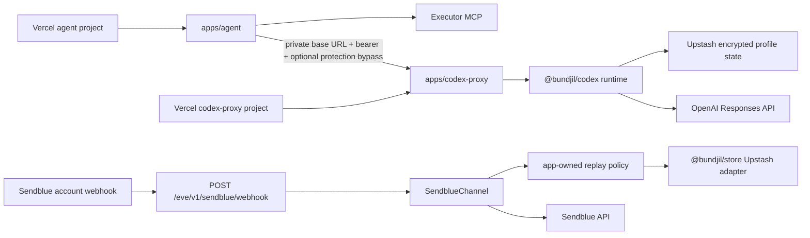
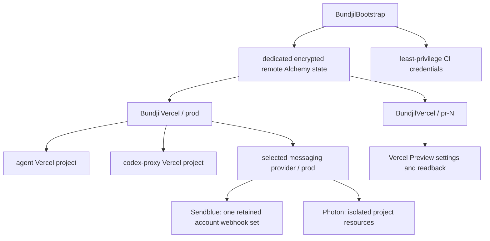
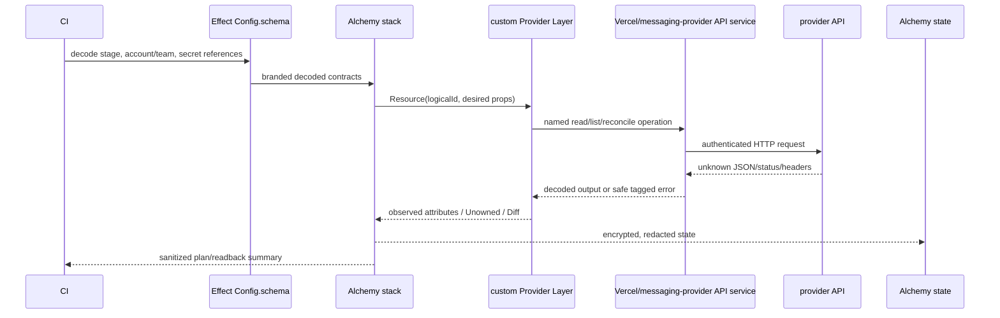
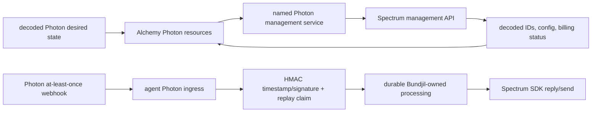
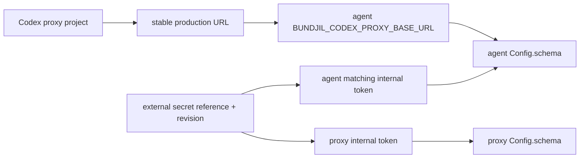

# Alchemy ownership for Vercel and messaging providers

## Research snapshot decision

Adopt a **hybrid Alchemy model** after an infrastructure proof SPEC and a
messaging-provider decision are accepted:

- Alchemy owns stable Vercel project configuration, domains, environment
  variable metadata and values, explicitly adopted Marketplace bindings, and
  read-only drift/proof resources.
- Vercel Git integration continues to create immutable Preview and Production
  deployments. Promotion and rollback remain explicit CI/runbook operations;
  they are not ordinary convergent resources.
- The Sendblue runtime and production-only ingress observed at research time
  remain unchanged while the proof compares two provider paths. If Sendblue is retained,
  Alchemy may own one adopted account webhook set, with retain and deletion
  protection, while line/account lifecycle remains provider-owned. If Photon
  is selected, separate production and preview Spectrum projects may support
  project-scoped webhooks, lines, users, platform configuration, and billing
  readback through custom resources.
- Photon exposes materially stronger documented management lifecycles than
  Sendblue, including stable line and webhook IDs and documented deletion. It
  is the preferred provider candidate for a bounded spike, not an accepted
  architecture decision. Its billable line creation lacks a documented
  idempotency key, project deletion/secret rotation are currently CLI
  contracts rather than complete public API contracts, and its runtime uses
  the Spectrum SDK/webhook model rather than the current Sendblue HTTP channel.
- A dedicated, remotely persisted Alchemy state backend is bootstrapped under
  separate authority. The site repository proves `Cloudflare.state()` works,
  but Bundjil must not silently share the site's stack identity or credentials.

This report authorizes no provider operation. It is supporting research, not
current implementation intent, provider selection, or live provider truth.
Infrastructure proof must begin with `prd-writer`; a Photon migration would
require a second provider-selection/channel-migration SPEC. Accepted SPECs are
then implemented through `prd-implementer`.

### Post-research implementation status — 2026-07-21

The later [Schema-driven Channels and Photon Preview proof SPEC](../product-specs/photon-channel-provider.md)
implemented a clean provider-neutral Channel boundary plus fresh Sendblue and
Photon packages. It deliberately migrated no legacy Sendblue behavior. Local
dual-provider conformance and a bounded Photon management/SDK lifecycle proof
passed; the hosted Preview/message journey stopped because Vercel authority and
a live Space were absent. The [dated receipt](../verification/photon-provider-proof-2026-07-21.md)
is the only live Photon observation and the
[target runbook](../../apps/agent/runbooks/photon.md) owns repeatable proof
operations.

That implementation does not accept this report's Alchemy recommendation,
select a Production provider, or establish current Vercel, Sendblue, or Photon
topology. Current architecture is routed through
[`../architecture/README.md`](../architecture/README.md); any Production
provider selection or Alchemy ownership still requires a new `$prd-writer`
SPEC.

## Truth and evidence boundaries

| Truth layer                   | Evidence used                                                                                                                        | What it proves                                                                                               | What it does not prove                                                                                     |
| ----------------------------- | ------------------------------------------------------------------------------------------------------------------------------------ | ------------------------------------------------------------------------------------------------------------ | ---------------------------------------------------------------------------------------------------------- |
| Bundjil repository            | Git `b38e39e2b3b2b93c611e58d34828c5c00fc8c06f` inspected on 2026-07-20; this report is a subsequent uncommitted documentation change | Declared routes, config contracts, package boundaries, historical provider notes, and verification ownership | Current Vercel, Sendblue, Upstash, DNS, secret, webhook, deployment, or alert state                        |
| Site reference implementation | `/Users/cooper/Projects/site` at Git `93d48948efcea5e39fdcd7e934705cc1f7fcf577`, with an already-dirty working tree                  | Concrete Alchemy 2.0.0-beta.62 and Effect patterns in the files cited below                                  | A clean reproducible snapshot of unrelated dirty documentation/tooling, or a Bundjil-ready custom provider |
| Upstream documentation        | Alchemy v2, Vercel, Sendblue, and Photon primary documentation and published OpenAPI read on 2026-07-20                              | Documented provider/resource and API capability at research time                                             | Tenant-specific availability, permissions, billing, IDs, quotas, or observed live values                   |
| Live provider truth           | Not queried                                                                                                                          | Nothing                                                                                                      | Every current provider claim requiring readback                                                            |

No Vercel, Sendblue, Photon, DNS, Upstash, secret, webhook, deployment, or
other provider mutation was performed. Photon findings are public-documentation
truth only; no Photon tenant was queried.

## 1. Research-time Bundjil call graph and ownership

### Runtime call graph



Repository evidence:

- Vercel has two independently configured applications. The agent has only a
  root build command (`apps/agent/vercel.json:1-4`). The proxy declares its
  package build chain, function duration, and catch-all API rewrite
  (`apps/codex-proxy/vercel.json:1-18`). No repository-owned IaC currently
  declares project creation, domains, environment bindings, or Marketplace
  resources.
- Agent model selection is decoded through Effect `Config.schema`; the
  `codex-proxy` mode requires its URL, internal token, model/window settings,
  and optional Vercel protection bypass (`apps/agent/agent/config.ts:23-110`).
- Sendblue ingress is `POST /eve/v1/sendblue/webhook`. It authenticates and
  replay-claims before dispatch; tagged failures map to safe `401`, `400`, or
  `503` responses (`apps/agent/agent/channels/sendblue.ts:177-233`).
- Sendblue secrets, line/routing policy, replay storage, and limits are
  schema-decoded application configuration (`apps/agent/agent/lib/sendblue/config.ts:21-150`).
  The runtime composes the app-owned channel services over the shared Upstash
  adapter (`apps/agent/agent/lib/sendblue/runtime.ts:17-53`).
- The Codex proxy separately decodes its mode, internal bearer, branded
  subject identity, optional account, and runtime restrictions
  (`apps/codex-proxy/src/env.ts:34-214`). Its live Layer composes encrypted
  profile storage, atomic refresh lock/commit behavior, HTTP clients, provider,
  and readiness (`apps/codex-proxy/src/live.layer.ts:30-103`).
- Sendblue replay can use app-specific `BUNDJIL_SENDBLUE_REPLAY_STORE_*`
  bindings or legacy Vercel `KV_REST_API_*` aliases. Codex storage uses separate
  `BUNDJIL_UPSTASH_REDIS_*` bindings or its own legacy fallback. The repository
  says the credentials and key namespaces are distinct
  (`apps/agent/README.md:330-366`; `packages/codex/README.md:275-308`).

### Current owner map

| Concern                        | Earliest durable repository owner                                 | Current external owner                                      | Gap                                                                               |
| ------------------------------ | ----------------------------------------------------------------- | ----------------------------------------------------------- | --------------------------------------------------------------------------------- |
| Agent build/runtime            | `apps/agent`, its README, `vercel.json`, Effect config            | Vercel project                                              | Project/settings/domain declarations are outside the repository                   |
| Codex proxy build/runtime      | `apps/codex-proxy`, its README, `vercel.json`, `@bundjil/codex`   | Separate Vercel project                                     | Same gap; live project linkage and URL are not repository proof                   |
| Agent-to-proxy URL/auth        | `apps/agent/agent/config.ts` and model provider                   | Vercel environment variables and protection settings        | Rotation and target-specific binding are imperative                               |
| Sendblue route/auth/delivery   | `apps/agent/agent/lib/sendblue`                                   | Sendblue account webhook, line, API credentials; Vercel env | Provider webhook/line lifecycle is outside the repository                         |
| Replay and profile persistence | `@bundjil/store`, app-owned key policy                            | Upstash or Vercel Marketplace connection                    | Integration IDs, database identity, targets, and drift are unknown                |
| Preview/Production separation  | App config and completed rollout notes                            | Vercel environments; one shared Sendblue account            | Vercel isolation needs readback; Sendblue Preview ingress is intentionally absent |
| CI and proof                   | `.github/workflows/ci.yml`, tests, historical app/package READMEs | GitHub Actions and provider dashboards                      | CI verifies code only; current runbook/proof extraction remains an HGI-304 gap    |

The documentation router is explicit that package/provider operations embedded
in package READMEs are not current provider truth. The current SPEC index and
active-plan index contain only HGI-300 (`docs/product-specs/index.md:17-20`;
`docs/exec-plans/active/README.md:10-16`). Infrastructure work therefore has no
active SPEC or execution authority.

The repository's last recorded topology is one active Production Sendblue
receive webhook and no Preview ingress. Multiple account-level webhooks would
duplicate delivery; separate replay stores do not isolate it
(`docs/product-specs/sendblue-eve-channel.md:1026-1059`). This is historical
repository evidence until a live read-only check confirms it.

## 2. Reusable Alchemy and Effect patterns from `~/Projects/site`

The reusable unit is a set of patterns, not a package copy. The site contains no
custom provider for Vercel or Sendblue.

### Stack, stage, and state pattern

`/Users/cooper/Projects/site/alchemy.run.ts:22-65` is the smallest useful
reference:

1. `Alchemy.Stack` gives the stack a stable name.
2. `Cloudflare.providers()` and `Cloudflare.state()` are explicit stack
   dependencies.
3. The stack body is one linear `Effect.gen` program.
4. Every stage gets the common website resource.
5. A stage predicate adds production-only zone/routes.
6. The existing production zone uses `adopt(true)` rather than replacement.
7. The stack returns a schema-shaped summary rather than raw provider objects.

Stable logical IDs, the production stage literal, domain/route names, and
observable settings live together in
`/Users/cooper/Projects/site/apps/web/src/lib/build/cloudflare-stack.ts:7-82`.
Bundjil should reuse that locality: stable identities and desired settings sit
beside the owning stack, not in a generic constants or utilities package.

### Separate bootstrap authority

`/Users/cooper/Projects/site/stacks/github.ts:16-41` uses a distinct stack to
bridge Cloudflare credentials into GitHub Secrets. It merges only the required
providers, keeps remote state explicit, loads Effect Config, and passes secrets
as `Redacted`. Bundjil should likewise separate:

- one-time state/CI credential bootstrap;
- routine read/plan;
- Production apply and rollback.

Bootstrap must never run as part of an ordinary Preview plan.

### Effect boundary and service pattern

The site deployment program provides a concrete template:

- branded/schema config through `Config.schema`, literal branch gating, and a
  safe tagged configuration error
  (`/Users/cooper/Projects/site/packages/scripts/src/cloudflare-production/config.ts:1-28`);
- named `CloudflareCommands.run` service operation
  (`/Users/cooper/Projects/site/packages/scripts/src/cloudflare/service.ts:1-17`);
- a scoped live process Layer which unwraps redacted environment values only at
  process ingress and scrubs them from both output streams
  (`/Users/cooper/Projects/site/packages/scripts/src/cloudflare/live.layer.ts:14-118`);
- a memory Layer that records calls and returns queued results for deterministic
  tests (`/Users/cooper/Projects/site/packages/scripts/src/cloudflare/memory.layer.ts:10-58`);
- Effect Schema decoding of unknown CLI JSON before the value crosses into the
  deployment program
  (`/Users/cooper/Projects/site/packages/scripts/src/cloudflare/output.boundary.ts:10-37`);
- a flat plan → deploy → state readback → route verification sequence, with a
  bounded retry only around transient readiness rather than writes
  (`/Users/cooper/Projects/site/packages/scripts/src/cloudflare-production/service.ts:19-115`).

Bundjil should apply the same form to provider HTTP clients: decode unknown
responses once, expose named Effect service operations, unwrap credentials only
in the live adapter, provide memory/fake Layers, and retry only explicitly safe
reads or idempotent writes.

### Preview, production, CI, proof, and rollback pattern

- Preview stages are branded from `pr-N` and cannot decode as production
  (`/Users/cooper/Projects/site/packages/scripts/src/cloudflare-preview/config.ts:15-66`).
- Preview deploy reads state, verifies the live route, writes a stable PR
  comment, and destroys the isolated stage on close
  (`/Users/cooper/Projects/site/packages/scripts/src/cloudflare-preview/service.ts:120-194`).
- Preview CI is concurrency-scoped by PR and uses a separate token
  (`/Users/cooper/Projects/site/.github/workflows/cloudflare-preview.yml:14-81`).
- Production CI uses an immutable SHA, a production-only token, concurrency,
  post-deploy verification, and a retained sanitized proof artifact
  (`/Users/cooper/Projects/site/.github/workflows/cloudflare-production.yml:14-58`).
- Production runs only after the reusable quality workflow succeeds on `main`
  (`/Users/cooper/Projects/site/.github/workflows/ci.yml:9-23`).

Reusable code should initially be copied with ownership-specific names and
adapted, not imported from the site repository. Specifically reusable:

| Site owner                                                                             | Bundjil adaptation                                                                    |
| -------------------------------------------------------------------------------------- | ------------------------------------------------------------------------------------- |
| `alchemy.run.ts`                                                                       | root stack router and stage gate                                                      |
| `apps/web/src/lib/build/cloudflare-stack.ts`                                           | stable Bundjil stack/resource IDs and outputs                                         |
| `stacks/github.ts`                                                                     | separate bootstrap stack                                                              |
| `packages/scripts/src/cloudflare/{service,live.layer,memory.layer,output.boundary}.ts` | Vercel/messaging-provider API services, live/fake Layers, decoded response boundaries |
| `packages/scripts/src/cloudflare-{preview,production}`                                 | target-specific config, deploy program, tests, readback proof                         |
| Cloudflare workflows                                                                   | concurrency, immutable ref, least-secret CI, verification artifacts                   |

Do not reuse provider-specific Cloudflare resource definitions, command names,
or route policy. Do not create `common`, `utils`, or `helpers`; the site pattern
works because each service and policy has a narrow owner.

## 3. Native-support gap analysis

Alchemy v2 documents native AWS and Cloudflare coverage and its source tree has
provider directories for those and selected integrations, but no Vercel,
Sendblue, or Photon directory ([Alchemy repository](https://github.com/alchemy-run/alchemy),
[provider source tree](https://github.com/alchemy-run/alchemy/tree/main/packages/alchemy/src)).
The installed site dependency, Alchemy `2.0.0-beta.62`, has the same absence.

| Capability                         | Alchemy native on 2026-07-20 | Upstream API exists                                                                                                   | Decision                                                     |
| ---------------------------------- | ---------------------------- | --------------------------------------------------------------------------------------------------------------------- | ------------------------------------------------------------ |
| Vercel project CRUD/settings       | No                           | Yes; Projects are a documented REST category                                                                          | Custom resource, after adoption proof                        |
| Vercel project domains             | No                           | Yes; add, list, verify, and remove endpoints                                                                          | Custom child resource                                        |
| Vercel environment variables       | No                           | Yes; project environment CRUD and sensitive values                                                                    | Custom child resource with external secret resolution        |
| Vercel deployments                 | No                           | Yes; deploy, inspect, events, promote, rollback                                                                       | Keep Vercel Git/CI; model only read/proof or explicit action |
| Vercel Marketplace/Upstash binding | No                           | Marketplace and integration APIs exist; Upstash is a native Marketplace resource                                      | Adopt/read first; mutation waits for exact tenant/API proof  |
| Vercel webhooks/drains             | No                           | REST webhooks and drains endpoints exist                                                                              | Optional custom monitoring resource                          |
| Sendblue webhook set               | No                           | GET/POST/PUT/DELETE account webhook API exists                                                                        | App-owned custom singleton only if Sendblue is retained      |
| Sendblue lines                     | No                           | List and two-step provision endpoints exist                                                                           | Read-only data source first; no provision in initial scope   |
| Sendblue subaccounts and seats     | No                           | Account/member operations exist, but no complete adopt/delete contract was established from the public lifecycle docs | Keep imperative/provider-owned; verify with support          |
| Sendblue phone-number deletion     | No                           | Provision/list is documented; no complete deprovision and number-release lifecycle was found                          | Retain; do not model destructive reconciliation              |
| Sendblue alerts                    | No                           | Limits and delivery errors are documented, but no first-class alert-policy lifecycle was found                        | Bundjil monitoring owns alerts; provider state is read-only  |
| Photon Spectrum management         | No                           | Projects, project webhooks, platforms, lines, users, billing, voice, WhatsApp, and Slack operations are published     | App-owned custom resources only after provider selection     |

Vercel's REST API explicitly covers projects, deployments, domains,
environment variables, Marketplace, and webhooks, and publishes per-endpoint
rate-limit response headers ([Vercel REST API](https://vercel.com/docs/rest-api)).
Projects group deployments, domains, and environment variables
([Vercel projects](https://vercel.com/docs/projects)); deleting one removes
those dependent resources, making default deletion unacceptable
([managing projects](https://vercel.com/docs/projects/managing-projects)).

Vercel environment changes affect only new deployments
([environment variables](https://vercel.com/docs/environment-variables)).
Sensitive values cannot be revealed after creation, including by the API
([sensitive environment variables](https://vercel.com/changelog/sensitive-environment-variables-are-now-available)).
This makes desired-value revision metadata, not value readback, the drift
contract.

Vercel's Upstash integration can create or connect a database and inject
bindings ([Upstash Marketplace integration](https://vercel.com/marketplace/upstash)).
The old Vercel KV product moved to Upstash in 2024
([Vercel Redis transition](https://vercel.com/docs/redis)). Marketplace native
integrations can now restrict credentials to Production, making Preview
binding behavior tenant- and connection-specific
([production-only Marketplace credentials](https://vercel.com/changelog/secure-marketplace-credentials-with-production-only-access)).

Sendblue webhooks are account-level, all lines share them, POST appends, PUT
replaces the complete configuration, and DELETE removes selected URLs
([Sendblue webhooks](https://docs.sendblue.com/getting-started/webhooks/),
[delete endpoint](https://docs.sendblue.com/api/resources/webhooks/methods/delete)).
Sendblue v2 documents line listing plus preview/confirm provisioning
([Sendblue API v2](https://docs.sendblue.com/api-v2/)). Per-line throughput is
10 messages per second and excess traffic returns `429`
([Sendblue limits](https://docs.sendblue.com/limits/)).

### Photon Spectrum alternative

Photon's published Spectrum API covers substantially more of the desired
management plane than the Sendblue lifecycle established above. The management
API is project-scoped; runtime messaging is a separate Spectrum SDK and signed
webhook integration, so management coverage does not make Photon a drop-in
replacement for Bundjil's current Sendblue channel.

| Requirement                    | Documented Photon coverage                                                                                              | IaC assessment                                                                                                                           |
| ------------------------------ | ----------------------------------------------------------------------------------------------------------------------- | ---------------------------------------------------------------------------------------------------------------------------------------- |
| Project bootstrap              | Dashboard API creates and lists projects and can return a Spectrum project ID and one-time project secret               | Partial: stable identity exists, but public Dashboard OpenAPI is intentionally incomplete; delete and secret rotation are CLI-only today |
| Webhook lifecycle              | Project-scoped list/register/delete; stable webhook UUID; one-time 64-hex signing secret; same active URL returns `409` | Strong custom-resource candidate with external/write-only secret custody and replacement on URL or secret rotation                       |
| Dedicated iMessage lines       | Project-scoped list/create/profile/route/delete; stable line UUID; create/delete report billing/proration               | Stronger than Sendblue, but create is billable and has no documented idempotency key; retain/protect and never blindly retry             |
| Users                          | Create/list/get/soft-delete; shared creation is idempotent by phone and dedicated creation by phone plus assigned line  | Viable custom resource after exact upsert and soft-delete semantics are fixture-tested                                                   |
| Platform configuration         | Get/toggle platforms and update platform metadata                                                                       | Viable in-place project child resource                                                                                                   |
| Billing and convergence        | Subscription details and billing-sync status expose `in_sync`, `syncing`, and `failed`, including proration results     | Read-only observation can close eventual-consistency loops after authorized line mutations                                               |
| Delivery operations and alerts | Six webhook attempts with exponential backoff and jitter; 30-second attempts; retry on network, `408`, `429`, and `5xx` | Useful runtime contract, but no persistent queue, DLQ, self-service delivery log, or first-class alert-policy API                        |
| Runtime send/receive           | `spectrum-ts` handles signed inbound webhooks and messaging                                                             | Requires a new app-owned channel adapter and cutover SPEC; the management REST API is not the runtime send API                           |

Primary contracts are the published
[Spectrum API introduction](https://photon.codes/docs/api-reference/introduction),
[Spectrum OpenAPI](https://spectrum.photon.codes/openapi/json), and
[Dashboard OpenAPI](https://photon.codes/docs/api-reference/dashboard-openapi.json).
Line deletion is documented, unlike the unresolved Sendblue deprovision path
([remove a dedicated line](https://photon.codes/docs/api-reference/lines/remove-a-dedicated-line)),
and billing convergence is observable
([billing sync status](https://photon.codes/docs/api-reference/billing/get-billing-sync-status)).
However, the create endpoint is billable and does not document an idempotency
key ([add a dedicated line](https://photon.codes/docs/api-reference/lines/add-a-dedicated-imessage-line)).
That gap overrides the general statement that retrying `5xx` is safe: a timed-
out create is `OutcomeUncertain` until list/billing observation or provider
support establishes a safe recovery key.

The CLI documents permanent project deletion and immediate invalidation of the
old project secret on rotation, but those operations are not both exposed by
the intentionally limited public Dashboard OpenAPI
([project CLI](https://photon.codes/docs/cli/projects),
[Dashboard OpenAPI](https://photon.codes/docs/api-reference/dashboard-openapi.json)).
Project lifecycle should therefore remain bootstrap/retain rather than an
Alchemy CRUD resource until Photon publishes a stable API contract. User
creation has documented semantic idempotency and deletion is soft-delete
([create user](https://photon.codes/docs/api-reference/users/create-user),
[delete user](https://photon.codes/docs/api-reference/users/delete-user));
platform state has explicit get/toggle/metadata operations
([get platforms](https://photon.codes/docs/api-reference/platforms/get-platforms),
[toggle platform](https://photon.codes/docs/api-reference/platforms/toggle-platform),
[update metadata](https://photon.codes/docs/api-reference/platforms/update-platform-metadata)).

Webhook registration has a better ownership surface than Sendblue's
account-wide document: Photon returns a stable UUID and a signing secret only
once, while list returns metadata without the secret
([register](https://photon.codes/docs/api-reference/webhooks/register-webhook),
[list](https://photon.codes/docs/api-reference/webhooks/list-webhooks),
[delete](https://photon.codes/docs/api-reference/webhooks/delete-webhook)).
Delivery remains at-least-once and is dropped after the final retry, with no
self-service delivery log
([delivery](https://photon.codes/docs/webhooks/delivery),
[troubleshooting](https://photon.codes/docs/webhooks/troubleshooting)).
Bundjil therefore still owns replay, durable processing, metrics, and alerts.

## 4. Recommended project structure and topology

### Proposed owners

```text
alchemy.run.ts
stacks/
  bundjil.ts                 # topology and stage gates only
  bootstrap.ts               # remote state and CI credential bridge only
packages/vercel/
  src/api/                   # Vercel schemas, errors, named service, live/fake Layers
  src/resources/             # project, domain, env, binding, webhook/readback
apps/agent/infrastructure/
  sendblue/                  # retained-provider API and webhook-set resource
  photon/                    # selected only by a later provider-migration SPEC
  desired.ts                 # agent project/env desired state
apps/codex-proxy/infrastructure/
  desired.ts                 # proxy project/env desired state
tooling/infrastructure/
  preview/                   # plan/readback orchestration and tests
  production/                # apply/readback orchestration and tests
apps/agent/runbooks/         # app-owned consequential provider operations
docs/verification/           # sanitized current proof owner added with implementation
```

`packages/vercel` is justified only because both deployed applications consume
one stable provider contract. Sendblue or Photon remains under the agent because
the messaging provider has one application consumer. The provider-selection
SPEC chooses one owner; it must not instantiate both. Do not introduce a
provider-neutral messaging abstraction until a stable contract has proved
multiple consumers. Lifecycle policy stays inline in each provider resource
unless demonstrated reuse justifies extraction.

### Stack topology



Use one Vercel stack with `prod` and `pr-N` state isolation, but do not create a
new Vercel project per PR. The existing two projects own their Vercel Preview
environment; PR stages own only branch-scoped desired env metadata and proof.
If Sendblue is retained, use a separate `BundjilSendblue` stack because a shared
account webhook is not PR-scoped; it has only `prod` until provider isolation is
real. If Photon is selected, use separate Spectrum projects and stack stages for
Production and Preview. Preview must not receive a billable dedicated line by
default; that is a separately authorized resource, not a consequence of stage
creation.

A dedicated `Cloudflare.state()` backend is the lowest-risk reuse of the site
pattern if Bundjil can receive a separately scoped Cloudflare token. Its
creation is a one-time bootstrap mutation requiring its own runbook. Alchemy
state records desired props and outputs per stack/stage and supports recovery
from intermediate states
([Alchemy state store](https://v2.alchemy.run/state-store/)). It must not reuse
the site's logical stack name.

## 5. Proposed Effect and resource call graphs

### Plan/apply path



### Conditional Photon management and runtime paths



The management and runtime paths share branded project/line identities and
secret references, not raw clients or generic helpers. Alchemy never sends
messages; the runtime adapter never mutates management resources. A Photon
selection SPEC owns both contracts and their cutover ordering in the agent.

### Runtime URL and secret binding



The internal token is one rotation unit written to two projects. Alchemy must
not generate a new value during ordinary reconcile. A versioned external secret
is resolved at apply time and both environment resources declare the same
`secretRevision`; a new deployment is required before promotion.

### Effect service rules

Each provider boundary must expose named operations, for example:

```ts
class VercelProjects extends Context.Service<
  VercelProjects,
  {
    readonly getProject: (
      id: VercelProjectId
    ) => Effect<Project, ProjectReadError>;
    readonly createProject: (
      desired: ProjectDesired
    ) => Effect<Project, ProjectWriteError>;
    readonly updateProject: (
      id: VercelProjectId,
      desired: ProjectDesired
    ) => Effect<Project, ProjectWriteError>;
    readonly deleteProject: (
      id: VercelProjectId
    ) => Effect<void, ProjectDeleteError>;
  }
>()("@bundjil/vercel/VercelProjects") {}
```

Unknown response JSON is decoded once using the operation's Effect Schema.
Provider IDs, team IDs, project names, domains, environment keys/targets,
webhook URLs, line IDs, and account IDs are branded. Config uses
`Config.schema`; tokens and secret values are redacted. Errors are operation-
specific tagged classes with safe status, provider code, retry classification,
and a sanitized message—never a raw body, credential, URL query, phone number,
or SDK error. Live and memory/fake Layers implement the same service.

## 6. Resource inventories

These are desired inventories inferred from code. Physical IDs, exact domains,
targets, values, integrations, account identities, and current existence require
live read-only inventory.

### Production

| Resource                   | Desired repository-derived state                                                                                                                         | Physical identity to adopt                   | Mutation posture                                    |
| -------------------------- | -------------------------------------------------------------------------------------------------------------------------------------------------------- | -------------------------------------------- | --------------------------------------------------- |
| Vercel agent project       | Root `apps/agent`; root build command; Production/Preview envs                                                                                           | Existing project ID/name                     | Read/adopt, retain                                  |
| Vercel codex-proxy project | Root `apps/codex-proxy`; no framework; 30s API function; catch-all rewrite                                                                               | Existing project ID/name                     | Read/adopt, retain                                  |
| Production domains         | Stable agent and proxy aliases; exact names unknown                                                                                                      | Existing domain plus project ID              | Read/adopt; no DNS ownership initially              |
| Agent model/Executor env   | `BUNDJIL_AGENT_MODEL_PROVIDER`, `BUNDJIL_AGENT_MODEL`, `AI_GATEWAY_API_KEY`, `VERCEL_OIDC_TOKEN`, `BUNDJIL_EXECUTOR_MCP_URL`, `BUNDJIL_EXECUTOR_API_KEY` | project + key + `production`                 | Declare target/type; external secret values         |
| Agent-to-proxy env         | proxy base URL, internal token, optional protection bypass, proxy model, context window                                                                  | project + key + `production`                 | One coordinated rotation group                      |
| Sendblue app env           | API key/secret, webhook secret, line, sender identities, routing key, allowed services, typing duration                                                  | agent project + key + `production`           | External values; sensitive where supported          |
| Sendblue replay env        | app-specific Upstash URL/token/prefix/TTL/lease; legacy `KV_REST_API_*` only during migration                                                            | agent project + key + `production`           | Preserve database and prefix                        |
| Codex proxy env            | mode, internal token, profile/connector/installation/subject/account, cipher key/id/algorithm, refresh timing                                            | proxy project + key + `production`           | External values; coordinated token/cipher revisions |
| Codex profile store        | Upstash URL/token/key prefix                                                                                                                             | existing Marketplace/database/connection IDs | Import/read; never recreate from a guessed name     |
| Sendblue replay store      | Upstash URL/token/key prefix                                                                                                                             | existing database/connection IDs             | Import/read; prove whether shared physical DB       |
| Sendblue webhook set       | one `receive` URL at stable Production route, signing secret                                                                                             | account + canonical URL/type set             | Import first; retain/protect                        |
| Sendblue line inventory    | configured `from_number` and account lines                                                                                                               | provider line ID/phone number                | Read-only                                           |
| Monitoring                 | Vercel deployment/project events, proxy `/health`, safe Sendblue attempt/outcome metrics, duplicate Preview ingress alert                                | existing drain/webhook/observability IDs     | Read/adopt before mutation                          |

### Preview

| Resource                            | Desired state                                                                                       | Isolation rule                                                                                     |
| ----------------------------------- | --------------------------------------------------------------------------------------------------- | -------------------------------------------------------------------------------------------------- |
| Vercel project Preview environments | Same two projects, target `preview`; branch-scoped values only where needed                         | Never write Production targets from a PR stage                                                     |
| Agent-to-proxy URL/auth             | Preview proxy URL and a Preview-only token/bypass                                                   | Must not equal Production credentials                                                              |
| Replay/profile stores               | Preview bindings and prefixes distinct from Production                                              | Physical DB may be shared only if key namespace and credentials are intentionally scoped; prove it |
| Sendblue webhook                    | None on the shared account                                                                          | A separate Sendblue account and its own line, plus a SPEC, are prerequisites                       |
| Domains                             | Vercel-generated Preview deployment URLs; no production custom-domain writes                        | PR cleanup removes only PR-owned metadata, not projects/deployments                                |
| Proof                               | project/env/domain plan, deployment URL health, proxy auth denial/acceptance, zero Sendblue ingress | Sanitized PR artifact/comment, no secrets or message identifiers                                   |

### Conditional Photon inventory

This inventory applies only if a later provider-selection SPEC chooses Photon.
It does not coexist with an Alchemy-owned Sendblue webhook resource.

| Stage      | Resource inventory                                                                                                                 | Isolation and mutation posture                                                                                                      |
| ---------- | ---------------------------------------------------------------------------------------------------------------------------------- | ----------------------------------------------------------------------------------------------------------------------------------- |
| Production | Spectrum project, enabled platforms and metadata, project webhook, adopted/dedicated lines, users, subscription and billing status | Separate project and project secret; webhook and lines retain/protect; users soft-delete only by explicit policy; billing read-only |
| Preview    | Separate Spectrum project, platform metadata, project webhook, synthetic users, billing status                                     | Separate secret and webhook signing key; no dedicated billable iMessage line unless separately authorized                           |
| Both       | Vercel env bindings for project secret, webhook signing secret/revision, runtime URL, platform/line identities, replay namespace   | Values stay in external secret custody; state records only stable IDs, references, revisions, booleans, and sanitized status        |
| Proof      | Project/line/webhook/user/platform IDs, config digest, billing sync state, signed ingress/replay result, delivery limitations      | No phone number, message body, project secret, webhook secret, or end-user identity in ordinary artifacts                           |

`turbo.json:10-40` currently enumerates many agent build variables but omits the
Executor API key from the agent build task while including it for tests. This
report does not classify that as a bug: whether it is required at build time
depends on the actual Vercel build boundary. The infrastructure SPEC must derive
the authoritative inventory from every `Config` owner and add an automated
contract test so the list cannot drift.

## 7. Custom resource lifecycle designs

Alchemy providers implement `list`, `reconcile`, and `delete`, with optional
`read`, `diff`, and `precreate`. `reconcile` handles create, update, and
adoption; replacement creates a new generation before deleting the old one.
Reads can return `Unowned` to gate adoption
([custom provider](https://v2.alchemy.run/infrastructure-as-code/custom-provider/),
[resource lifecycle](https://v2.alchemy.run/infrastructure-as-code/resource-lifecycle/)).
Logical IDs must remain stable because a rename is a delete/create identity
change ([Alchemy Resource](https://v2.alchemy.run/infrastructure-as-code/resource/)).

### Shared lifecycle contract

```ts
const provider = Resource.Provider.of({
  read: ({ output, newsOrOlds }) =>
    api.observe(deterministicPhysicalKey(newsOrOlds, output)).pipe(
      Effect.map(ownershipGate) // undefined | attributes | Unowned(attributes)
    ),
  diff: ({ olds, news, output }) =>
    classify(decodedCanonicalDiff(olds, news, output)),
  reconcile: ({ news, olds, output }) =>
    Effect.gen(function* () {
      const observed = yield* api.observe(physicalKey(news, output));
      const result = yield* convergeWithoutDuplicate(news, observed);
      return yield* decodeAttributes(result);
    }),
  delete: ({ olds, output }) =>
    deletionPolicy(olds).pipe(
      Match.value,
      Match.when("retain", () => Effect.void),
      Match.when("delete", () => api.deleteIfPresent(output.physicalId)),
      Match.exhaustive
    ),
  list: () => api.listAllPages(),
});
```

Every reconcile observes first, applies the minimal idempotent change, then
reads until the documented condition is visible. Missing-on-delete is success.
Retry only `429`, documented transient `5xx`, timeouts before a response, and
eventual-consistency reads; use bounded exponential backoff with jitter and the
provider reset header when available. Vercel publishes `X-RateLimit-*` headers
and per-endpoint limits ([REST API](https://vercel.com/docs/rest-api),
[limits](https://vercel.com/docs/limits)); Photon documents five management API
requests per second per project and `429`
([Photon rate limit](https://photon.codes/docs/api-reference/rate-limit)). A
timed-out non-idempotent write is an `OutcomeUncertain` error followed by
observe/reconcile, never blind replay.

### Per-resource contracts

| Resource                           | Physical ID and read/import                                                                                                                                                                   | Diff and reconcile                                                                                                                                                                                                                                                        | Delete/replacement                                                                                                                                      |
| ---------------------------------- | --------------------------------------------------------------------------------------------------------------------------------------------------------------------------------------------- | ------------------------------------------------------------------------------------------------------------------------------------------------------------------------------------------------------------------------------------------------------------------------- | ------------------------------------------------------------------------------------------------------------------------------------------------------- |
| `VercelProject`                    | Vercel project ID; discover by exact team + project name. Existing match is `Unowned` until explicit adoption.                                                                                | Root/build/framework/settings update in place when API supports it. Team or immutable Git identity change is replacement or rejected.                                                                                                                                     | Default retain/protected. Explicit deletion requires a separate destructive runbook because project deletion cascades.                                  |
| `VercelProjectDomain`              | project ID + normalized domain; verify exact project attachment.                                                                                                                              | Add then poll verification; DNS is observed, not mutated in the first slice. Move between projects is replacement.                                                                                                                                                        | Retain by default for Production; Preview-owned optional domains can delete-if-present.                                                                 |
| `VercelProjectEnvironmentVariable` | provider env-var ID when known; otherwise project + key + sorted targets + optional branch.                                                                                                   | Key/targets/type are canonical. Secret value is resolved at apply; compare `secretRevision`, not readback. Update if supported, otherwise create replacement then remove old only after a deployment proof.                                                               | Production retain by default. Never remove a credential until all consumers are cut over.                                                               |
| `VercelMarketplaceBinding`         | Vercel integration/configuration/resource ID plus Upstash database ID.                                                                                                                        | First implementation supports list/read/import and desired project/target attachment only after exact Marketplace API proof. Never infer create from env aliases.                                                                                                         | Always retain initially. Detach/delete is separate because it can remove injected credentials or data access.                                           |
| `VercelDeploymentObservation`      | immutable deployment ID and Git SHA.                                                                                                                                                          | Read-only: status, target, aliases, events, and provenance. `reconcile` fails if asked to create.                                                                                                                                                                         | No-op retain.                                                                                                                                           |
| `VercelPromotion` (future action)  | deployment ID + target + explicit operation nonce.                                                                                                                                            | Replacement-only action after health/proof; not run by ordinary drift reconciliation. The repository should prefer a typed CI service instead.                                                                                                                            | No delete. Rollback is a separate explicit action to a retained deployment.                                                                             |
| `VercelWebhook` or `Drain`         | provider webhook/drain ID; target URL and event set.                                                                                                                                          | Canonical event set updates in place; signing secret uses external revision. Endpoint readiness is verified before activation.                                                                                                                                            | Retain Production by default; disable before delete.                                                                                                    |
| `SendblueAccountWebhookSet`        | account identity + singleton logical ID; observed canonical type/URL set. Because Sendblue exposes no ownership tags, any existing match is `Unowned` until an adoption manifest is approved. | GET all. Targeted POST/DELETE manages only declared URLs. PUT is forbidden unless `ownsEntireAccountWebhookDocument` is explicitly true and a fresh GET was captured in the same operation. Secret rotation behavior for an unchanged URL must be proven before mutation. | `retain` and deletion protection are mandatory for Production. Explicit delete removes only the exact adopted type/URL after agent ingress is disabled. |
| `SendblueLineInventory`            | line provider ID/number from paginated GET.                                                                                                                                                   | Read/list only; no desired mutation.                                                                                                                                                                                                                                      | No-op.                                                                                                                                                  |
| `SendblueLine` (future)            | confirmed provider line ID, never a guessed number.                                                                                                                                           | Create is replacement-only and requires an approved preview token from the two-step flow. It may not run during normal reconcile.                                                                                                                                         | Retain; no documented safe delete lifecycle was established.                                                                                            |

Photon resources are conditional on provider selection:

| Resource                      | Physical ID and read/import                                                                     | Diff and reconcile                                                                                                                             | Delete/replacement                                                                                                              |
| ----------------------------- | ----------------------------------------------------------------------------------------------- | ---------------------------------------------------------------------------------------------------------------------------------------------- | ------------------------------------------------------------------------------------------------------------------------------- |
| `PhotonProject`               | Dashboard project ID plus Spectrum project ID; adopt by exact reviewed IDs, never display name  | Bootstrap/create is an explicit action because the project secret is returned once; routine reconcile reads profile/config and stable identity | Retain/protect. Do not implement Alchemy delete until the lifecycle is a stable public API contract rather than a CLI-only path |
| `PhotonWebhook`               | Project ID plus webhook UUID; list exposes URL and timestamps but not the signing secret        | Register exact URL; treat same-URL `409` as an adoption decision, not success; URL or secret rotation creates a replacement                    | Retain Production; explicit delete by UUID after new endpoint proof, then tolerate `404` and in-flight final deliveries         |
| `PhotonLine`                  | Project ID plus stable line UUID; observe list, routing/profile, subscription, and billing sync | Create is replacement-only, billable, explicitly authorized, and never blindly retried after timeout; poll billing until not `syncing`         | Retain/protect by default. Explicit delete by UUID only after traffic drain and cost/number-release confirmation                |
| `PhotonUser`                  | Project ID plus user UUID and the documented semantic phone/assigned-line key                   | Use the documented idempotent shared or dedicated upsert; read back the stable UUID                                                            | Soft-delete only. Replacement must preserve the chosen semantic key and routing contract                                        |
| `PhotonPlatformConfiguration` | Project ID plus branded platform literal                                                        | Read current enablement/metadata; apply only decoded canonical field changes in place                                                          | Restore prior metadata/enablement; no project deletion                                                                          |
| `PhotonBillingObservation`    | Project ID                                                                                      | Read-only subscription and billing-sync status; `reconcile` rejects writes                                                                     | No-op retain                                                                                                                    |

There is no `PhotonAlertPolicy` resource in this design because the published
surface does not expose one. Bundjil-owned monitoring consumes sanitized
billing/profile status, webhook registration drift, runtime attempt/outcome
metrics, and provider delivery limitations.

### Sendblue webhook pseudocode

```ts
reconcile({ news, output }) = Effect.gen(function* () {
  const observed = yield* webhooks.listAccountWebhooks();
  const owned = yield* verifyAdoptionManifest(news.adoptionDigest, observed);
  const diff = canonicalManagedDiff(news.entries, owned);

  yield* Effect.forEach(diff.additions, webhooks.append, { concurrency: 1 });
  yield* pollUntilVisible(diff.additions);

  // Destructive half only after additions are observed and only for adopted URLs.
  yield* Effect.forEach(diff.removals, webhooks.deleteExact, {
    concurrency: 1,
  });
  return yield* webhooks.readRedactedAttributes(news.managedTypes);
});
```

Do not persist a Sendblue secret returned by GET. Outputs contain only a
`secretConfigured` boolean and the declared secret revision. Alchemy preserves
Effect `Redacted` values in logs/state
([Alchemy outputs](https://v2.alchemy.run/infrastructure-as-code/outputs/)), but
the safer contract keeps actual secret material in the deploy-time Config
provider and stores only a revision/digest. The same rule applies to Vercel
sensitive environment values.

Photon uses the same secret boundary. A project secret grants project-wide
management access and does not expire; a webhook signing secret is returned
once on registration. Neither belongs in Alchemy output/state. The resource
stores an external reference, revision, and `secretConfigured` boolean. A
failed state write after successful webhook registration is a partial failure:
observe by URL, retain the remote webhook, quarantine the just-returned secret
in the approved secret store if possible, and require an explicit rotation/
replacement decision instead of creating another endpoint.

### Testing contract

For every resource:

- Schema contract tests cover accepted and malformed provider fixtures;
- the API fake records named calls, paginates, simulates `404`, `409`, `429`,
  transient `5xx`, timeout-after-write, and eventual consistency;
- provider tests cover create, no-op, in-place update, replace, adoption denied,
  adoption allowed, drift refresh, retain, idempotent delete, and recovery after
  state persistence failure;
- write-only secret tests assert no value appears in attributes, plan, state
  serialization, error text, spans, or fixtures;
- Alchemy's provider test harness validates lifecycle behavior
  ([Alchemy testing](https://v2.alchemy.run/concepts/testing));
- live tests are separately authorized, narrow, read-only by default, and run
  against disposable resources only when mutation is explicitly approved.

## 8. Secret migration and state adoption

1. **Freeze identities.** Record Git SHA, Vercel team/project IDs, root
   directories, domain attachments, env keys/types/targets, Marketplace
   configuration and Upstash database IDs, current Sendblue account/line
   identity, canonical webhook entries, and key prefixes. If Photon is selected,
   separately record its exact project, platform, webhook, line, and user IDs.
   Record values only in the existing secret manager.
2. **Build read/import providers first.** A first plan may call GET/list but its
   `reconcile` rejects writes. Existing resources return `Unowned`; adoption
   requires `--adopt` or `.pipe(adopt(true))` plus a reviewed manifest.
3. **Seed remote state without mutation.** Adopt one resource class at a time,
   beginning with Vercel projects, then domains, env metadata, Marketplace
   bindings, and finally the selected provider's existing webhook. Photon
   project/line adoption is a separate manifest; never infer it from a phone
   number or webhook URL. Stop on any create, replace, or delete plan.
4. **Keep production resources retained.** Project, domain, database/binding,
   webhook, and line resources begin with `deletionPolicy: "retain"`. Logical
   IDs are never renamed during migration.
5. **Externalize values.** The Alchemy state stores env key, target, Vercel
   type, secret reference, and `secretRevision`; the live Layer resolves the
   Redacted value. No live value is printed or captured. Existing sensitive
   values that Vercel cannot reveal are marked `revision: "pre-alchemy-v1"`
   until deliberately rotated.
6. **Rotate by dependency group.** For agent-to-proxy auth, write the new token
   to both projects, create/verify deployments, promote the proxy and agent in
   dependency order, then revoke the old token. For Sendblue, make the agent
   accept the new secret before changing the provider webhook, verify ingress,
   then remove the old path. For Photon, first escrow the one-time project or
   webhook secret, update the Vercel env revision, verify a new deployment, and
   only then retire the prior endpoint/credential.
7. **Preserve storage.** Adopt Marketplace/database IDs and both key prefixes.
   Never create a new Upstash database because an env alias is missing.
8. **Prove and only then enable writes.** Each resource class moves from
   read/import to reconcile under a SPEC acceptance criterion and a reviewed
   no-replacement plan.

The first import artifact must include a hash of the sanitized observed
manifest. A subsequent adoption fails if the live manifest hash changes,
forcing a new review rather than taking over drift silently.

## 9. CI/CD, promotion, rollback, drift, and monitoring

### Pull requests

1. Run `bun run verification`.
2. Run contract/provider fake tests.
3. Run the future SPEC-owned read-only Preview plan operation; no such Bundjil
   command exists yet.
4. Fail if the plan touches Production targets or contains project/domain/
   database/webhook delete or replacement.
5. Let Vercel Git create immutable Preview deployments.
6. Read deployment IDs/status, prove proxy `/health`, prove authorized and
   unauthorized agent-to-proxy paths with synthetic content, and assert zero
   shared-account Sendblue ingress or use only an explicitly isolated Photon
   Preview project.
7. Upload a sanitized plan and proof artifact; destroy only PR-owned Alchemy
   state on close.

### Production

1. Run on immutable `main` SHA after quality and Preview proof.
2. Use a production environment approval and separately scoped credentials.
3. Plan first and reject unapproved create/replace/delete actions.
4. Apply stable configuration only.
5. Let Vercel build immutable deployments with the new environment snapshot.
6. Verify each deployment before promotion. Promote proxy before agent for URL/
   auth contract changes; promote storage-compatible changes before consumers.
7. Capture project IDs, deployment IDs, Git SHA, targets, alias results,
   readback status, proof checks, limitations, and rollback target—never values.

Vercel documents immutable deployments, promotion, and instant rollback
([deployment overview](https://vercel.com/docs/deployments/overview),
[promoting deployments](https://vercel.com/docs/deployments/promoting-a-deployment)).
An environment-variable change needs a new deployment, so a config rollback may
require rebuilding with the old revision rather than only rerouting traffic.

### Rollback and partial failure

- Alchemy provider reconcile is observe-first and rerunnable. After an
  uncertain write, re-read before any retry.
- Vercel application rollback reroutes to the retained prior deployment. If the
  new deployment depends on a new env value, retain both value revisions until
  rollback expiry.
- Sendblue webhook rollback first restores/keeps a known-good agent deployment
  and credential, then adjusts the webhook. Never delete the last production
  receive endpoint as an automatic compensating action.
- Photon rollback retains the current Sendblue channel until the new runtime
  path and signed webhook have passed cutover proof. A failed Photon webhook
  replacement retains the observed endpoint; a failed or uncertain line create
  is reconciled through line/billing reads and never compensated by an
  automatic delete.
- State-store failure after provider success resumes from intermediate state;
  providers must use deterministic identity and idempotent read/reconcile/delete
  ([resource lifecycle](https://v2.alchemy.run/infrastructure-as-code/resource-lifecycle/)).
- A failed multi-resource apply emits a partial-failure proof and stops. It does
  not attempt broad reverse-order deletion.

### Drift and monitoring

- Run the future SPEC-owned Production plan operation read-only on a schedule;
  no such Bundjil command exists yet. Alert on unexpected create, update,
  replace, or delete and retain the sanitized plan.
- Read Vercel project settings, env metadata/targets/types, domains,
  integrations, latest deployments and aliases. Deployment events provide
  build evidence
  ([deployment events](https://vercel.com/docs/rest-api/reference/endpoints/deployments)).
- Monitor proxy `/health`, agent-to-proxy authorization denial/acceptance,
  Upstash availability, key-prefix collision, and current deployment identity.
- Read Sendblue account webhook count/type/URL and line inventory. Alert on more
  than one shared-account receive webhook, missing Production URL, any Preview
  URL, unexpected line, `429`, unavailable typing/delivery attempts, or replay
  store failures. Do not inspect message content or phone identifiers in alerts.
- If Photon is selected, read project webhook IDs/URLs, platform configuration,
  line IDs/profile status, subscription quantity, and billing sync state. Alert
  through Bundjil-owned monitoring on missing/unexpected registration,
  `syncing` beyond a bounded window, `failed`, signed-ingress failures, replay
  failure, and exhausted runtime delivery. Photon does not supply a declarative
  alert policy, persistent queue, DLQ, or self-service delivery log.
- Prefer a Vercel drain/webhook only after its endpoint/auth resource is adopted;
  until then, CI readback and existing provider observability remain authoritative.

## 10. Weighted decision matrix

Scores are 1 (poor) to 5 (strong). Weighted totals are out of 5.

| Criterion                          |   Weight | Full Alchemy |   Hybrid | Current imperative/provider setup |
| ---------------------------------- | -------: | -----------: | -------: | --------------------------------: |
| Safe adoption and deletion control |      25% |            2 |        5 |                                 3 |
| Drift coverage                     |      20% |            5 |        4 |                                 1 |
| Implementation/maintenance cost    |      15% |            2 |        4 |                                 4 |
| Preview/Production isolation       |      15% |            4 |        5 |                                 3 |
| Promotion/rollback fit             |      10% |            3 |        5 |                                 3 |
| Effect testability and proof       |      10% |            4 |        5 |                                 2 |
| Operator clarity                   |       5% |            2 |        4 |                                 3 |
| **Weighted total**                 | **100%** |     **3.20** | **4.60** |                          **2.65** |

Full ownership offers maximum theoretical drift coverage but forces immutable
deployments, commercial line provisioning, and weakly deletable provider
objects into a convergent lifecycle. The current setup is simple but leaves
configuration and drift outside repository review. Hybrid wins because it
declaratively owns stable state while preserving the providers' safer native
deployment and account workflows.

Messaging-provider suitability is a separate decision from the Alchemy
ownership model:

| Criterion                         | Sendblue retained | Photon candidate | Evidence boundary                                                                |
| --------------------------------- | ----------------: | ---------------: | -------------------------------------------------------------------------------- |
| Management lifecycle completeness |                 2 |                4 | Photon publishes stable IDs and delete/read contracts for webhooks, lines, users |
| Current Bundjil runtime fit       |                 5 |                2 | Sendblue is implemented; Photon requires an SDK/webhook channel migration        |
| Preview/Production isolation      |                 2 |                4 | Photon resources are project-scoped; current Sendblue webhook is account-wide    |
| Destructive/write safety          |                 2 |                3 | Photon line delete exists, but billable create lacks documented idempotency      |
| Operations and alert coverage     |                 2 |                3 | Photon exposes status/retry behavior, but neither provides full alert ownership  |

These unweighted research scores rank Photon as the stronger management-plane
candidate, not the automatic migration winner. Runtime migration cost, product
behavior, account/plan truth, and a disposable lifecycle spike remain decision
gates.

## 11. Proof of concept and migration plan

All commands run from the Bundjil repository root. Commands below are proposed;
provider-read/apply commands must not run until the SPEC and credential scope
authorize them.

### Spike programme

The spike programme must prove two different claims:

- **works:** Bundjil can express, decode, test, adopt, reconcile, retain, and
  recover the proposed resources through Alchemy and Effect; and
- **is effective:** the approach reduces unreviewed drift and manual work
  without competing with Vercel deployments, leaking secrets, weakening
  Preview/Production isolation, or making rollback harder.

Activity count is not evidence of effectiveness. Each spike has a bounded
environment, authority class, observable oracle, proof artifact, and stop
condition. Local and fake-provider spikes prove code behavior only. Read-only
provider inventory proves observed metadata at one time. Disposable-provider
spikes prove only their named disposable resources. None proves Production
until a later target-owned runbook and current provider readback do so.

| Order | Spike                                     | Environment and authority                                      | Decisive postcondition                                                                                       |
| ----: | ----------------------------------------- | -------------------------------------------------------------- | ------------------------------------------------------------------------------------------------------------ |
|     1 | Offline provider lifecycle harness        | Local only; no credentials or provider access                  | Lifecycle and fault matrix passes through fake Layers with no secret leakage                                 |
|     2 | Read-only live inventory                  | Current providers; explicitly scoped read-only credentials     | Stable physical identities and sanitized metadata decode with zero writes                                    |
|     3 | Import/adoption dry run                   | Current providers; read-only plus separately approved import   | Existing identities adopt without create, replacement, deletion, or physical-ID change; second plan is no-op |
|     4 | Disposable Vercel lifecycle               | Dedicated disposable project; explicit write authority         | Create/update/drift repair/retain converge with bounded calls and a no-op second plan                        |
|     5 | Secret and agent-to-proxy rotation        | Two disposable Vercel projects; synthetic secret               | Coordinated revision rotates without disclosure or an unrecoverable mismatch                                 |
|     6 | Hybrid pull-request deployment            | Disposable or approved Preview projects; no Production         | Alchemy config and Vercel Git deployment coexist; cleanup touches only PR-owned state                        |
|     7 | Sendblue singleton and recovery lifecycle | Separate disposable Sendblue account; explicit write authority | Append/read/rotate/delete/retain/recover behavior avoids duplicate or dropped ingress                        |
|     8 | Photon management and runtime viability   | Local fakes first; isolated Photon project; explicit writes    | Project-scoped lifecycle and signed runtime path work without unsafe billable retries or Sendblue cutover    |

#### Spike 1 — offline provider lifecycle harness

**Question:** Can the custom-provider design satisfy Alchemy's lifecycle and
Bundjil's Effect contracts before any provider access exists?

Implement only schemas, branded identities, safe tagged errors, named services,
live-interface stubs, memory/fake Layers, skeletal resources, and provider tests.
The fake must record calls and simulate:

- missing, owned, and existing-but-`Unowned` resources;
- malformed provider JSON and unknown enum variants;
- pagination, `404`, `409`, `429`, transient `5xx`, and eventual consistency;
- timeout before a write and timeout after provider acceptance;
- state persistence failure after provider success; and
- create, no-op, in-place update, replacement, adoption denied/allowed,
  drift refresh, retain, and idempotent missing-on-delete.

**Acceptance:** timeout-after-write triggers observe-before-retry and never a
duplicate; second reconcile is no-op; secrets appear nowhere in attributes,
plan/state serialization, errors, logs, spans, or fixtures; all operations are
named Effects with live-compatible and memory Layers.

**Stop:** do not add live write methods if stable identity, uncertain-outcome
recovery, or secret redaction cannot be expressed in the fake lifecycle.

#### Spike 2 — read-only live inventory

**Question:** Can Bundjil identify every existing resource precisely enough to
plan adoption without retrieving secret values?

With explicitly scoped read-only credentials, decode a sanitized manifest of:

- Vercel team/project IDs, roots, framework/build settings, domains, aliases,
  deployment identities, env key/type/target/branch metadata, Marketplace
  installation/connection/resource IDs, Upstash database IDs, webhooks, and
  drains;
- Sendblue account/line identities, capabilities, webhook types, canonical
  route labels, and secret-presence booleans; and
- the repository Git SHA, provider contract version, collection time,
  principal, credential scope, pagination completeness, and limitations.

Hash the sanitized observed manifest. Values, raw secrets, phone numbers,
credential-bearing URLs, provider bodies, and message identifiers must not be
written to the artifact.

**Acceptance:** all unknown input crosses one Schema boundary; physical IDs are
unambiguous; pagination is complete; the manifest closes or explicitly defers
every relevant question in section 12; provider call recording proves zero
writes.

**Stop:** do not proceed to import when a project, domain, environment target,
database, webhook, line, or ownership boundary remains ambiguous.

#### Spike 3 — import and adoption dry run

**Question:** Can Alchemy take state ownership without replacing or changing
existing infrastructure?

Build read/import providers whose `reconcile` and `delete` fail closed. Existing
matches return `Unowned`; adoption requires the reviewed manifest hash and
explicit `--adopt` or `adopt(true)`. Adopt one resource class at a time:
projects, domains, environment metadata, Marketplace bindings, then Sendblue
webhook metadata.

**Acceptance:** adopted IDs equal the manifest; the plan contains no create,
replace, delete, domain move, database creation, webhook mutation, or secret
rotation; the second plan is no-op; removing a retained resource from a test
stack leaves the provider resource intact; a changed manifest hash refuses
adoption.

**Stop:** any unintended write intent, unstable logical identity, or non-no-op
second plan keeps that resource class imperative.

#### Spike 4 — disposable Vercel lifecycle

**Question:** Does a custom Vercel provider converge real API state safely?

Against a dedicated disposable project only:

1. create or explicitly import the project;
2. rerun to no-op;
3. update a harmless supported project setting;
4. introduce one dashboard drift and prove plan detection;
5. repair it and read back the provider state;
6. remove the logical declaration with `deletionPolicy: "retain"`; and
7. simulate a logical-ID rename and confirm the safety gate rejects replacement.

Record API call count, rate-limit headers, propagation reads, stable physical
ID, plan classes, elapsed time, and exact cleanup/retention result.

**Acceptance:** each desired transition converges with one minimal write plus
bounded reads; second plans are no-op; drift is detected and repaired; retain
preserves the project; no action can address the Bundjil Production projects.

**Stop:** unstable API identity, ambiguous update semantics, unbounded polling,
or replacement during an in-place change keeps project settings outside
Alchemy ownership.

#### Spike 5 — secret and agent-to-proxy rotation

**Question:** Can Alchemy coordinate a write-only secret across the agent and
proxy without disclosure, outage, or loss of rollback?

Use two disposable Vercel projects and a synthetic external secret reference:

```text
secretRef: bundjil-spike/internal-token
secretRevision: v1
```

Apply the same revision to both projects, create immutable deployments, and
prove authorized and unauthorized proxy calls. Rotate to `v2`, create and
verify new deployments, promote in dependency order, prove `v2`, exercise the
rollback path while `v1` is retained, then revoke `v1`.

**Acceptance:** neither value appears in plans, Alchemy state, command output,
logs, spans, errors, snapshots, or proof; the resources compare revisions rather
than unreadable values; no agent/proxy mismatch becomes user-visible; both
deployment and configuration rollback remain available until revocation.

**Stop:** if Alchemy must persist plaintext, Vercel target isolation cannot be
proven, or rotation requires an unbounded mismatch window, keep secret writes in
the existing imperative secret owner.

#### Spike 6 — hybrid pull-request deployment

**Question:** Is the hybrid model operationally better than either full Alchemy
deployment ownership or the current configuration workflow?

For one disposable or separately approved Preview pull request:

```text
Alchemy configuration plan/apply
  + Vercel Git immutable Preview deployment
  + read-only deployment observation
  + health and authorization proof
```

Measure time from commit to usable Preview, number of credentials and manual
steps, Alchemy/provider call count, time to detect and repair one harmless
drift, second-plan behavior, and cleanup scope. The job must prove structurally
that a `pr-N` stage cannot target Production and that Alchemy never attempts to
create, promote, or roll back a deployment.

**Acceptance:** the deployment is attributable to the exact Git SHA; Alchemy's
configuration converges without competing with Vercel Git; health and synthetic
authorized/unauthorized journeys pass; closing the PR removes only PR-owned
state; Production and shared Sendblue ingress are untouched.

**Stop:** if both systems race over deployment/alias state, PR cleanup can reach
stable resources, or Preview credentials cannot be isolated, reject the hybrid
topology.

#### Spike 7 — Sendblue singleton and recovery lifecycle

**Question:** Is account-wide Sendblue webhook ownership safe enough to move
from a runbook into Alchemy?

This spike requires a separate disposable Sendblue account and its own line. A
second line on the current shared account is not isolated. Test GET/Schema
decoding, POST append, propagation readback, exact targeted DELETE, same-URL
secret rotation, unexpected unmanaged entries, timeout after POST, duplicate
delivery during transition, retain-on-removal, and rollback to the prior
endpoint. Inject state-store failure and rate limiting where the provider permits.

**Acceptance:** the resource never uses PUT unless it owns and freshly read the
entire account document; it refuses to overwrite unmanaged entries; additions
are observed before removals; one accepted fixture dispatches once; invalid
authentication is rejected; rollback never deletes the only working endpoint;
no secret, phone number, message, handle, or raw provider body enters proof.

**Stop:** without a disposable account, stop at fake-provider plus read-only
inventory. If same-URL rotation requires unsafe whole-account replacement, or
transition ordering cannot avoid duplicate/dropped ingress, keep Sendblue
mutation imperative and Alchemy read-only.

#### Spike 8 — Photon management and runtime viability

**Question:** Does Photon close enough Sendblue lifecycle gaps to justify a
separate channel-migration SPEC?

Start locally from the published Spectrum and Dashboard OpenAPI contracts. Add
Effect Schema fixtures and fake Layers for project, webhook, platform, line,
user, billing, `409`, `429`, malformed output, timeout-after-write, and delayed
billing convergence. Then, only with an isolated Photon project and explicit
authority:

1. read project profile, platforms, lines, users, webhooks, subscription, and
   billing status without writing;
2. register a disposable project webhook, escrow the one-time signing secret,
   verify list/readback, receive one signed synthetic event, and delete by UUID;
3. prove Vercel request-scoped webhook handling returns promptly while durable
   replay/processing remains Bundjil-owned;
4. exercise user upsert/soft-delete and platform metadata only if they are
   disposable and authorized; and
5. do not create or delete a dedicated line until Photon confirms safe
   idempotency/timeout recovery and separate billable authority is granted.

Record stable IDs, sanitized call classes, webhook retry/duplicate behavior,
latency to acknowledgement, queue/replay outcome, billing status, recovery
decisions, and every limitation. The proof must not contain project secrets,
signing secrets, phone numbers, message bodies, or user identities.

**Acceptance:** a second read/reconcile is no-op; webhook register/list/delete
converges by stable UUID; the signing secret exists only in approved secret
custody; inbound HMAC timestamp/signature verification and replay denial pass;
runtime work is durable despite provider at-least-once delivery; a timed-out
billable create cannot be blindly retried; Production Sendblue remains
untouched and available for rollback.

**Stop:** keep Photon at research status if project lifecycle remains CLI-only
where the resource needs API ownership, Vercel runtime behavior cannot satisfy
the webhook contract, safe line-create recovery cannot be established, or the
channel migration does not improve isolation/operations enough to justify its
cost.

### Cross-spike effectiveness scorecard

The programme is successful only when all applicable thresholds hold:

- the second plan/reconcile is no-op;
- no unapproved create, replacement, deletion, promotion, DNS mutation,
  database creation, line provisioning, or Production access occurs;
- ordinary drift is detected in one scheduled/read-only run and repaired with
  one minimal update plus bounded reads;
- uncertain writes are observed before retry and never blindly replayed;
- no secret value or protected Sendblue/Photon identifier appears in any artifact;
- Preview jobs cannot address Production targets;
- physical IDs survive adoption, update, retain, and recovery;
- the prior deployment and secret revision remain usable through the recorded
  rollback window; and
- the hybrid PR spike reduces or holds steady time-to-preview, manual steps,
  credentials, and recovery time compared with the recorded current baseline.

The minimum Alchemy decision set is spikes 1 through 6. Messaging-provider
selection additionally requires the fake-provider portions of spikes 7 and 8,
then at least one authorized isolated webhook lifecycle. A live Sendblue
mutation requires a genuinely separate disposable account. A live Photon line
mutation additionally requires provider-confirmed idempotency/recovery and
billable authority. Failure of one resource class does not invalidate the
hybrid model; it keeps that class under its existing provider/runbook owner.

### Phase 0 — SPEC and inventory contract

Use `prd-writer` to create a first active SPEC with the exact boundary:

> **Bundjil Alchemy infrastructure proof and messaging-provider selection:**
> introduce a dedicated local/fake Alchemy stack boundary, Effect-native Vercel
> and messaging-provider read/import contracts, sanitized inventory schemas,
> and spikes 1–8. Preserve Vercel Git deployment ownership, current Vercel
> projects/domains/databases, the current Production-only Sendblue runtime and
> account webhook, and all existing secret/storage identities. Exclude DNS
> mutation, live provider writes by default, Production apply, project/database/
> line creation or deletion, provider cutover, deployment promotion/rollback
> automation, and secret value generation. Any disposable read/write spike must
> have resource-specific authority, isolation, rollback, and proof acceptance.

After that evidence selects a provider, use `prd-writer` again for exactly one
implementation boundary:

- **Sendblue-retained path:** adopt only the production account webhook set;
  keep account, seat, line, phone deletion, and alert ownership imperative or
  read-only until complete lifecycles are proven.
- **Photon-selected path:** implement an app-owned Photon channel migration and
  the accepted project/webhook/platform/user/line/billing resources; preserve
  Sendblue unchanged until cutover proof and rollback acceptance. Billable line
  mutation remains separately authorized.

Each SPEC must add a task ledger, active exec plan, runbook/proof owners, exact
resource identities, deletion policy, rollback, credential scopes, and separate
approvals for bootstrap, adoption, and writes. Only then use `prd-implementer`.

Repository checks:

```bash
git status --short
bun run check:boundaries
bun run check:effect-setup
bun run check:skills
bun run verification
```

Acceptance: no implementation without a current SPEC/index entry and active
plan; sanitized inventory schema and provider fake contracts accepted.

### Phase 1 — provider contract POC, no live writes

Implement schemas, branded IDs, tagged errors, named services, live read
operations, fake Layers, and provider lifecycle tests for one disposable
`VercelProject` fixture, one `SendblueAccountWebhookSet` fixture, and the
conditional Photon project/webhook/line/user/platform/billing fixtures.
Reconcile/delete fail closed in read-only mode.

No provider-package or app-infrastructure test command exists yet. The future
SPEC must name the real owners and add their runnable focused checks in the same
implementation slice. Until then, the only documented repository gates are the
existing root checks:

```bash
bun run check:boundaries
bun run check:effect-setup
bun run check:skills
bun run verification
```

Acceptance: lifecycle matrix passes; malformed fixtures fail at ingress; secrets
cannot appear in snapshots/errors/state; no provider write call exists in the
read-only Layer.

### Phase 2 — authorized read-only live inventory

No inventory or Alchemy command is currently installed or owned by this
repository. The future SPEC must add a real inventory command, a real plan
command, help/usage proof, credential-scope checks, and a sanitized artifact
path before documenting any executable provider operation.

Acceptance: exact IDs and sanitized desired/observed manifest are reviewed;
plans contain no writes; Preview plan cannot address Production targets; all
unknowns in section 12 are closed or explicitly deferred.

### Phase 3 — state bootstrap and adoption

Bootstrap dedicated remote state under a target-owned runbook, then adopt one
resource class at a time. No runnable bootstrap, deploy, or state-inspection
command exists in Bundjil today. The future implementation slice must add and
verify the exact commands before the runbook can name them.

Acceptance: adopted IDs equal the live manifest; no create/replace/delete;
state outputs are redacted and recoverable; removing an adopted resource from a
test stack retains it.

### Phase 4 — Vercel stable configuration ownership

Enable writes in order: project settings → domains → non-secret env metadata →
secret revisions → Marketplace attachments. Each class has its own plan,
approval, apply, readback, and rollback.

Acceptance: second plan is no-op; a fake drift is detected and repaired in a
disposable fixture; Production domains/projects/databases remain the same
physical IDs; new env revisions are verified through new deployments.

### Phase 5 — selected messaging-provider adoption and ownership

Take only the provider path selected by the second SPEC:

- for Sendblue, keep `retain` and protection enabled, import the exact
  production account webhook set, and make the first authorized mutation a
  reversible secret rotation with a known-good agent deployment and readback;
- for Photon, establish separate project identities and secret custody, migrate
  the app-owned channel behind signed synthetic proof, then adopt only the
  accepted webhook/platform/user/line resources. Keep Sendblue operating until
  explicit cutover and rollback acceptance.

Acceptance: exactly one intended Production ingress path after cutover, an
isolated Preview path only when selected, authenticated fixture accepted once,
duplicate suppressed, invalid signature denied, no message/phone/secret
leakage, and rollback restores the prior known-good path without automatically
deleting the only endpoint or a billable line.

### Phase 6 — scheduled drift and proof

Add read-only scheduled plans and sanitized evidence retention.

Acceptance: alert fixture fires on project/env/domain/webhook drift, duplicate
or unisolated messaging ingress, Photon billing/profile failure when applicable,
deployment mismatch, and unavailable storage; a no-drift run is quiet; proof
records exact Git and provider resource identities.

## 12. Risks, unresolved questions, and live checks

| Risk or unknown                                                              | Why it matters                                                          | Read-only check that closes it                                                         |
| ---------------------------------------------------------------------------- | ----------------------------------------------------------------------- | -------------------------------------------------------------------------------------- |
| Exact Vercel team/project IDs, roots, framework/settings                     | Adoption by name alone can target the wrong project                     | GET/list projects and compare repo/root/linkage                                        |
| Production/Preview domain and alias inventory                                | A domain move can cut traffic                                           | List project domains, deployments, aliases, verification status                        |
| Environment key types/targets/branches and sensitive support                 | Wrong target leaks or breaks credentials                                | List env metadata only; never request/print values                                     |
| Agent build-time Executor API key requirement                                | `turbo.json` and runtime config do not establish Vercel build behavior  | Inspect Vercel build settings/log variable names only, then contract-test              |
| Marketplace integration/configuration and Upstash database IDs               | Recreating a database or binding risks state loss                       | List Marketplace installations/resources/connections and project attachments           |
| Whether replay and Codex use one physical DB or separate DBs                 | Prefix preservation and blast radius depend on it                       | Compare redacted connection/resource IDs and key prefixes, not tokens                  |
| Current Sendblue account webhook document                                    | Historical repository notes may be stale                                | GET account webhooks; sanitize URLs to approved route labels and secret presence       |
| Sendblue GET secret exposure and same-URL rotation behavior                  | State leakage or PUT could remove unrelated hooks                       | Read API response shape safely; ask Sendblue support or test disposable account        |
| Sendblue account/line IDs, capabilities, and provisioning deletion semantics | Prevents a safe resource lifecycle                                      | GET lines/account limits; obtain provider documentation for deprovision/retain         |
| Sendblue webhook duplicate/ordering behavior under POST/DELETE               | Reconcile could briefly double-deliver or drop ingress                  | Disposable-account targeted lifecycle test only after authorization                    |
| Vercel API update idempotency and conflict semantics per endpoint            | Determines safe retry after timeout                                     | Inspect official endpoint schemas/headers; disposable fixture fault test               |
| Vercel Marketplace mutation API available to this integration/plan           | Public Marketplace APIs may be partner-oriented                         | List accessible endpoints/scopes with read-only token; do not infer from docs          |
| Dedicated remote state credentials and recovery                              | State custody and locking are infrastructure dependencies               | Inspect chosen state backend, token scopes, encryption, backup/recovery procedure      |
| Current monitoring/drains/webhooks and alert destinations                    | Duplicate or missing monitoring creates noise/blindness                 | List Vercel webhooks/drains and current sanitized alert policy                         |
| DNS authority and desired ownership                                          | Domain verification is not DNS ownership                                | Read authoritative DNS provider and records; keep mutation out of initial SPEC         |
| Photon tenant, project IDs, enabled plan/platforms, and credential scope     | Public docs do not prove Bundjil access, limits, cost, or isolation     | List projects/profile/platforms/subscription with scoped read-only credentials         |
| Photon line-create timeout and idempotency semantics                         | A blind retry can create a second billable line                         | Obtain provider confirmation, then fault-test only in an authorized disposable project |
| Photon line deletion finality and number reuse                               | API deletion and billing decrement do not prove number release/recovery | Ask Photon support; observe disposable delete, billing sync, and post-delete list      |
| Photon project delete/secret rotation API stability                          | CLI-only lifecycle is a weak custom-resource contract                   | Obtain a documented API contract/version or keep project lifecycle bootstrap-only      |
| Photon Vercel runtime and outbound-message fit                               | Management API coverage does not prove channel compatibility            | Preview-only signed-webhook/SDK journey with synthetic messages and exact timing       |
| Photon delivery log, DLQ, and alert gaps                                     | Final delivery loss can be operationally invisible                      | Confirm support/dashboard capability; prove Bundjil-owned attempt/outcome alerts       |

Additional risks:

- Alchemy is beta software in the referenced site (`2.0.0-beta.62`); pin the
  exact version, test state migration, and review release notes before upgrades.
- Alchemy `nuke` enumerates ambient provider resources and bypasses stack state.
  Custom Production providers must opt out where deletion is unsafe, and the
  command must be forbidden in Bundjil runbooks
  ([Alchemy nuke](https://v2.alchemy.run/cli/nuke/)).
- Account-wide Sendblue webhook ownership couples every line. The resource must
  fail if it sees an unadopted entry rather than overwriting it.
- Photon line creation combines an ambiguous write retry boundary with immediate
  commercial effect. Treat any uncertain response as `OutcomeUncertain`; do not
  generalize the documented `5xx` retry guidance over this resource.
- Provider schemas can drift. Persist provider version and decoded contract
  version in proof; treat unknown enum variants as safe typed failures.
- A full desired-state environment inventory can reveal operational topology
  even without values. Proof artifacts require access control and retention.

### Research-time documentation impact ledger — 2026-07-20

This ledger records the original research slice. The post-research status above
routes later implementation, runbook, and proof owners; it does not rewrite the
report's original no-operation evidence.

This research slice follows the repository lifecycle and routing model in
`docs/README.md`. It does not activate implementation or expand the active
harness-governance campaign.

| Surface                                    | Decision         | Owner and reason                                                                                                                                            | Verification or non-claim                                                                                         |
| ------------------------------------------ | ---------------- | ----------------------------------------------------------------------------------------------------------------------------------------------------------- | ----------------------------------------------------------------------------------------------------------------- |
| This decision report                       | Change required  | `docs/research/alchemy-vercel-sendblue-decision-report.md` owns supporting Vercel/Sendblue/Photon research, spike charters, and the two-stage SPEC boundary | Research is not executable policy, provider selection, current provider truth, or authority                       |
| Research index                             | Change required  | `docs/research/README.md` is the necessary pointer from the sole docs router's existing research route                                                      | Pointer resolves to this report                                                                                   |
| Root `README.md`                           | Preserve         | Public repository entry point already routes to `docs/README.md`; spike detail and mutable provider questions do not belong there                           | No public setup, package shape, or supported command changed                                                      |
| `docs/README.md`                           | Preserve         | It already owns lifecycle/truth layers and routes supporting research to `docs/research/README.md`                                                          | No document class, lifecycle vocabulary, or route changed                                                         |
| Architecture and standards                 | Preserve         | Hybrid ownership and Photon are recommendations, not accepted durable design; promotion waits for provider-selection SPEC and implementation evidence       | No current architecture or provider-selection claim is made                                                       |
| App and package READMEs                    | Preserve         | No runtime, public command, export, app boundary, or package contract changed                                                                               | Historical provider observations there remain non-current and are not copied                                      |
| Public API and generated references        | N/A              | No public API, generated document, source Schema, export, or generator changed; Bundjil has no generated owner for this research                            | No generated output is edited and no regeneration command is claimed                                              |
| Active SPEC/tasks and execution plans      | Preserve         | Current intent remains HGI-300 only; infrastructure work must begin with `prd-writer`, a new indexed SPEC/task ledger, and a matching active plan           | This report neither opens nor advances an implementation task                                                     |
| Runbooks                                   | N/A for research | No provider operation is authorized; app-owned runbooks and the authority register own any later target operation                                           | Proposed commands are explicitly unexecuted; no operational authority, receipt, rollback execution, or readback   |
| Critical journeys and proof                | N/A for research | No spike has run; HGI-305 owns canonical `docs/verification/**`, and a future SPEC must define artifact/environment/authority receipts                      | Local documentation checks cannot prove Vercel, Sendblue, Photon, Upstash, DNS, deployment, or Production state   |
| Skills and agent instructions              | N/A              | This slice follows existing `docs-maintainer`, `prd-writer`, and `prd-implementer` contracts without changing their behavior                                | `bun run check:skills` verifies existing instruction surfaces only                                                |
| Code, config, Schemas, CI, lint, and tests | N/A              | No implementation or executable policy changed                                                                                                              | Repository verification proves the documentation slice does not regress the checked repository, not spike success |
| Migration and release notes                | N/A              | No data migration, compatibility transition, package version, release, publication, or deployment occurred                                                  | No changelog, Changeset, release note, migration guide, or release proof is created                               |
| Observability and operations               | Preserve         | The report proposes future monitoring evidence, but no monitor, alert, webhook, drain, dashboard, operational owner, or provider configuration changed      | Operational actuality still requires provider readback and a target-owned runbook                                 |
| Documentation-audit evidence               | N/A              | This feature research is not an HGI-300 acceptance receipt and must not be represented as one                                                               | Worktree diff and verification receipt are reported at handoff; no corpus-count claim is added                    |

Ledger-wide lifecycle/generated action: this report and its index remain
`reference`/`supporting`; no lifecycle transition or generated document occurs.
The handoff receipt records the existing repository checks and exact worktree
paths. No durable provider proof packet is created because no spike, deployment,
provider readback, release, or public journey ran.

## Source index

Primary upstream sources read 2026-07-20:

- [Alchemy repository and native provider tree](https://github.com/alchemy-run/alchemy)
- [Alchemy resource lifecycle](https://v2.alchemy.run/infrastructure-as-code/resource-lifecycle/)
- [Alchemy custom providers](https://v2.alchemy.run/infrastructure-as-code/custom-provider/)
- [Alchemy resources and identity](https://v2.alchemy.run/infrastructure-as-code/resource/)
- [Alchemy state store](https://v2.alchemy.run/state-store/)
- [Alchemy outputs/redaction](https://v2.alchemy.run/infrastructure-as-code/outputs/)
- [Alchemy CI guidance](https://v2.alchemy.run/environments/ci/)
- [Vercel REST API](https://vercel.com/docs/rest-api)
- [Vercel projects](https://vercel.com/docs/projects)
- [Vercel environment variables](https://vercel.com/docs/environment-variables)
- [Vercel deployments](https://vercel.com/docs/deployments/overview)
- [Vercel Marketplace storage](https://vercel.com/docs/marketplace-storage)
- [Sendblue webhooks](https://docs.sendblue.com/getting-started/webhooks/)
- [Sendblue API v2](https://docs.sendblue.com/api-v2/)
- [Sendblue limits](https://docs.sendblue.com/limits/)
- [Photon Spectrum API introduction](https://photon.codes/docs/api-reference/introduction)
- [Photon Spectrum OpenAPI](https://spectrum.photon.codes/openapi/json)
- [Photon Dashboard OpenAPI](https://photon.codes/docs/api-reference/dashboard-openapi.json)
- [Photon project lifecycle CLI](https://photon.codes/docs/cli/projects)
- [Photon project creation](https://photon.codes/docs/api-reference/projects/create-project)
- [Photon line inventory](https://photon.codes/docs/api-reference/lines/list-project-lines)
- [Photon dedicated-line creation](https://photon.codes/docs/api-reference/lines/add-a-dedicated-imessage-line)
- [Photon dedicated-line deletion](https://photon.codes/docs/api-reference/lines/remove-a-dedicated-line)
- [Photon subscription details](https://photon.codes/docs/api-reference/billing/get-subscription-details)
- [Photon billing-sync status](https://photon.codes/docs/api-reference/billing/get-billing-sync-status)
- [Photon webhook management](https://photon.codes/docs/webhooks/managing-webhooks)
- [Photon webhook registration](https://photon.codes/docs/api-reference/webhooks/register-webhook)
- [Photon webhook listing](https://photon.codes/docs/api-reference/webhooks/list-webhooks)
- [Photon webhook deletion](https://photon.codes/docs/api-reference/webhooks/delete-webhook)
- [Photon webhook delivery](https://photon.codes/docs/webhooks/delivery)
- [Photon webhook troubleshooting](https://photon.codes/docs/webhooks/troubleshooting)
- [Photon user creation](https://photon.codes/docs/api-reference/users/create-user)
- [Photon user deletion](https://photon.codes/docs/api-reference/users/delete-user)
- [Photon platform inventory](https://photon.codes/docs/api-reference/platforms/get-platforms)
- [Photon platform toggle](https://photon.codes/docs/api-reference/platforms/toggle-platform)
- [Photon platform metadata](https://photon.codes/docs/api-reference/platforms/update-platform-metadata)
- [Photon Spectrum TypeScript getting started](https://photon.codes/docs/spectrum-ts/getting-started)
- [Photon Spectrum TypeScript webhooks](https://photon.codes/docs/spectrum-ts/webhooks)
- [Photon API rate limit](https://photon.codes/docs/api-reference/rate-limit)

Research also used Executor Personal DeepWiki and Parallel search for discovery
and cross-checking. Conclusions above cite primary sources. No live provider
connector, provider API credential, or provider CLI was used.
